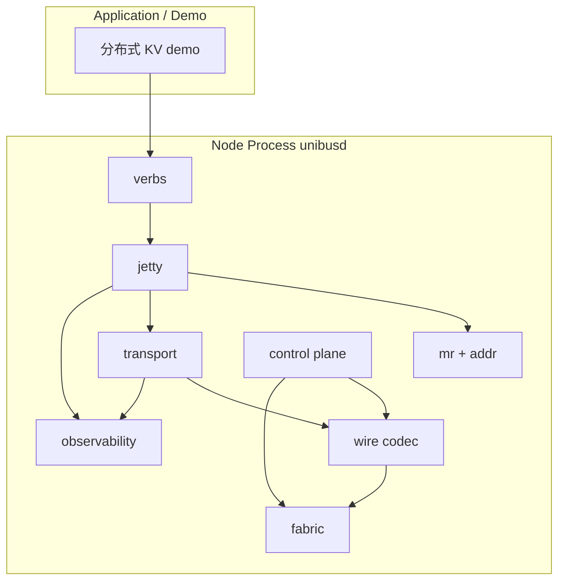

# UniBus Toy 详细设计

| 项 | 值 |
|---|---|
| **对应需求** | [REQUIREMENTS.md](./REQUIREMENTS.md)（最后对齐版本以仓库内文档为准） |
| **文档状态** | Draft（待评审） |
| **最后更新** | 2026-04-11 |

本文在需求文档已拍板的默认决策（Go、YAML、UDP 默认、HTTP `/metrics`、128 bit UB 地址等）基础上，给出**可实现**的模块划分、协议头、状态机与关键算法约定；未写死的字段保留「实现可调整但须回归需求 FR」的弹性。

---

## 1. 设计目标与原则

1. **语义优先于性能**：严格满足 FR-REL（至多一次）、FR-MEM-7（非原子无顺序）、FR-MSG-5（消息序仅 per jetty 对）、FR-FLOW（按 WR 的信用流控）。
2. **逼近用户态软件上限**（与需求 1、2.2 一致）：首版以 **单 reactor + worker** 与 **零拷贝尽量局部化**（如 `[]byte` 视图、池化 buffer）为目标；**不**在首版绑定 RDMA/DPDK，但在 **§12 Fabric 抽象** 预留替换点，便于后续里程碑切换。
3. **控制面 / 数据面隔离**：独立 goroutine 与独立 socket（或独立 QUIC 式多路前的双端口），避免控制 RPC 阻塞数据面。
4. **可测试**：传输层、分片重组、序号去重可纯单元测试；跨进程用脚本起 `unibusd`。

---

## 2. 总体架构

### 2.1 分层（对应 US-8）

| 层 | 包（建议） | 职责 |
|---|---|---|
| **Verb / 事务层** | `pkg/verbs`（或并入 `pkg/jetty`） | 将 `ub_read` / `ub_write` / `ub_send` 等转为 WR，投递 JFS；从 JFC 交付 CQE；同步 API 在此层封装 `Wait` |
| **Jetty 资源层** | `pkg/jetty` | JFS/JFR/JFC 队列、深度、背压；`jetty_id` 分配；`flushed` CQE |
| **MR / 地址** | `pkg/mr`, `pkg/addr` | 本地 MR 表、UB→VA 翻译；对齐检查；权限检查 |
| **可靠传输** | `pkg/transport` | 每对 `(src_node, dst_node)` 的序号、ACK/SACK、重传定时器、去重窗口 |
| **分片与重组** | `pkg/transport/fragment`（子目录） | 大于 PMTU 的 payload 切分；重组超时与内存上限 |
| **网络成帧** | `pkg/wire` 或 `pkg/codec` | 定长头 + payload + 可选扩展头；版本、魔数 |
| **Fabric** | `pkg/fabric` | UDP / TCP / UDS 实现 `Send`/`Recv`；连接表（TCP） |
| **控制面** | `pkg/control` | 成员关系、MR 目录广播/拉取、心跳、节点状态机 |
| **可观测** | `pkg/obs` | 计数器、日志、`/metrics`、tracing 钩子 |
| **进程入口** | `cmd/unibusd` | 读配置、拉起各子系统 |
| **CLI** | `cmd/unibusctl` | 子命令调用本地 HTTP 管理接口或直连 control socket（二选一，见 §8） |



### 2.2 并发模型（Q6）

- **Reactor（1 个 goroutine）**：阻塞或 `epoll` 风格事件循环（Go 中可用 `net.Conn` + `SetReadDeadline` 轮询或多 conn per peer）；负责 **所有 fabric 读**、将完整 **帧** 投递到每 peer 的 inbound channel；负责 **定时器 tick**（心跳、RTO）信号。
- **Workers（默认 `runtime.NumCPU()`）**：
  - 从 JFS 取 WR、组帧、交给 transport 发送队列；
  - 处理 inbound 帧：控制面消息、数据面 ACK、数据 payload、完成 JFC；
  - 不得在执行路径上直接阻塞于应用回调；CQE 入队由 worker 完成。
- **顺序保证**：同一 `(src_jetty_id, dst_jetty_id)` 的 **消息** 有序，在 **transport 层按 jetty 对建子队列** 或在 **jetty 层串行化 send 路径** 二选一；详细设计推荐 **jetty 层 per-dst 串行化 + transport 每 peer 总序**，避免 TCP 多流乱序（若未来一连接多 jetty）破坏 FR-MSG-5。首版 **建议每 (src_node, dst_node) 一条 TCP 连接或一条 UDP 会话上下文**，消息头带 `src_jetty/dst_jetty`，接收端按 `dst_jetty` 入队。

---

## 3. 标识与地址

### 3.1 128 bit UB 地址（FR-ADDR-1）

内存布局（大端序列化到 on-wire 16 字节）：

| 字段 | 位宽 | 说明 |
|---|---|---|
| PodID | 16 | 配置 `pod_id`，默认 1 |
| NodeID | 16 | 控制面分配，静态配置或 seed 分配 |
| DeviceID | 16 | 首版仅 `MEMORY` device，默认 0 |
| Offset | 64 | **字节**偏移，相对 MR 起始 |
| Reserved | 16 | 填 0；扩展 Tenant/VC |

**MR 与 UB 关系**：注册 MR 时选定 `base_ub_addr`（通常由 `(PodID, NodeID, DeviceID)` + 选定 `offset_base` 组成）；有效区间为 `[base, base+len)`。**FR-ADDR-3**：Offset 空间在节点内由 MR 分配器管理，保证不重叠。

**文本表示**（与 FR-API 示例一致）：`0x{pod}:{node}:{dev}:{off64}:{res}` 共五段十六进制，冒号分隔；`off64` 固定 16 个十六进制字符。

### 3.2 Jetty 标识

- **JettyID**：节点内 `uint32` 自增分配器；**不得**跨节点唯一（跨节点需 `(NodeID, JettyID)`）。
- **对端寻址**：数据面头携带 `dst_node_id` + `dst_jetty_id`；源携带 `src_jetty_id`。

---

## 4. Wire 协议（数据面）

### 4.1 帧类型

`uint8`：

| 值 | 名称 | 方向 | 说明 |
|---|---|---|---|
| 0x01 | `DATA` | 双向 | 携带 verb 或消息 payload 分片 |
| 0x02 | `ACK` | 双向 | 累积 ACK + 可选 SACK 位图 |
| 0x03 | `CREDIT` | 双向 | 通告/更新 WR 级信用 |
| 0x04 | `PING` / `PONG` | 双向 | 可合并进控制面；若独立则走数据端口需防放大攻击（toy 可忽略） |

控制面帧类型单独枚举（见 §7），**不与数据面混用同一端口**（FR-CTRL-3）。

### 4.2 通用帧头（建议 32 字节对齐前 24～32 B）

字段（逻辑顺序，实际打包用 `encoding/binary` BigEndian）：

| 偏移 | 长度 | 字段 |
|---|---|---|
| 0 | 4 | Magic `0x55425459`（"UBTY"） |
| 4 | 1 | Version，首版 `1` |
| 5 | 1 | Type（上表） |
| 6 | 2 | Flags（ACK 请求、分片首/中/尾、是否 imm 等） |
| 8 | 2 | SrcNodeID（`uint16`，与 FR-ADDR-1 NodeID:16 对齐） |
| 10 | 2 | DstNodeID（`uint16`） |
| 12 | 4 | Reserved（首版填 0；高 8 bit 预留源路由扩展偏移，对应 FR-CTRL-5 预留点） |
| 16 | 8 | **StreamSeq**：本 `(src,dst)` 会话单调递增序号（见 §5） |
| 24 | 4 | PayloadLen |
| 28 | 4 | HeaderCRC（可选；首版可 0 表示禁用） |

**DATA 扩展头**（紧随通用头后）：

| 字段 | 说明 |
|---|---|
| Verb | `READ_REQ` / `READ_RESP` / `WRITE` / `ATOMIC_CAS` / `ATOMIC_FAA` / `SEND` / `WRITE_IMM` … |
| UBAddr | 16 B，目标 UB 地址（写/原子/带 RDMA 语义） |
| RemoteKey / MRHandle | `uint32` 本地句柄，供对端 O(1) 查表（可选优化） |
| JettySrc / JettyDst | `uint32` |
| Imm | `uint64`，仅 imm 类 verb |
| Fragment | `frag_id, frag_index, frag_total` |
| Opaque | `uint64`，关联本地 WR id，用于完成事件 |

**PMTU**：默认 **1400** 字节 UDP 载荷上限（与需求 9.1 一致）；TCP 路径可使用相同逻辑 PMTU 简化实现。

### 4.3 分片（FR-MEM-6）

- 发送端：`payload > PMTU - headers` 时切分；每片带 **相同 Opaque** 与 **frag_index/total**。
- 接收端：按 `(src_node, StreamSeq 或 OpKey)` 维护重组表；**超时**（如 2s）释放缓冲并向上报 `UB_ERR_TIMEOUT` 或对端复位（实现选择须在测试中断言无泄漏）。

---

## 5. 可靠传输（FR-REL）

### 5.1 会话与序号

- **每有序通道**：定义 `ReliableSession` keyed by `(local_node, remote_node, fabric_kind)`。首版 **UDP 与 TCP 各一条会话** 不混用序号；切 fabric 即新会话。
- **StreamSeq**：单调递增 `uint64`，在 **发送端** 每帧 +1。接收端维护 `next_expected` 实现累积确认。
- **去重**：接收端维护大小为 W 的滑动窗口（如 1024）；`seq < next_expected` 且已确认 → 丢弃；`seq` 在窗口内重复 → 丢弃；**绝不再次执行写副作用**（FR-REL-5/6）。

### 5.2 ACK / SACK（FR-REL-2）

- **累积 ACK**：`ack_seq = 最后一个连续已处理 seq`。
- **SACK 简化版**：Flags 表示携带 **256 bit 位图**，相对 `ack_seq+1` 的缺失包标记；触发快速重传。
- **ACK 策略**：每收到 N 个包或每 T ms 发送 ACK（可配置），避免纯停等。

### 5.3 重传与 RTO（FR-REL-3/4）

- 未 ACK 段进入 `retransmit_queue`，每条记录 `first_sent_at`, `rto_deadline`。
- **指数退避**：`RTO = min(RTO_max, RTO_0 * 2^k)`。
- **上限**：超过 `max_retries` → 会话进入 `DEAD`，对该 peer 上所有未完成 WR 投递 `UB_ERR_LINK_DOWN`（FR-FAIL-3 联动）。

### 5.4 读路径重复（FR-REL-6）

- **读请求**重复到达：第二次可 **直接丢弃** 不再发 RESP（若首请求仍在处理），或 **缓存 (req_id → resp)** 极短时间（toy 可选）；**禁止**阻塞读线程等待去重锁链导致死锁。
- **读响应**重复：`READ_RESP` 带相同 `Opaque`；发送端已完成后忽略重复 RESP。

### 5.5 写路径幂等（FR-REL-6）

- 对 `WRITE` / `WRITE_IMM` / `ATOMIC_*`：**以 StreamSeq 或 (Opaque + 首次执行表)** 保证同一数据帧只应用一次；重复帧仅回 ACK。

---

## 6. 流控（FR-FLOW）

- **信用粒度**：**WR 个数**（需求已明确）。
- **初始窗口**：配置 `initial_credits`（如 64）；接收端在应用 **poll/取走 CQE** 时（即 CQE 被消费，与 FR-FLOW-1「消费一个 CQE 返还 1 credit」一致），本地 `credits_to_grant++`，并通过 `CREDIT` 帧或嵌入 ACK 通告发送端；**注意**：credit 返还时机是 CQE 被取走，而非内部交付到 JFC——两者存在时间差，应用积压 CQE 不取则自然形成背压。
- **背压（FR-FLOW-2）**：接收端 JFR 或 JFC 槽紧张时，**停止返还** credit（`credits_to_grant` 保持 0，不发负向 CREDIT 帧）；发送端未收到新 grant，`credits` 归零后停止取新 WR（**禁止**无限堆内存）；与 **FR-JETTY-3** 一致：JFC 高水位满时同样阻止新发送。
- **AIMD（FR-FLOW-3）**：在检测到持续 `NO_CREDIT` 或 RTT 上升时减小窗口；恢复时线性增（具体参数放配置文件）。

---

## 7. 控制面（FR-CTRL）

### 7.1 传输

- **独立监听端口**：`control_listen: <addr>`，TCP 优先（消息小、需可靠）；UDP 亦可但需自建 ACK（首版推荐 TCP）。
- **Static 模式**：配置列出所有节点；启动顺序任意；**全连接控制 TCP mesh** 或 **星形连 hub**（二选一，推荐 **星形减 O(N²)**：指定 `hub_node_id`，非 hub 仅连 hub，由 hub 转发广播）。
- **Seed 模式**：新节点连 seed → `JOIN` → seed `MEMBER_SNAPSHOT` 下发 → 新节点再与必要 peer 建立数据面会话（全连接则连所有人）。

### 7.2 消息类型（示例）

| 类型 | 内容 |
|---|---|
| `HELLO` | NodeID, 数据面地址, 版本 |
| `MEMBER_UP` / `MEMBER_DOWN` | 节点状态 |
| `MR_PUBLISH` / `MR_REVOKE` | MR 元数据：UB 区间、len、perms、owner_node |
| `HEARTBEAT` / `HEARTBEAT_ACK` | 时间戳；或独立心跳线程 |

**FR-CTRL-4**：`last_seen` + 超时（默认 1s * 3）将节点标为 `DOWN`，广播 `MEMBER_DOWN`，并通知 transport 失效该 peer 会话。

### 7.3 MR 目录（FR-MR-4）

**首版推荐**：**广播式 `MR_PUBLISH`**（简单，符合 M2）；可选增加 `MR_QUERY`（按需拉取）作为优化。与 **FR-ADDR-4** 一致：广播仅 **元数据**，不含 VA。

### 7.4 Fan-out（FR-CTRL-6）

- API 层提供 `ub_notify_many(dst_list []JettyAddr, ...)`（命名随意），内部 **for each dst** 调用单播路径；**独立计数器** `fanout_ok/err`；**不**保证顺序。

---

## 8. Jetty 与 Verb 路径

### 8.1 队列参数

- 配置项：`jfs_depth`, `jfr_depth`, `jfc_depth`；满足 **FR-JETTY-3**：当 `unacked_cqe >= jfc_high_water` 时，`Send` 路径阻塞或返回 `UB_ERR_NO_RESOURCES`（**必须**文档化选择；推荐异步 API 返回 `EAGAIN` 风格 + 同步 API 阻塞带超时）。

### 8.2 WR → CQE

- 每个 WR 分配 `wr_id`（uint64）；完成时 CQE 带 `wr_id`, `status`, `imm`（若有）, `byte_len`。
- **flushed**（FR-JETTY-5）：`jetty_close` 时对未完成 WR 批量生成错误完成，`status = FLUSHED`。

### 8.3 内存 verb 与 Jetty

- 需求 FR-MEM-5：内存操作通过 JFC；实现上 **允许** 使用「内部 jetty」或显式 `ub_jetty_default()`；详细设计推荐 **每线程或每节点一个默认 Jetty**，CLI/bench 可覆盖。

### 8.4 消息有序（FR-MSG-5）

- **实现要点**：在 **src** 侧对 `(dst_node, dst_jetty)` 维护串行队列；在 **dst** 侧按接收顺序入对应 JFR，匹配 `post_recv` 顺序。

### 8.5 跨语义顺序

- **不**在协议层提供 fence；若 demo 需要，用 `write_with_imm` 或应用层协议序号。

### 8.6 MR 注销时 inflight 处理（FR-ADDR-5）

- `ub_mr_deregister(handle)` 立即将 MR 状态置为 `REVOKING`，同时触发控制面 `MR_REVOKE` 广播。
- **此后到达的** `READ_REQ` / `WRITE` / `ATOMIC_*` 帧若引用该 MR 的 UB 区间：接收端返回错误响应帧（`status = UB_ERR_ADDR_INVALID`），**不执行**任何写副作用。
- **已通过权限检查、正在执行的**写操作：允许完成（内存仍在范围内），避免状态机复杂化；toy 级别可接受此窗口。
- 本地 WR 若尚未发出且 MR 已 `REVOKING`：直接在 JFC 生成 `UB_ERR_ADDR_INVALID` CQE，不发送网络帧。
- `MR_REVOKE` 广播 fire-and-forget，不等 peer ACK；peer 在本地 MR 元数据缓存中标记该区间无效即可。

---

## 9. 错误码映射（FR-ERR）

全路径统一 `ub_status`；transport / mr / jetty 各层映射到需求表中的码。扩展内部错误可用 `UB_ERR_INTERNAL`（若需求未列，可在实现中保留，CLI 显示为字符串）。

---

## 10. 可观测（FR-OBS）

- **计数器**（Prometheus gauge/counter 名称示例）：`unibus_tx_pkts_total`, `unibus_rx_pkts_total`, `unibus_retrans_total`, `unibus_drops_total`, `unibus_cqe_ok_total`, `unibus_cqe_err_total`, `unibus_mr_count`, `unibus_jetty_count`, `unibus_peer_rtt_ms`（histogram 可选）。
- **`/metrics`**：默认绑定 `127.0.0.1:9090`（可配置），**仅本机** 以降低 toy 暴露面；需要远程采集时显式 `0.0.0.0`。
- **Tracing（FR-OBS-4）**：定义接口 `type Tracer interface { Span(ctx, name string) func()` }`；默认 `noopTracer`。

---

## 11. 配置（YAML 草案）

```yaml
pod_id: 1
node_id: 42
role: member            # hub | member（星形控制面时）
control:
  listen: "0.0.0.0:7900"
  bootstrap: static           # static | seed
  peers: ["10.0.0.1:7900", "10.0.0.2:7900"]  # static 模式：列出所有节点地址
  # seed_addrs: ["10.0.0.1:7900"]             # seed 模式：报到地址（与 peers 二选一）
  hub_node_id: 0              # 星形拓扑时指定 hub 的 NodeID；0 = 全连接模式
data:
  listen: "0.0.0.0:7901"
  fabric: udp             # udp | tcp | uds
  mtu: 1400
transport:
  rto_ms: 200
  max_retries: 8
  sack_bitmap_bits: 256
flow:
  initial_credits: 64
jetty:
  jfs_depth: 1024
  jfr_depth: 1024
  jfc_depth: 1024
  jfc_high_watermark: 896
obs:
  metrics_listen: "127.0.0.1:9090"
heartbeat:
  interval_ms: 1000
  fail_after: 3
```

---

## 12. Fabric 抽象（扩展点）

```go
type Fabric interface {
    Kind() string // "udp" | "tcp" | "uds"
    // Endpoint 建立到远端 data 地址；UDP 可为无连接 sendto
    Dial(peer PeerAddr) (Session, error)
}

type Session interface {
    Send(ctx context.Context, pkt []byte) error
    // Recv 返回的 []byte 归 Session 所有；调用方必须在下次 Recv 调用前完成读取或自行拷贝。
    // transport 层应通过 sync.Pool 复用 buffer 以避免频繁分配。
    Recv(ctx context.Context) ([]byte, error)
    Close() error
}
```

- **UDP**：`ReliableSession` 完全在 `pkg/transport`。
- **TCP**：`Session` 一条连接；**仍调用同一套分片+可靠逻辑**（避免双套语义）；或简化为「TCP 下关闭重传但保留分片」（需在评审中二选一：**推荐 TCP 仍走 transport 统一路径**，仅将「丢包」视为连接错误）。

---

## 13. 分布式 KV Demo（Q4）映射

| 能力 | UB 能力 |
|---|---|
| put / get | `ub_write` / `ub_read` 到 owner 节点 MR |
| cas 更新 | `ub_atomic_cas` |
| 通知副本 | `ub_send` 或 `write_with_imm` |
| 故障 | 节点 DOWN 后 client 收到 `UB_ERR_LINK_DOWN`，CLI 切换 |

---

## 14. 测试计划（对齐需求 6 / M2–M5）

| 类型 | 内容 |
|---|---|
| 单元 | 分片重组、序号窗口、SACK 解码、credit 窗口、YAML 解析 |
| 集成 | 两进程本机 UDP/TCP 互打；1% 随机丢包注入（udp wrapper） |
| 并发 | 多 goroutine `atomic_cas` 同一 UB 字 |
| E2E | shell 脚本起 3×`unibusd` + `unibusctl` 断言 `node list` / `mr list` |

---

## 15. 里程碑与代码交付映射

| 里程碑 | 主要代码落点 |
|---|---|
| M1 | `pkg/control`, `cmd/unibusd`, `cmd/unibusctl node` |
| M2 | `pkg/mr`, `pkg/addr`, `pkg/transport` + verbs read/write/atomic |
| M3 | `pkg/jetty`, send/recv/imm |
| M4 | 完整 FR-REL + FR-FLOW + FR-FAIL |
| M5 | `pkg/obs`, bench, KV demo |

---

## 16. 公开评审清单（给 reviewer）

1. **TCP 上是否重复实现可靠层**：若选「TCP 禁用重传仅分片」，是否在需求层需追加 FR（当前需求写「复用同一 Jetty 语义」——建议 **语义一致 = 帧格式+完成模型一致**，重传可按 fabric 能力短路）。
2. **控制面星形 vs 全连接**：N=64 时 hub 带宽与单点故障是否可接受（toy 可接受）。
3. **默认 Jetty 与显式 Jetty** 是否要在 API 文档中强制一种风格。
4. **读重复**策略选「短缓存 RESP」还是「仅丢弃重复请求」对 RPC 延迟影响。

---

## 17. 参考资料

与需求文档 [REQUIREMENTS.md](./REQUIREMENTS.md) 中「参考资料」一节保持一致；实现时不依赖外链内容的正确性。
