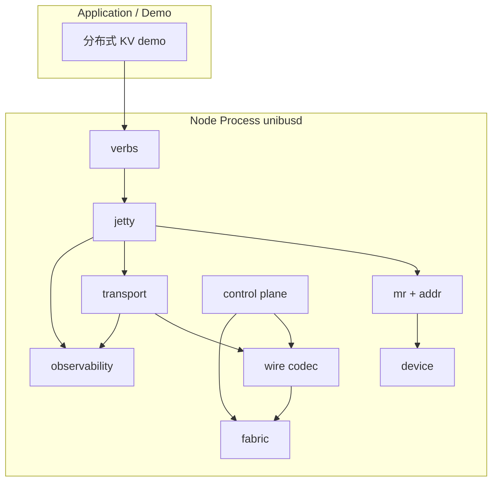

# UniBus Toy 详细设计

| 项 | 值 |
|---|---|
| **对应需求** | [REQUIREMENTS.md](./REQUIREMENTS.md)（最后对齐版本以仓库内文档为准） |
| **文档状态** | Draft（待评审）。**Part I（Verbs 层，§1–§12）** 可直接排入 M1–M5 开工；**Part II（Managed Memory 层，§13–§18）** 为 M7 exploratory，方向已对齐、细节待正式启动时再固化；**Part III（§19–§23）** 是跨两层共享的交付物、测试、里程碑与评审清单。 |
| **最后更新** | 2026-04-11 |

本文在需求文档已拍板的默认决策（**Rust + tokio**、YAML、UDP 默认、HTTP `/metrics`、128 bit UB 地址、**首版含 Device 抽象与 NPU 纯软件模拟**等）基础上，给出**可实现**的模块划分、协议头、状态机与关键算法约定。未写死的字段保留「实现可调整但须回归需求 FR」的弹性。

**如何阅读本文**：从上往下就是"从底层往上层一步步爬"的顺序——Part I 先把 verbs 层按 transport → control → verbs/jetty 的顺序过完，Part II 在已对齐的 verbs 层之上叠一个 managed memory 层（M7 vision），Part III 汇总 demo/tests/milestones/review。只关心 M1–M5 主线的 reviewer 读到 §12 即可；对"分布式 OS 风格的全局堆"感兴趣的继续读 Part II。

---

## 1. 设计目标与原则

1. **语义优先于性能**：严格满足 FR-REL（至多一次）、FR-MEM-7（非原子无顺序）、FR-MSG-5（消息序仅 per jetty 对）、FR-FLOW（按 WR 的信用流控）。
2. **逼近用户态软件上限**（与需求 1、2.2 一致）：首版以 **单 reactor + worker** 与 **零拷贝尽量局部化**（如 `Bytes` 视图、池化 buffer）为目标；**不**在首版绑定 RDMA/DPDK，但在 **§12 Fabric 抽象** 预留替换点，便于后续里程碑切换。
3. **控制面 / 数据面隔离**：独立 tokio task 与独立 socket（或独立 QUIC 式多路前的双端口），避免控制 RPC 阻塞数据面。
4. **可测试**：传输层、分片重组、序号去重可纯单元测试；跨进程用脚本起 `unibusd`。
5. **分层不泄漏**：Verbs 层（Part I）与 Managed 层（Part II）通过**单向依赖**耦合——Managed 层只调用 Verbs 层的公开接口；Verbs 层**不感知** Managed 层存在，保持可独立测试与独立交付。

---

# Part I：Verbs 层详细设计（M1–M5）

Part I 覆盖 REQUIREMENTS §5.1–§5.13 的全部功能需求（FR-ADDR / FR-MR / FR-MEM / FR-MSG / FR-JETTY / FR-CTRL / FR-REL / FR-FLOW / FR-FAIL / FR-ERR / FR-API / FR-OBS / FR-DEV），是项目的主交付线。

---

## 2. 总体架构

### 2.1 两层总览

UniBus Toy 的软件分为**两个耦合点明确的层**；本文 Part I 实现下层，Part II 描述上层的建议设计。

```
┌───────────────────────────────────────────────────────────────┐
│ Application                                                   │
│  ├─ 分布式 KV demo（verbs 层版，M5 交付）                    │
│  └─ 3 节点 KV cache demo（managed 层版，M7 交付）            │
├───────────────────────────────────────────────────────────────┤
│ Part II: ub-managed    (M7 / exploratory)                     │
│   §13 动机、§14 概念、§15 API、§16 机制、§17 一致性、§18 对比 │
│                                                               │
│   Global allocator · Placer · Region table · Coherence SM     │
│   Cache tier controller · LRU eviction                        │
├───────────────────────────────────────────────────────────────┤
│ Part I: ub-core verbs   (M1–M5)                               │
│   §3 addr · §8 jetty · verbs (read/write/atomic/send/recv)    │
│   §3.3 Device trait · memory / npu backends                   │
├───────────────────────────────────────────────────────────────┤
│ ub-transport (M4)  §4–§6 wire / reliable / flow control       │
├───────────────────────────────────────────────────────────────┤
│ ub-fabric (M1)     §12 UDP / TCP / UDS Fabric trait           │
└───────────────────────────────────────────────────────────────┘
          ▲
          │ ub-control (M1, §7)   hub / seed / heartbeat / MR 目录
          │                         （跨所有层的控制面）
```

关键点：

- **M1–M5 可独立交付可演示**：应用用 `ub_read / ub_write / ub_atomic / ub_send + NodeID 编址` 直接写跨节点程序，不需要 managed 层存在。
- **Managed 层是叠加的上层**：`ub_alloc` 内部会调 verbs 层的 `ub_mr_register`、`ub_read/write`，不会自己实现传输与 MR。
- **控制面横跨两层**：verbs 层的 `MR_PUBLISH / HEARTBEAT` 与 managed 层的 `DEVICE_PROFILE_PUBLISH / ALLOC_REQ / INVALIDATE` 都走同一个 `ub-control` 通道，只是消息类型枚举的不同分支。

### 2.2 Verbs 层模块划分（对应 US-8）

| 层 | crate / 模块（建议） | 职责 |
|---|---|---|
| **Verb / 事务层** | `ub-core::verbs`（或并入 `ub-core::jetty`） | 将 `ub_read` / `ub_write` / `ub_send` 等转为 WR，投递 JFS；从 JFC 交付 CQE；同步 API 在此层对 async 版本封装 `block_on` |
| **Jetty 资源层** | `ub-core::jetty` | JFS/JFR/JFC 队列、深度、背压；`jetty_id` 分配；`flushed` CQE |
| **MR / 地址** | `ub-core::{mr, addr}` | 本地 MR 表、UB→(device, offset) 翻译；对齐检查；权限检查；按 device 分派读写 |
| **Device 后端** | `ub-core::device`（内含 `memory` / `npu` 两个子模块） | `Device` trait：read / write / atomic 原语；CPU 直接操作 `&mut [u8]`；NPU 为纯软件模拟字节数组（FR-DEV-2） |
| **可靠传输** | `ub-transport` | 每对 `(src_node, dst_node)` 的序号、ACK/SACK、重传定时器、去重窗口 |
| **分片与重组** | `ub-transport::fragment`（子模块） | 大于 PMTU 的 payload 切分；重组超时与内存上限 |
| **网络成帧** | `ub-wire` | 定长头 + payload + 可选扩展头；版本、魔数 |
| **Fabric** | `ub-fabric` | UDP / TCP / UDS 实现 `Fabric` / `Session` trait；连接/会话表 |
| **控制面** | `ub-control` | 成员关系、MR 目录广播/拉取、心跳、节点状态机（Part II 的 managed 消息复用此通道） |
| **可观测** | `ub-obs` | 计数器、日志、`/metrics`、`tracing` span 钩子 |
| **进程入口** | `unibusd`（bin crate） | 读配置、拉起 tokio runtime 与各子系统 |
| **CLI** | `unibusctl`（bin crate） | 子命令通过本地 HTTP admin 接口调用 `unibusd`（与 `/metrics` 共端口，path 前缀 `/admin`，见 §10） |



### 2.3 并发模型（Q6）

- **Runtime**：`tokio` 多线程 runtime，工作线程数默认 `num_cpus::get()`。
- **Reactor（1 个专用 tokio task）**：以 `tokio::select!` 驱动事件循环，多路复用 `tokio::net::UdpSocket::recv_from` / `TcpListener::accept` / `tokio::time::interval`（心跳、RTO tick）；将收到的完整 **帧** 通过 `tokio::sync::mpsc` 投递到每 peer 的 inbound channel。
  - 由于 tokio 的 IO 驱动是多线程共享的，"1 个 reactor task" 在逻辑上只是事件多路分发器，内部并不强绑定单线程；但我们**约束**所有 fabric 读只从这一个 task 中出栈，以保证 inbound 顺序单点化。
- **Workers（若干 tokio task）**：
  - 从 JFS 取 WR、组帧、交给 transport 发送队列；
  - 处理 inbound 帧：控制面消息、数据面 ACK、数据 payload、完成 JFC；
  - 不得在执行路径上直接阻塞于应用回调；CQE 入队由 worker 完成。
  - 对 **应用侧回调**（例如同步 API 等 CQE）使用 `tokio::sync::Notify` 或 `oneshot::Sender` 唤醒，避免在 runtime 内部 `.await` 阻塞的同步调用。
- **顺序保证**：同一 `(src_jetty_id, dst_jetty_id)` 的 **消息** 有序，在 **transport 层按 jetty 对建子队列** 或在 **jetty 层串行化 send 路径** 二选一；详细设计推荐 **jetty 层 per-dst 串行化 + transport 每 peer 总序**，避免 TCP 多流乱序（若未来一连接多 jetty）破坏 FR-MSG-5。首版 **建议每 (src_node, dst_node) 一条 TCP 连接或一条 UDP 会话上下文**，消息头带 `src_jetty/dst_jetty`，接收端按 `dst_jetty` 入队。

### 2.4 关键 crate 选型

| 用途 | Crate | 说明 |
|---|---|---|
| 异步 runtime | `tokio` | 多线程 runtime、`net`、`sync`、`time` features |
| Trait 上 async | `async-trait` | 供 `Fabric` / `Session` / `Device` 等 trait 用 |
| buffer | `bytes` | `Bytes` / `BytesMut` 做零拷贝切片与池化 |
| wire 编解码 | `byteorder` 或 std 的 `u64::to_be_bytes` | 不引入 `serde` 避免反射开销；**不用** `prost`（无 protobuf 依赖） |
| 错误类型 | `thiserror` | 定义 `UbError` enum 映射到 `UB_ERR_*` |
| 同步原语 | `parking_lot` | `Mutex` / `RwLock` 比 std 略快；异步场景仍用 `tokio::sync` |
| 无锁队列 | `crossbeam::queue::ArrayQueue` | JFS MPSC 实现备选（§8.4） |
| 配置 | `serde` + `serde_yaml` | YAML 解析 |
| 日志 / tracing | `tracing` + `tracing-subscriber` | 结构化日志 + span，契合 FR-OBS-4 |
| Prometheus | `metrics` + `metrics-exporter-prometheus` | `/metrics` 输出 |
| 随机 | `rand` | `rand::random::<u32>()` 生成 epoch（§5.1） |
| HTTP admin | `axum` 或 `hyper` 单独起一个 server | 承载 `/metrics` 与 `/admin`（CLI 后端） |
| bench | `criterion` | `cargo bench`；命中 FR-NFR 性能指标验证 |

---

## 3. 标识与地址

### 3.1 128 bit UB 地址（FR-ADDR-1）

内存布局（大端序列化到 on-wire 16 字节）：

| 字段 | 位宽 | 说明 |
|---|---|---|
| PodID | 16 | 配置 `pod_id`，默认 1 |
| NodeID | 16 | 控制面分配，静态配置或 seed 分配 |
| DeviceID | 16 | 节点内 device 身份（FR-DEV-4）：`0` = 默认 CPU memory；`1..` = NPU 或后续扩展设备；同一节点可同时存在 CPU 与 NPU MR |
| Offset | 64 | **字节**偏移，相对 MR 起始 |
| Reserved | 16 | 填 0；扩展 Tenant/VC |

**MR 与 UB 关系**：注册 MR 时选定 `base_ub_addr`（通常由 `(PodID, NodeID, DeviceID)` + 选定 `offset_base` 组成）；有效区间为 `[base, base+len)`。**FR-ADDR-3**：Offset 空间在节点内由 MR 分配器管理，保证不重叠。

**文本表示**（与 FR-API 示例一致）：`0x{pod}:{node}:{dev}:{off64}:{res}` 共五段十六进制，冒号分隔；`off64` 固定 16 个十六进制字符。

### 3.2 Jetty 标识

- **JettyID**：节点内 `uint32` 自增分配器；**不得**跨节点唯一（跨节点需 `(NodeID, JettyID)`）。
- **对端寻址**：数据面头携带 `dst_node_id` + `dst_jetty_id`；源携带 `src_jetty_id`。

### 3.3 Device 抽象与 NPU 模拟（FR-DEV）

首版要求一个节点能同时注册 **CPU 内存 MR** 与 **NPU 显存 MR**，且远端访问完全透明（FR-DEV-3/5）。为此在 `ub-core::device` 中定义：

```rust
#[derive(Copy, Clone, Debug, PartialEq, Eq)]
pub enum DeviceKind { Memory, Npu }

pub trait Device: Send + Sync {
    fn kind(&self) -> DeviceKind;
    fn device_id(&self) -> u16;           // 写入 UB 地址 DeviceID 字段
    fn capacity(&self) -> u64;

    /// buf 填充目标，offset 为 device 基址相对偏移
    fn read(&self, offset: u64, buf: &mut [u8]) -> Result<(), UbError>;
    fn write(&self, offset: u64, buf: &[u8]) -> Result<(), UbError>;

    /// 8 B 对齐原语，底层用 AtomicU64 实现；NPU 也复用该实现
    fn atomic_cas(&self, offset: u64, expect: u64, new: u64) -> Result<u64, UbError>;
    fn atomic_faa(&self, offset: u64, add: u64) -> Result<u64, UbError>;
}
```

- **`MemoryDevice`**：backing 是节点进程自身堆内存。`ub_mr_register` 传入的 `&mut [u8]` / `Box<[u8]>` 被 device 内部保管；`read/write` 直接 `copy_from_slice`；atomic 用 `AtomicU64::compare_exchange` / `fetch_add`（`Ordering::AcqRel`）。
- **`NpuDevice`（纯软件模拟）**：
  - 启动时 `ub_npu_open(size)` 分配一整块 `Box<[AtomicU8]>` 或 `Vec<u8>` + `UnsafeCell` 包装（前者便于 atomic 原语，后者省内存——首版用 `Vec<u8>` + `parking_lot::RwLock` 足够 toy 级）。
  - **不**引入任何 CUDA / ROCm / Vulkan 依赖，不模拟 HBM 延迟 / 带宽（FR-DEV-7）。
  - `ub_npu_alloc(handle, len, align)` 用简单的 bump allocator 在 device 内部维护游标；回收在首版为 no-op（注销 MR 即归还，但游标不复用——toy 阶段接受碎片）。
  - `atomic_*` 对 NPU 显存的语义与 CPU 内存一致，因为 backing 本质仍是进程内存；这个简化让"跨 device 的 UB 地址全用同一套 verbs"在实现上天然成立。
- **MR → Device 路由**：本地 MR 表以 `mr_handle: u32` 为主键，条目包含 `Arc<dyn Device>` + `offset_base` + `len` + `perms`。数据面收到 DATA 帧后（见 §4.2 `MRHandle`），`mr_table.lookup(handle)` O(1) 拿到 `Arc<dyn Device>`，再 `device.read/write(offset_base + frame.ub_addr.offset - mr.base_offset, ...)`。这条路径对 CPU / NPU **无分支**，满足 FR-DEV-3 的"远端透明"。
- **DeviceID 分配**：每个节点启动时：`MemoryDevice` 固定 `device_id = 0`；每 `ub_npu_open` 调用成功分配一个 `≥ 1` 的自增 `device_id`（首版通常只开 1 个 NPU，即 `device_id = 1`）。`device_id` 仅在节点内部有意义，不需要跨节点唯一，因为 UB 地址已经携带 NodeID 限定。
- **FR-DEV-5 API**：`ub_npu_open` / `ub_npu_alloc` 放在 `ub-core::device::npu` 模块，返回给应用的是 `NpuHandle` + `(offset, len)` 元组；应用把 `(npu_handle, offset)` 喂给 `ub_mr_register`，MR 层内部取出 `Arc<NpuDevice>` 存到 MR 条目中。

> **Managed 层前瞻**：Part II 的 Device Capability Registry（§16.1）会给每个 `Device` 额外挂一张静态 profile 表（带宽 / 时延 / 容量 / tier）；首版 verbs 层不需要这些字段，但实现时可以预留在 `Device` trait 或相邻结构里，避免 M7 启动时再回头改。

---

## 4. Wire 协议（数据面）

### 4.1 帧类型

`uint8`：

| 值 | 名称 | 方向 | 说明 |
|---|---|---|---|
| 0x01 | `DATA` | 双向 | 携带 verb 或消息 payload 分片 |
| 0x02 | `ACK` | 双向 | 累积 ACK + 可选 SACK 位图 |
| 0x03 | `CREDIT` | 双向 | 通告/更新 WR 级信用 |

控制面帧类型单独枚举（见 §7），**不与数据面混用同一端口**（FR-CTRL-3）。心跳走控制面（`HEARTBEAT` / `HEARTBEAT_ACK`，§7.2），**数据面不承载心跳**——避免 data plane 积压时心跳被阻塞而误判节点失联。

### 4.2 通用帧头（建议 32 字节对齐前 24～32 B）

字段（逻辑顺序，实际打包用 `byteorder::BigEndian` 或 `u{16,32,64}::to_be_bytes`；所有多字节整数一律大端）：

| 偏移 | 长度 | 字段 |
|---|---|---|
| 0 | 4 | Magic `0x55425459`（"UBTY"） |
| 4 | 1 | Version，首版 `1` |
| 5 | 1 | Type（上表） |
| 6 | 2 | Flags（ACK 请求、分片首/中/尾、是否 imm 等） |
| 8 | 2 | SrcNodeID（`uint16`，与 FR-ADDR-1 NodeID:16 对齐） |
| 10 | 2 | DstNodeID（`uint16`） |
| 12 | 4 | Reserved（首版填 0；高 8 bit 预留源路由扩展偏移，对应 FR-CTRL-5 预留点） |
| 16 | 8 | **StreamSeq**：本 `(src,dst)` 会话单调递增序号（见 §5） |
| 24 | 4 | PayloadLen |
| 28 | 4 | HeaderCRC（可选；首版可 0 表示禁用） |

**DATA 扩展头**（固定 48 B，紧随通用头后；Imm 仅当 `ExtFlags.HAS_IMM` 置位时追加 8 B）：

| 偏移 | 长度 | 字段 | 说明 |
|---|---|---|---|
| 0 | 1 | Verb | `uint8`：`READ_REQ=1` / `READ_RESP=2` / `WRITE=3` / `ATOMIC_CAS=4` / `ATOMIC_FAA=5` / `SEND=6` / `WRITE_IMM=7` |
| 1 | 1 | ExtFlags | `uint8`：bit0=`HAS_IMM`，bit1=`FRAG`，bit2=`ERR_RESP`（回错响应），其余保留 |
| 2 | 2 | Reserved | 填 0，对齐到 4 B |
| 4 | 4 | MRHandle | `uint32`：对端 MR 本地句柄，由 `MR_PUBLISH`（§7.2）下发；无 remote 地址语义时填 0 |
| 8 | 4 | JettySrc | `uint32` |
| 12 | 4 | JettyDst | `uint32` |
| 16 | 8 | Opaque | `uint64`：发送端 `wr_id`；接收端用作分片重组键的一部分（§4.3） |
| 24 | 4 | FragID | `uint32`：同一 WR 的所有分片共享此 ID（即 `Opaque` 低 32 位的快照，便于位运算） |
| 28 | 2 | FragIndex | `uint16`：本片索引，0 起 |
| 30 | 2 | FragTotal | `uint16`：总片数，1 表示无分片 |
| 32 | 16 | UBAddr | 目标 UB 地址；非地址类 verb（SEND）填 0 |
| 48 | 8 | Imm | `uint64`，仅当 `ExtFlags.HAS_IMM` 置位时存在 |

**PMTU**：默认 **1400** 字节 UDP 载荷上限（与需求 9.1 一致）；TCP 路径可使用相同逻辑 PMTU 简化实现。通用头 32 B + DATA 扩展头 48 B = 固定 80 B 头部开销（不含 Imm）。

### 4.3 分片（FR-MEM-6）

- 发送端：`payload > PMTU - 80` 时切分；每片带 **相同 `Opaque`** 与 **`FragIndex` / `FragTotal`**，并设置 `ExtFlags.FRAG`。
- 接收端：按 `(src_node, Opaque)` 作为重组表索引键（选择理由：`Opaque` 已是发送端 `wr_id`，天然对一个 WR 唯一；`StreamSeq` 每片不同不适合作键）；所有片到齐后交付上层。
- **重组超时**：**inactivity** 超时 2s（距离最近一片到达时间），到期释放缓冲并向上报 `UB_ERR_TIMEOUT`；单节点重组缓冲总大小上限 `reassembly_budget_bytes`（默认 64 MiB），超限时拒绝新 WR 的首片并计数 `unibus_reassembly_rejects_total`，已接收的片不变，测试用例须断言无内存泄漏。

---

## 5. 可靠传输（FR-REL）

### 5.1 会话与序号

- **每有序通道**：定义 `ReliableSession` keyed by `(local_node, remote_node, fabric_kind, epoch)`。`epoch` 是 `uint32` 会话代号，见下节"崩溃恢复"。首版 **UDP 与 TCP 各一条会话** 不混用序号；切 fabric 即新会话。
- **StreamSeq**：单调递增 `uint64`，在 **发送端** 每帧 +1。接收端维护 `next_expected` 实现累积确认。
- **去重**：接收端维护大小为 W 的滑动窗口（如 1024）；`seq < next_expected` 且已确认 → 丢弃；`seq` 在窗口内重复 → 丢弃；**绝不再次执行写副作用**（FR-REL-5/6）。

**崩溃恢复（会话 epoch）**：
- 节点启动时生成一个进程级 `local_epoch: u32`（`SystemTime::now().duration_since(UNIX_EPOCH).as_nanos() as u32` 或 `rand::random::<u32>()`），在控制面 `HELLO` 消息里通告。
- 对端收到 `HELLO` 后，若发现 `remote_epoch` 与自己缓存中的不同（意味着对端重启过），**立即**失效旧 `ReliableSession`：未完成 WR 投递 `UB_ERR_LINK_DOWN`，重组表清空，dedup 窗口清空，按新 epoch 建会话。
- 帧头 `Reserved` 4 B 的低 24 bit 首版不使用，高 8 bit 未来若需源路由再启用；epoch 不放在数据面帧头里（控制面交换 epoch 已足够），避免膨胀每帧。
- **副作用**：对端重启期间未收到 ACK 的写会被本地标记为失败，应用感知到 `UB_ERR_LINK_DOWN` 后自行决定是否重试；与 **FR-REL-5 至多一次** 的承诺保持一致（重启=会话结束，不跨 epoch 补发）。

### 5.2 ACK / SACK（FR-REL-2）

- **累积 ACK**：`ack_seq = 最后一个连续已处理 seq`。
- **SACK 简化版**：通用头 `Flags` 的 bit0 = `HAS_SACK`，表示 payload 区携带 **256 bit 位图**（32 B），相对 `ack_seq+1` 的缺失包标记；触发快速重传。
- **ACK 策略**：每收到 N 个包或每 T ms 发送 ACK（可配置），避免纯停等。

**ACK 帧 payload 布局**（紧随通用帧头之后）：

| 偏移 | 长度 | 字段 | 说明 |
|---|---|---|---|
| 0 | 8 | AckSeq | `uint64`，累积已处理的最后 seq |
| 8 | 4 | CreditGrant | `uint32`，顺带通告 credit 数（嵌入式 CREDIT，可省独立 CREDIT 帧） |
| 12 | 4 | Reserved | 填 0 |
| 16 | 32 | SackBitmap | 仅当 `Flags.HAS_SACK` 置位时存在；bit i 表示 `ack_seq+1+i` 是否已收到 |

ACK 帧通用头的 `PayloadLen` = 16（无 SACK）或 48（含 SACK）。

### 5.3 重传与 RTO（FR-REL-3/4）

- 未 ACK 段进入 `retransmit_queue`，每条记录 `first_sent_at`, `rto_deadline`。
- **指数退避**：`RTO = min(RTO_max, RTO_0 * 2^k)`。
- **上限**：超过 `max_retries` → 会话进入 `DEAD`，对该 peer 上所有未完成 WR 投递 `UB_ERR_LINK_DOWN`（FR-FAIL-3 联动）。

### 5.4 读路径重复（FR-REL-6）

- **读请求**去重：接收端维护 LRU 响应缓存 `resp_cache: (src_node, Opaque) → READ_RESP_payload`，容量默认 1024 条、TTL 5s。
  - 首次 `READ_REQ` 到达 → 执行本地读 → 写入缓存 → 发送 `READ_RESP`。
  - 重复 `READ_REQ` 到达 → **从缓存取出 RESP 重发**，**不能**简单丢弃（否则首次 RESP 丢失时请求永久 stuck）。
  - 缓存 miss（已过期）：允许重新执行本地读——读是幂等的，重复执行无副作用。
  - 缓存命中路径走 worker task，与本地读路径共享读锁即可，**禁止**在 tokio task 里持长读锁阻塞其他 ready 任务导致死锁。
- **读响应**重复：`READ_RESP` 带相同 `Opaque`；发送端若对应 WR 已完成则直接忽略。

### 5.5 写路径幂等（FR-REL-6）

- 对 `WRITE` / `WRITE_IMM` / `ATOMIC_*`：**以 StreamSeq 或 (Opaque + 首次执行表)** 保证同一数据帧只应用一次；重复帧仅回 ACK。

---

## 6. 流控（FR-FLOW）

- **信用粒度**：**WR 个数**（需求已明确）。
- **初始窗口协商**：两端配置各自的 `flow.initial_credits`（如 64）；`HELLO` 消息里通告本端 `initial_credits`，会话建立后 **双方各自**以 `min(local_initial, remote_initial)` 作为对端发送窗口上限。首次数据面写在应用 post WR 之前，若尚未收到对端 `HELLO`，则发送端阻塞等待（与控制面 bootstrap 语义一致）。
- **信用返还**：接收端在应用 **poll/取走 CQE** 时（即 CQE 被消费，与 FR-FLOW-1「消费一个 CQE 返还 1 credit」一致），本地 `credits_to_grant++`，并通过 `CREDIT` 帧或嵌入 ACK 通告发送端；**注意**：credit 返还时机是 CQE 被取走，而非内部交付到 JFC——两者存在时间差，应用积压 CQE 不取则自然形成背压。
- **背压（FR-FLOW-2）**：接收端 JFR 或 JFC 槽紧张时，**停止返还** credit（`credits_to_grant` 保持 0，不发负向 CREDIT 帧）；发送端未收到新 grant，`credits` 归零后停止取新 WR（**禁止**无限堆内存）；与 **FR-JETTY-3** 一致：JFC 高水位满时同样阻止新发送。
- **AIMD（FR-FLOW-3）**：在检测到持续 `NO_CREDIT` 或 RTT 上升时减小窗口；恢复时线性增（具体参数放配置文件）。

---

## 7. 控制面（FR-CTRL）

### 7.1 传输

- **独立监听端口**：`control_listen: <addr>`，TCP 优先（消息小、需可靠）；UDP 亦可但需自建 ACK（首版推荐 TCP）。
- **Static 模式**：配置列出所有节点；启动顺序任意；**全连接控制 TCP mesh** 或 **星形连 hub**（二选一，推荐 **星形减 O(N²)**：指定 `hub_node_id`，非 hub 仅连 hub，由 hub 转发广播）。
- **Seed 模式**：新节点连 seed → `JOIN` → seed `MEMBER_SNAPSHOT` 下发 → 新节点再与必要 peer 建立数据面会话（全连接则连所有人）。

### 7.2 消息类型（示例）

**Verbs 层消息**（Part I 需要全部实现）：

| 类型 | 内容 |
|---|---|
| `HELLO` | NodeID, 数据面地址, 版本, `local_epoch`（§5.1）, `initial_credits`（§6） |
| `MEMBER_UP` / `MEMBER_DOWN` | 节点状态 |
| `MR_PUBLISH` / `MR_REVOKE` | `owner_node`, `mr_handle`（owner 本地 uint32 句柄，供 DATA 扩展头 O(1) 查表）, UB 区间起始/长度, `perms`, `device_kind`（`u8`: 0=MEMORY, 1=NPU, 供 `unibusctl mr list` 展示与远端可观测性，不参与路由逻辑） |
| `HEARTBEAT` / `HEARTBEAT_ACK` | 时间戳；走控制面 TCP 共用连接，**不**独立线程（FR-CTRL-3） |

**Managed 层消息**（Part II，M7 再引入；保留在同一控制面通道的另一段枚举中，见 §16.2）：

| 类型 | 内容（简述，细节见 §16） |
|---|---|
| `DEVICE_PROFILE_PUBLISH` | 节点各 device 的静态画像 + 动态负载 |
| `ALLOC_REQ` / `ALLOC_RESP` | 应用 `ub_alloc` 请求 / placer 分配结果 |
| `REGION_CREATE` / `REGION_DELETE` | placer 通知某 node 创建 / 删除 region |
| `FETCH` / `FETCH_RESP` | Reader 向 home 拉取 region 数据 |
| `WRITE_LOCK_REQ` / `WRITE_LOCK_GRANTED` / `WRITE_UNLOCK` | Writer guard 获取 / 释放 |
| `INVALIDATE` / `INVALIDATE_ACK` | Home 失效 reader 本地副本 |

**FR-CTRL-4**：`last_seen` + 超时（默认 1s * 3）将节点标为 `DOWN`，广播 `MEMBER_DOWN`，并通知 transport 失效该 peer 会话。

### 7.3 MR 目录（FR-MR-4）

**首版推荐**：**广播式 `MR_PUBLISH`**（简单，符合 M2）；可选增加 `MR_QUERY`（按需拉取）作为优化。与 **FR-ADDR-4** 一致：广播仅 **元数据**，不含 VA。

**注册同步语义**：
- `ub_mr_register` **本地**同步返回 UB 地址 + handle；此时本地 MR 已可用。
- 控制面 `MR_PUBLISH` 异步投递（fire-and-forget 至 hub / 全网），远端可见性是 **最终一致**。
- **应用契约**：注册完成到远端首次可访问之间存在"可见窗口"（最长约一个控制面 RTT）；应用若需等远端感知，应主动 `ub_send` 一条同步消息作为 barrier，或重试直到 `ub_read` 不返 `UB_ERR_ADDR_INVALID`。
- 远端在 MR 可见前发起的访问：返回 `UB_ERR_ADDR_INVALID`，应用应视作可重试错误。

### 7.4 Fan-out（FR-CTRL-6）

- API 层提供 `ub_notify_many(dst_list []JettyAddr, ...)`（命名随意），内部 **for each dst** 调用单播路径；**独立计数器** `fanout_ok/err`；**不**保证顺序。

---

## 8. Jetty 与 Verb 路径

### 8.1 队列参数

- 配置项：`jfs_depth`, `jfr_depth`, `jfc_depth`；满足 **FR-JETTY-3**：当 `unacked_cqe >= jfc_high_water` 时，`Send` 路径阻塞或返回 `UB_ERR_NO_RESOURCES`（**必须**文档化选择；推荐异步 API 返回 `EAGAIN` 风格 + 同步 API 阻塞带超时）。

### 8.2 WR → CQE

- 每个 WR 分配 `wr_id`（uint64）；完成时 CQE 带 `wr_id`, `status`, `imm`（若有）, `byte_len`。
- **flushed**（FR-JETTY-5）：`jetty_close` 时对未完成 WR 批量生成错误完成，`status = UB_ERR_FLUSHED`（需求 FR-ERR 已新增该码）。

### 8.3 内存 verb 与 Jetty

- 需求 FR-MEM-5：内存操作通过 JFC；实现上 **允许** 使用「内部 jetty」或显式 `ub_jetty_default()`；详细设计推荐 **每线程或每节点一个默认 Jetty**，CLI/bench 可覆盖。

### 8.4 消息有序与 JFS 并发（FR-MSG-5）

- **JFS 并发语义**：**多生产者 / 单消费者（MPSC）**。多个 app task / 线程可并发 `ub_send` / `ub_post_send` 同一 Jetty；实现可选：
  - **简洁版**：`parking_lot::Mutex<VecDeque<WorkRequest>>`，适合首版调试。
  - **无锁版**：`crossbeam::queue::ArrayQueue<WorkRequest>`（MPMC 语义足以覆盖 MPSC），避免写路径竞争。
  - **async 场景**：`tokio::sync::mpsc::channel`，但注意 `send().await` 会在满队列时挂起调用者；若需要 `EAGAIN` 风格非阻塞提交，用 `try_send`。
  消费者固定为该 Jetty 绑定的一个 worker task（通过 `tokio::spawn` 启动并持有 `Notify` 被 post 路径唤醒），取出顺序 = 入队顺序。
- **同 (src, dst) 顺序**：对 **同一** `(dst_node, dst_jetty)` 的 WR 在 **src** 侧以入队顺序串行化组帧和交付 transport；在 **dst** 侧按 `StreamSeq` 重排后入对应 JFR，匹配 `post_recv` 顺序。
- **不同 dst 之间不保证顺序**：与 FR-MSG-5 一致，两个 dst_jetty 之间的 WR 可以被不同 worker task 并行处理。

### 8.5 跨语义顺序

- **不**在协议层提供 fence；若 demo 需要，用 `write_with_imm` 或应用层协议序号。

### 8.6 MR 注销时 inflight 处理（FR-ADDR-5）

`ub_mr_deregister(handle)` 是 **同步** API，调用方可以在返回后安全 `free(buf)`。实现细节：

1. **状态机**：MR 有三态 `Active` → `Revoking` → `Released`（Rust enum，内部状态用 `AtomicU8` 存储以便 lock-free 判定）。
2. **引用计数**：MR 维护 `inflight_refs: AtomicI64`，在 **通过权限检查后、实际访问 buffer 前** `fetch_add(1, Acquire)`，操作完成（或错误返回）后 `fetch_sub(1, Release)`。
3. **deregister 流程**：
   - 原子置 `state = Revoking`（`compare_exchange` 从 `Active`）；后续新到达帧会 short-circuit 到错误路径，**不再** `+1`。
   - 发送 `MR_REVOKE` 广播（fire-and-forget 至 hub / 全网）。
   - **异步等待** `inflight_refs` 归零：用 `tokio::sync::Notify`（在 `fetch_sub` 归零时 `notify_one`）或轮询 + `tokio::time::sleep`；总等待上限 `mr.deregister_timeout_ms`（默认 500ms）→ 超时返回 `UB_ERR_TIMEOUT`，caller 决定是否重试（此时 Rust 侧因为 `Arc<MrInner>` 引用计数未归零，buffer 其实仍被协议栈持有，不会真 UAF；但 `ub_mr_deregister` 仍然不能向上层承诺成功）。
   - `inflight_refs == 0` 后置 `state = Released`，释放本地 MR 表项，返回 `UB_OK`。
4. **新到达帧处理**：`state == REVOKING/RELEASED` 时，接收端返回 `ERR_RESP` 帧（`ExtFlags.ERR_RESP=1`，`status = UB_ERR_ADDR_INVALID`），**不** `inflight_refs++`、**不**访问 buffer。
5. **本地 WR 未发出**：MR 已进入 `REVOKING` 时，直接在 JFC 生成 `UB_ERR_ADDR_INVALID` CQE，不发送网络帧。
6. **peer 端缓存**：peer 收到 `MR_REVOKE` 后立即在本地 MR 元数据缓存中标记该区间无效；后续 WR 在本地就会被短路拒绝，不会再发出网络帧，从而加速 `inflight_refs` 归零。

> **Managed 层前瞻（V8）**：Part II 的 region 会在一个"大 MR pool"内部做 sub-allocation（§16.2），这意味着 `ub_mr_deregister` 的粒度（整个 pool）和 managed 层的 region 失效粒度（sub-range）不一致。M7.2 启动时需要评估：是**给 verbs 层加一个 sub-range 失效接口**，还是**managed 层自己维护 sub-range 状态，verbs 层 MR 永不注销**。首版倾向后者（verbs 层不需要改）。

---

## 9. 错误码映射（FR-ERR）

全路径统一 `ub_status`；transport / mr / jetty 各层映射到需求表中的码。扩展内部错误可用 `UB_ERR_INTERNAL`（若需求未列，可在实现中保留，CLI 显示为字符串）。

---

## 10. 可观测（FR-OBS）

- **计数器**（Prometheus gauge/counter 名称示例）：`unibus_tx_pkts_total`, `unibus_rx_pkts_total`, `unibus_retrans_total`, `unibus_drops_total`, `unibus_cqe_ok_total`, `unibus_cqe_err_total`, `unibus_mr_count`, `unibus_jetty_count`, `unibus_peer_rtt_ms`（histogram 可选）。
- **`/metrics`**：默认绑定 `127.0.0.1:9090`（可配置），**仅本机** 以降低 toy 暴露面；需要远程采集时显式 `0.0.0.0`。
- **Tracing（FR-OBS-4）**：直接复用 `tracing` crate 的 `#[tracing::instrument]` 宏和 `tracing::Span`；默认用 `tracing_subscriber::fmt()` 输出到 stderr；OpenTelemetry 接入留作扩展（`tracing-opentelemetry`）。

**Managed 层额外计数器**（Part II / M7）：`unibus_placement_decision_total{tier=...}`, `unibus_region_cache_hit_total`, `unibus_region_cache_miss_total`, `unibus_invalidate_sent_total`, `unibus_write_lock_wait_ms`, `unibus_region_count{state=home|shared|invalid}`。

---

## 11. 配置（YAML 草案）

```yaml
pod_id: 1
node_id: 42
# 本节点是否是 hub：程序运行时由 `node_id == control.hub_node_id` 直接判断，
# 不在配置里单独维护 role 字段，避免双字段相互矛盾。
control:
  listen: "0.0.0.0:7900"
  bootstrap: static           # static | seed
  peers: ["10.0.0.1:7900", "10.0.0.2:7900"]  # static 模式：列出所有节点地址
  # seed_addrs: ["10.0.0.1:7900"]             # seed 模式：报到地址（与 peers 二选一）
  hub_node_id: 0              # 星形拓扑时指定 hub 的 NodeID；0 = 全连接模式（无 hub）
data:
  listen: "0.0.0.0:7901"
  fabric: udp             # udp | tcp | uds
  mtu: 1400
mr:
  deregister_timeout_ms: 500    # §8.6：ub_mr_deregister 等待 inflight 归零的上限
device:
  npu:
    enabled: true               # FR-DEV-2：首版默认启用一个模拟 NPU
    mem_size_mib: 256           # 模拟显存大小，启动时一次性分配
    # 未来如需多 NPU，可改成 list：[{mem_size_mib: 256}, {mem_size_mib: 512}]
transport:
  rto_ms: 200
  max_retries: 8
  sack_bitmap_bits: 256
  reassembly_budget_bytes: 67108864   # §4.3：64 MiB 重组缓冲总上限
flow:
  initial_credits: 64
jetty:
  jfs_depth: 1024
  jfr_depth: 1024
  jfc_depth: 1024
  jfc_high_watermark: 896
obs:
  metrics_listen: "127.0.0.1:9090"
heartbeat:
  interval_ms: 1000
  fail_after: 3

# ↓↓↓ 下面是 Part II (M7) 的配置段；verbs 层默认忽略整个 managed 段。
managed:
  enabled: false              # M1–M5 期间为 false；M7.x 逐步放开
  placer_node_id: 0           # 通常与 control.hub_node_id 相同
  pool:
    memory_reserve_ratio: 0.25  # CPU 内存作为 region pool 预留比例
    npu_reserve_ratio:    0.50  # NPU 显存作为 region pool 预留比例
  writer_lease_ms: 5000
  fetch_block_on_writer: true
  cache:
    max_bytes: 536870912      # 512 MiB 本地 Shared 副本 cache pool 上限
    eviction: lru
  cost_weights:               # §16.2 placement cost function
    latency: 1.0
    capacity: 0.3
    tier_match: 0.5
    load: 0.2
```

---

## 12. Fabric 抽象（扩展点）

```rust
use async_trait::async_trait;
use bytes::{Bytes, BytesMut};

#[async_trait]
pub trait Fabric: Send + Sync {
    fn kind(&self) -> &'static str;  // "udp" | "tcp" | "uds"

    /// 启动本端监听，返回 Listener 供 accept 接受入站会话。
    /// UDP 实现：listen 绑定本地 `tokio::net::UdpSocket`；accept 从"首次见到的 peer
    ///          地址"触发并返回一个以该地址为对端的 Session（demux 由 fabric 层完成）。
    /// TCP / UDS：对应标准 `TcpListener::accept` / `UnixListener::accept`。
    async fn listen(&self, local: PeerAddr) -> Result<Box<dyn Listener>, UbError>;

    /// 主动建立到远端 data 地址的会话；UDP 下可视为无连接 `send_to` 的 per-peer 封装。
    async fn dial(&self, peer: PeerAddr) -> Result<Box<dyn Session>, UbError>;
}

#[async_trait]
pub trait Listener: Send {
    /// 异步等待新会话到来；可通过 drop Listener 或外层 `tokio::select!` + `CancellationToken`
    /// 取消等待。
    async fn accept(&mut self) -> Result<Box<dyn Session>, UbError>;
}

#[async_trait]
pub trait Session: Send {
    fn peer(&self) -> PeerAddr;

    async fn send(&mut self, pkt: &[u8]) -> Result<(), UbError>;

    /// 返回的 `BytesMut` 可能由 Session 内部 buffer 池借出；调用方在下一次 `recv().await`
    /// 之前必须完成消费或用 `.freeze()` 转成 `Bytes`（零拷贝引用计数）。
    /// 上层 transport 应通过 `BytesMut` 池（如手写的 `Arc<Mutex<Vec<BytesMut>>>` 或
    /// `bytes-pool` crate）复用内存，避免频繁分配。
    async fn recv(&mut self) -> Result<BytesMut, UbError>;
}
```

- **UDP**：`ReliableSession` 完全在 `ub-transport`；`ub-fabric::udp` 用单个 `tokio::net::UdpSocket` + `DashMap<PeerAddr, mpsc::Sender<BytesMut>>` 做 demux，Accept 侧在看到新 `src_addr` 时懒创建一个 Session。
- **TCP / UDS**：`Listener` 接收连接后用 `HELLO` 交换 `(NodeID, epoch)`，完成后把 `Session` 交给 transport。**推荐 TCP 仍走 transport 统一路径**（帧格式 + 可靠逻辑一致），只是在 TCP 下丢包概率为 0，RTO 重传几乎不触发，连接断开视作 `UB_ERR_LINK_DOWN`。
- **为什么用 `Box<dyn Trait>` 而不是泛型 / GAT**：fabric 选择在运行时由配置决定，动态分发开销可忽略；若后续 bench 显示虚表调用成为瓶颈，再局部替换成 enum 派发或泛型。

---

# Part II：Managed Memory 层详细设计（M7, Exploratory）

> **状态**：Part II 是 vision track，**不阻塞** M1–M5 主线；方向已与 reviewer 对齐（见 §22.2），细节在 M7 正式启动时再收敛。应用在 M5 交付时可以完全不使用本层，直接用 verbs API 跑通 KV demo（§19.1）。

## 13. Managed 层动机与定位

### 13.1 为什么 verbs 层不够

Part I 交付的 verbs 层本质是 IB verbs 的软件翻版：

- **应用 node-aware**：必须知道 `owner_node`、自己选 device、自己决定数据放 CPU 还是 NPU。
- **手动生命周期**：应用自己 `malloc` → `register` → 算 UB 地址 → 让 peer 知道 → 用完 `dereg`。
- **拓扑变化应用要管**：节点上下线、device 画像变化、热点迁移，全部由应用代码响应。

而 AI 训练/推理里最典型的两类数据——**KV cache** 和 **模型权重**——的访问模式高度一致：大对象、字节级随机访问、**单一 writer**（prefill / update 阶段）、**多个 reader**（decode / attention 阶段）、读者分布在多个 node、延迟敏感、存储天然分层（HBM / DRAM / CXL / NVMe）。让应用代码直接管这些事情不合理——就像让应用决定"这个变量存在哪条 DIMM 上"。传统 OS 用虚拟内存 + page cache + NUMA 调度把这件事封装了；分布式场景需要对应的一层。

### 13.2 一句话定义

> **UB Managed Memory Layer** = 把 SuperPod 内所有 verbs 层 MR 抽象成**一个带性能画像的全局堆**，通过**中心 placer** 做首次放置、通过 **region 级 single-writer-multi-reader 缓存协议**做多点读取，让应用用不透明 `ub_va_t` 访问数据**而无需知道 NodeID / DeviceID / 拓扑**。

### 13.3 与 Verbs 层的边界规则（首版）

1. **应用只选一层**。使用 managed 层的应用**不得**持有 verbs 层 `UB Address`；混用留到 M7 之后。
2. Managed 层对下**只调用** verbs 层的公开接口；verbs 层**不感知** managed 层存在。
3. Managed 层的每个 region 在内部对应 1 个或多个 verbs 层 MR（home 持权威副本，其他 node 持 cache 副本各自注册为本地 MR）。
4. Managed 层的 **首次 alloc 性能** 允许慢（走控制面 RPC），但**稳态数据面**（本地 cache 命中）必须直达 verbs 层零拷贝路径。

---

## 14. 核心概念

| 概念 | 说明 | 类比 |
|---|---|---|
| **`ub_va_t`** | 全局逻辑地址，`u128` 不透明 handle，**不编码 NodeID**；内部 `[region_id:64 \| offset:64]` | Plan 9 全局 namespace / CUDA UM 指针 |
| **Region** | 一次 `ub_alloc` 的粒度；迁移、cache、失效都以 region 为单位；首版不做 page 级 | RADOS object / Alluxio block |
| **Device Capability Profile** | 每个 verbs 层 device 的静态 + 动态元数据：带宽、时延、容量、tier、当前利用率 | NUMA distance matrix |
| **Placement Policy** | `ub_alloc` 时 placer 用 cost function 选 home device | OS 调度器 / 数据库 optimizer |
| **Home Node** | 一个 region 的权威副本所在 node；所有写操作直达 home | Directory-based DSM home |
| **Cache Replica** | Reader 本地的只读副本，按需从 home 拉；本地 LRU 淘汰 | CDN edge / CPU L2 cache |
| **Coherence Protocol** | 首版：**Single-Writer Multi-Reader + write-through + invalidation**；写前 writer 锁住 home，home 批量 invalidate 所有 reader | 简化 MESI 的 M/S/I 三态 |
| **Writer Guard** | 应用显式 `ub_acquire_writer(va)` 拿到的独占写许可；带 lease，崩溃超时自动释放 | 分布式锁 |
| **Epoch** | 每次 writer release 时 home 单调递增；reader 副本带 epoch，invalidate 用 epoch 区分新旧 | Raft term / Lamport 版本号 |
| **Migration** | Home 节点迁移（冷数据下沉、热数据上浮）；首版**不做**，留到 M7 后续 | LSM compaction |

---

## 15. 应用层 API sketch

> 只是为了把语义对齐清楚，不是最终签名；具体签名在 M7 启动时再定。

```rust
// ---------- 句柄 ----------

/// 全局虚拟地址。对应用不透明，内部 u128。
#[derive(Copy, Clone, Eq, PartialEq, Hash)]
pub struct UbVa(u128);

// ---------- 分配 hint ----------

pub enum AccessPattern {
    ReadMostly,            // KV cache 权重类
    SingleWriterReadOften, // KV cache decode 段
    Scratch,               // 临时缓冲，不需跨节点一致
}

pub enum LatencyClass  { Critical, Normal, Bulk }
pub enum CapacityClass { Small, Large, Huge }

pub struct AllocHints {
    pub access: AccessPattern,
    pub latency_class: LatencyClass,
    pub capacity_class: CapacityClass,
    /// 逃生门：强制绑到指定 device 类型。首版允许 `Some(DeviceKind::Npu)` / `Some(DeviceKind::Memory)`。
    pub pin: Option<DeviceSelector>,
    /// 可选：预告 reader 集合，让 placer 更好地选 home 位置
    pub expected_readers: Option<Vec<NodeId>>,
}

// ---------- 分配 / 释放 ----------

pub async fn ub_alloc(size: u64, hints: AllocHints) -> Result<UbVa, UbError>;
pub async fn ub_free(va: UbVa)                      -> Result<(), UbError>;

// ---------- 读写 ----------

/// 通用读：本地若有 Shared 副本则本地命中；否则触发 FETCH。
pub async fn ub_read_va (va: UbVa, offset: u64, buf: &mut [u8]) -> Result<(), UbError>;

/// 通用写：必须先 acquire_writer；写路径直达 home，顺带 invalidate。
pub async fn ub_write_va(va: UbVa, offset: u64, buf: &[u8])     -> Result<(), UbError>;

/// 快速路径：本地已有副本时借出指针（零拷贝）；否则返回 None。
pub fn ub_try_local_map(va: UbVa, perms: Perms) -> Result<Option<LocalView<'_>>, UbError>;

// ---------- 一致性同步 ----------

/// 显式 acquire writer 锁；drop guard = release，期间任意 ub_write_va 被允许。
/// 多个 acquire_writer 在同一 region 上串行化；lease 默认 5s。
pub async fn ub_acquire_writer(va: UbVa) -> Result<WriterGuard, UbError>;

/// Release 一致性的同步点：保证此前所有本地 ub_write_va 对其他 reader 变成可见。
/// Drop WriterGuard 时自动调用，一般应用不需要直接用。
pub async fn ub_sync(va: UbVa) -> Result<(), UbError>;
```

**要点**：

- `ub_alloc` 异步，因为要走控制面 RPC 到 placer。稳态数据面 `ub_read_va` / `ub_write_va` 尽量 fast path。
- `ub_try_local_map` 是给 "应用想自己用裸指针访问" 的逃生门，只在本地已有 `Shared` 副本时成功；配合 zero-copy 场景。
- 应用代码里**没有任何 NodeID**。`expected_readers` 是唯一可选的拓扑 hint，并且是软提示。

---

## 16. 内部机制

### 16.1 Device Capability Registry

每个 node 启动时，扫描本地所有 verbs device（§3.3 的 `MemoryDevice` / `NpuDevice`），生成 profile：

```rust
pub struct DeviceProfile {
    pub device_key: (NodeId, DeviceId),   // 内部用，不暴露给应用
    pub kind: DeviceKind,                  // Memory | Npu | ...
    pub tier: StorageTier,                 // Hot | Warm | Cold
    pub capacity_bytes: u64,
    pub peak_read_bw_mbps:   u32,
    pub peak_write_bw_mbps:  u32,
    pub read_latency_ns_p50: u32,
    pub write_latency_ns_p50: u32,
    // 动态部分（heartbeat piggyback 更新）
    pub used_bytes: u64,
    pub recent_rps: u32,
}
```

- **静态字段来源**：首版写死静态表（CPU memory 一组默认值、模拟 NPU 一组默认值——反正是 toy，不需要真去 bench）。未来可以启动时做短暂 micro-bench 自动填。
- **广播**：通过 §7.2 列出的 `DEVICE_PROFILE_PUBLISH` 控制面消息（和 `MR_PUBLISH` 同级）广播到 placer。
- **动态字段**：piggyback 在心跳里，周期 1s。

### 16.2 中心 Placer

- **部署**：placer 是 **hub node** 上的一个 tokio task（复用 §7.1 hub 基础设施，单点）。非 hub node 通过控制面 TCP 连接 placer。
- **首版不做 failover**：hub 挂掉 = managed 层不可用；verbs 层仍可工作。
- **`ub_alloc` 流程**：
  1. 应用 local agent → 发 `ALLOC_REQ(size, hints, requester_node)` 到 placer。
  2. Placer 查 device registry，跑 cost function：
     ```
     score(d) = w_lat  * latency_estimate(d, requester_node, hints.access)
              + w_cap  * (1 - free_ratio(d))          # 容量压力
              + w_tier * tier_mismatch(hints.latency_class, d.tier)
              + w_load * d.recent_rps / d.peak_rps    # 动态负载
     ```
     权重系数放 `managed.cost_weights`（§11）；选 score 最小者。
  3. Placer 向选中的 home node 发 `REGION_CREATE(region_id, size)`；home node 在本地 pool（见下）里切出一段 verbs 层 MR，回 `REGION_CREATE_OK(mr_handle, base_offset)`。
  4. Placer 记录 `region_id → home_node/mr_handle/base_offset`，回 `ALLOC_RESP(ub_va)` 给 requester。
- **本地 pool**：每个 node 启动时对每个 device **预先 `ub_mr_register` 一个大 MR**（比如 NPU 的 50%、CPU 的 25%，见 `managed.pool` 配置），managed 层后续的 region 都是在这个大 MR 内部做 sub-allocation（free-list / bump allocator）。好处：避免每次 alloc 都做一次控制面 `MR_PUBLISH` 广播；代价：device 用量上限受预留影响。首版接受这个取舍。

### 16.3 Coherence 协议（SWMR + write-through + invalidate）

**Region 状态**（每个副本持有方本地记录）：

| 状态 | 含义 |
|---|---|
| `Invalid` | 本地无数据 |
| `Shared` | 本地有只读副本（带 epoch） |
| `Home` | 本节点是 home，持有权威副本；当前可能有也可能没有 writer guard |

**Home 节点额外维护**：

```rust
struct RegionHomeState {
    mr_handle: u32,
    base_offset: u64,
    len: u64,
    epoch: u64,                       // 单调递增，writer release 时 +1
    readers: HashSet<NodeId>,         // 持有 Shared 副本的 node
    writer: Option<(NodeId, Instant)>,// 当前 writer + lease deadline
}
```

**5 个协议事件**：

1. **Reader 首次 `ub_read_va`，本地 `Invalid`**：
   - Local agent 查本地 region table → miss → 向 placer 查 `region_id → home`（可缓存）。
   - 向 home 发 `FETCH(region_id, offset, len)`。
   - Home 若处于 writer-held 状态：**阻塞** FETCH 直到 writer release（toy 首版选阻塞，最简单；更好的选择是返回旧 epoch 快照，后续可优化，对应 `managed.fetch_block_on_writer`）。
   - Home 回 `FETCH_RESP(epoch, payload)`；同时把 requester 加入 `readers` set。
   - Requester 把 payload 存入本地 cache tier（DRAM 中的一个 verbs MR，managed 层预留的 cache pool），state → `Shared(epoch)`。

2. **Reader 本地命中 `Shared`**：
   - 直接从本地 cache MR 读。**这是稳态热路径**，全程不走网络，零拷贝（`ub_try_local_map` 的背后）。

3. **Writer `ub_acquire_writer(va)`**：
   - 向 home 发 `WRITE_LOCK_REQ(region_id)`。
   - Home 检查：若已有 writer → 排队（FIFO）或返回 `UB_ERR_WOULD_BLOCK`（首版选排队 + 默认 5s 超时）。
   - Home 对所有 `readers` 发 `INVALIDATE(region_id, new_epoch = epoch + 1)`。
   - 每个 reader 收到后：本地 state → `Invalid`，回 `INVALIDATE_ACK`。
   - Home 收齐 ACK（或 reader 超时被踢出 readers set）后，`epoch += 1`，`writer = Some((writer_node, deadline))`，回 `WRITE_LOCK_GRANTED(epoch)`。

4. **Writer 持锁期间 `ub_write_va`**：
   - **Write-through**：若 writer 就在 home 上 → 本地写 verbs MR。否则向 home 发 `WRITE(region_id, offset, payload)`，home 执行本地写后回 ACK。
   - 持锁期间所有写都走 home，不在 writer 侧积累脏数据（不做 write-back）。

5. **Writer drop guard / `ub_sync`**：
   - 向 home 发 `WRITE_UNLOCK(region_id)`。
   - Home 清空 `writer`，readers set 此时为空（都在第 3 步被清了）。
   - 新一轮 FETCH 会看到 `epoch` 后的数据。

**Writer lease**：默认 5s（`managed.writer_lease_ms`），writer 崩溃 / 网络隔离时自动释放，home 丢弃该 writer，后续 acquire 可继续。lease 过期不会让已执行的 writes 回滚——它们已经 apply 到 home，只是 reader 可能看到的是 partial update；这是本模型的**一致性弱点**，但对 KV cache 这种幂等重算的场景可以接受。

**并发 FETCH 去重**：同一 region 的多个本地 task 并发 miss 时，只发出一个 `FETCH`，其余挂在 `tokio::sync::Notify` 上等。

### 16.4 Migration 与 Eviction

- **Reader 侧 eviction**：本地 cache MR 满时按 LRU 淘汰 `Shared` 副本；淘汰**不通知 home**——home 的 readers set 允许 stale（下次 invalidate 过去 reader 本地没这 region 也无妨，回 ACK 即可）。
- **Home 迁移**：**首版不做**。留扩展点：触发条件 = "home 负载 > 阈值 and 某 reader 命中率 > 阈值 → home 迁到该 reader"。迁移协议大致是 Raft leader transfer 的简化版（双锁交接），难度中等，M7 后续可加。
- **Region 删除**：`ub_free` 向 placer 发 `REGION_DELETE`，placer 通知 home + 所有 readers，home 释放 sub-allocation。

---

## 17. 一致性模型选型

### 候选方案

| 方案 | 优点 | 缺点 |
|---|---|---|
| (a) 最终一致 | 实现最简单（reader 自己按 TTL 拉新） | KV cache 的 writer update 可能几秒都看不到，对 decode step 不可接受 |
| **(b) SWMR + write-through + invalidate** ✓ | 原生匹配 KV cache 负载；writer release 后严格可见；实现只需 3 个状态 + 5 个事件 | 不支持多 writer；writer 持锁期间 reader 阻塞或看旧值 |
| (c) 完全线性化 | 语义最强 | 一切写都变 RPC 到 home，热路径崩溃；且需要全局序号或 Raft |

**选 (b)** 的理由：

- KV cache / 模型权重的 **"一个 writer 阶段 + 若干 reader 阶段"** 周期正是 SWMR 的典型；
- Write-through 避免了 dirty writeback 的复杂度，writer 崩溃也不会丢"本地脏页"；
- Invalidation 以 region 为单位，批次小，广播只发给 `readers` set 内的 node（不是全网）；
- 实现量 = 一个 `HashMap<RegionId, RegionHomeState>` + 5 个消息类型，toy 可控。

### 本模型**保证**

1. `WriterGuard` drop 后，任何**新发起**的 `ub_read_va` 都能看到该 writer 写入的值。
2. 同一 writer 在持锁期间的写按提交顺序 apply 到 home。
3. Reader 本地 `Shared` 副本在被 invalidate 前是内部一致的快照。

### 本模型**不保证**

1. **跨 region 写入顺序**：两个 region 各自的写无全局序；应用要靠自己用一个专门的 "同步 region" 做版本号。
2. **持锁中间可见性**：writer 持锁期间写了一半，其他 reader 不能"偷看"——acquire/release 是 release consistency 的 barrier。
3. **崩溃原子性**：writer lease 超时 = 部分写已 apply，reader 可能看到 partial update。对幂等 workload 可接受；对需要原子 update 的 workload 未来要加"版本号 region 指针 swap"。
4. **多 writer**：完全不支持。尝试并发 acquire 会排队或超时。

---

## 18. 与已有分布式系统对比

| 系统 | 粒度 | 一致性 | 放置 | 与本项目差异 |
|---|---|---|---|---|
| **Treadmarks / Munin / Argo (DSM)** | 页级 | Release / Entry consistency | 静态 | Page 级透明 → false sharing 致命；本项目 region 级规避 |
| **UPC / OpenSHMEM / Chapel (PGAS)** | 数组切片 | 语言级 fence | 编译期静态切分 | 无动态 placer，本项目由 placer 自动选 |
| **FaRM (MSR)** | object | 2PC + 1-sided RDMA | 应用指定 | 最接近本思路；FaRM 无 placer，应用管 primary；本项目加 placer 层 |
| **Ceph RADOS** | object | 多副本强一致 | CRUSH 哈希 | 面向持久存储；本项目纯内存层，一致性弱一档 |
| **Alluxio** | block | 最终一致 | 按 worker locality | 面向数据编排/文件；本项目字节级、region 级 |
| **CUDA Unified Memory** | page | 驱动内 migrate | 按 fault | 内核驱动实现；本项目纯用户态、显式 alloc |
| **CXL 3.0 Type 3 + coherency** | cache line | 硬件 MESI | 池化 | 硬件方向；本项目是它的软件 toy 模拟 |
| **Grappa** | task + data | — | 动态 | 迁移计算到数据；本项目只迁移数据不迁移计算 |

**本项目的定位缝隙**：region 级 + SWMR + 中心 placer + 纯用户态 + 异构 tier。这是一个 **未被任何成熟开源项目占据** 的坐标，但每一条边都有成熟子系统可以借鉴，**所以"难但不险"**。

---

# Part III：共享交付物

## 19. Demo 映射

### 19.1 分布式 KV Demo（Verbs 层版，M5 交付，对应 Q4）

| 能力 | UB 能力 |
|---|---|
| put / get | `ub_write` / `ub_read` 到 owner 节点 MR |
| cas 更新 | `ub_atomic_cas` |
| 通知副本 | `ub_send` 或 `write_with_imm` |
| 故障 | 节点 DOWN 后 client 收到 `UB_ERR_LINK_DOWN`，CLI 切换 |
| NPU MR（可选 demo 变体） | owner 把 value 区注册在 NPU MR 上（`ub_npu_open` + `ub_npu_alloc` + `ub_mr_register`），client 完全不感知——同一组 `ub_read/ub_write/ub_atomic_cas` 正确工作，验证 FR-DEV-3 的远端透明 |

### 19.2 3 节点 KV Cache Demo（Managed 层版，M7 交付）

```
┌──────────── N0 (hub + placer) ────────────┐
│  Device: CPU 256 MiB + 模拟 NPU 256 MiB    │
│  Role: 控制面 hub、placer、region home     │
└────────────────────────────────────────────┘
       ▲                       ▲
       │ control               │ data
       │                       │
┌──── N1 (writer) ────┐  ┌──── N2 (reader) ────┐
│  KV cache producer  │  │  KV cache consumer  │
│  (模拟 decode step) │  │  (模拟 attention)   │
└─────────────────────┘  └─────────────────────┘
```

**步骤**：

1. N0 启动，扫描本地 device，向自身 placer 注册 CPU + NPU profile。
2. N1、N2 启动并连接 N0，报告自己的 device（CPU DRAM 作为 cache pool）。
3. N1 调 `ub_alloc(4 MiB, { access: SingleWriterReadOften, latency_class: Critical, capacity_class: Small })`。
4. Placer 选中 N0 NPU（`Critical` + `Small` 命中 NPU tier），在 N0 NPU 预留 pool 里切 4 MiB，返回 `UbVa`。
5. N1 `ub_acquire_writer(va)` → 向 N0 home 发 WRITE_LOCK_REQ → readers 空 → 直接授权。
6. N1 `ub_write_va(va, 0, payload_4mib)` → write-through 到 N0 NPU MR。
7. N1 drop WriterGuard → N0 epoch +1。
8. N2 `ub_read_va(va, 0, buf)`：
   - 本地 Invalid → 查 home = N0 → FETCH → 读到 N2 本地 DRAM cache → state = Shared(epoch=1)。
9. N2 再次 `ub_read_va` → 本地 `Shared` 命中，**不走网络**。
10. N1 再 `ub_acquire_writer` → N0 向 N2 发 INVALIDATE(epoch=2) → N2 ACK → granted。
11. N1 写新 payload、release。
12. N2 再读 → 本地 Invalid → 重新 FETCH → Shared(epoch=2)。

**验收条件**：

- [ ] Demo 应用代码**出现 0 次 `NodeId`**（用 `grep` 强制检查）。
- [ ] `unibusctl region list` 能看到 region、home node、readers set、当前 epoch。
- [ ] metrics 端点暴露：`unibus_placement_decision_total{tier=...}`, `unibus_region_cache_hit_total`, `unibus_region_cache_miss_total`, `unibus_invalidate_sent_total`, `unibus_write_lock_wait_ms`。
- [ ] N2 第 2 次读的延迟 < 第 1 次读的 1/5（本地命中效果）。
- [ ] Kill N2 → N0 / N1 正常继续；重启 N2 → 重新 FETCH 从 epoch 拿最新。
- [ ] Kill N1 持锁中 → N0 lease 超时释放，readers 后续 acquire 成功。

---

## 20. 测试计划

### 20.1 Verbs 层（对齐需求 6 / M2–M5）

| 类型 | 内容 |
|---|---|
| 单元 | 分片重组、序号窗口、SACK 解码、credit 窗口、YAML 解析、MR 引用计数（§8.6）、读重复缓存（§5.4） |
| 集成 | 两进程本机 UDP/TCP 互打；1% 随机丢包注入（udp wrapper），断言 FR-REL-5 至多一次 |
| 并发 | 多 tokio task `atomic_cas` 同一 UB 字；多 task 并发 `ub_send` 同一 JFS（§8.4 MPSC） |
| 故障注入 | (a) 被动 kill peer → 本端 ≤5s 感知并把未完成 WR 置 `UB_ERR_LINK_DOWN`；(b) peer 重启（换新 epoch）→ 本端旧 session 正确失效；(c) `ub_mr_deregister` 期间 peer 仍在发 WRITE → ref-count 归零后才返回 |
| 性能 | `unibusctl bench write --size 1024` 本机 loopback 吞吐 ≥ 50K ops/s；端到端延迟 P50 < 200μs（需求非功能指标） |
| E2E | shell 脚本起 3×`unibusd` + `unibusctl` 断言 `node list` / `mr list`；跑完 §19.1 KV demo |

### 20.2 Managed 层（M7）

| 类型 | 内容 |
|---|---|
| 单元 | placement cost function 单调性（tier/latency class 正确优先）、region table CRUD、coherence 状态机 3×3 转移、LRU cache 淘汰、并发 FETCH 去重 |
| 集成 | §19.2 的 12 步全部跑通；应用源码 `grep -r NodeId` = 0 命中 |
| 故障注入 | (a) writer 持锁中 kill → lease 超时释放；(b) reader kill → home readers set 最终清理；(c) placer (hub) kill → 新 `ub_alloc` 失败 + 现有 region 数据面读写照常（只要不触发新 invalidate） |
| 性能 | 本地 Shared 命中延迟 < 首次 FETCH 的 1/5；placer RPC P50 < 5 ms；writer release 到 reader invalidate 送达 P50 < 2 ms（本机多进程） |

---

## 21. 里程碑与代码交付映射

### 21.1 Verbs 层主线（M1–M6）

| 里程碑 | 主要代码落点 |
|---|---|
| M1 | `ub-control`, `unibusd`, `unibusctl`（`node` 子命令） |
| M2 | `ub-core::{mr, addr, device}`（含 `device::memory` 与 `device::npu` 模拟后端，FR-DEV）, `ub-transport` + verbs read/write/atomic；端到端测试至少覆盖"CPU MR 与 NPU MR 在同一 demo 内共存" |
| M3 | `ub-core::jetty`, send/recv/imm |
| M4 | 完整 FR-REL + FR-FLOW + FR-FAIL |
| M5 | `ub-obs`, `criterion` bench, §19.1 KV demo |
| M6（可选） | 多跳 / 源路由 / 简化 nD-Mesh 拓扑 |

### 21.2 Managed 层 Vision Track（M7）

拆成 6 个子里程碑以分散风险。**M7.3 结束即可停**（得到一个"弱一致版 managed layer"可演示结果）——这是为什么把 cache 和 invalidate 拆成两步。

| 子 MS | 内容 | 验收 |
|---|---|---|
| **M7.1** | Device capability profile + registry + 控制面 `DEVICE_PROFILE_PUBLISH` 广播 | `unibusctl device list` 能看到所有 node 上所有 device 的静态画像 |
| **M7.2** | Placer + `ub_alloc` / `ub_free`；**无 cache**，读写直达 home | 跨节点 `ub_read_va` / `ub_write_va` 通；应用代码无 NodeID |
| **M7.3** | 本地 read cache + FETCH 协议（**无 invalidate**，加 epoch 对比让 reader 自判过期） | cache 命中率可观测；写一次后 reader 重拉新值 |
| **M7.4** | Writer guard + invalidation 协议（SWMR 完成） | §19.2 demo 步骤 5–12 全部通过 |
| **M7.5** | LRU eviction + 本地 cache pool 容量管理 | cache pool 满时正确淘汰，不 OOM |
| **M7.6** | 3 节点 KV cache demo + CLI/metrics 完善 | §19.2 全部验收条件满足 |

Managed 层完全不做也不阻塞主线：M1–M5 的 verbs 层 KV demo（§19.1）本身是可交付的（就是应用代码里有 NodeID），vision 可随时 park。

---

## 22. 公开评审清单

### 22.1 Verbs 层（Part I）

1. **TCP 上是否重复实现可靠层**：已推荐「帧格式+完成模型一致，TCP 下 RTO 近乎不触发」（§12）。若 reviewer 认为应追加 FR 明确 fabric 差异，告知我补一条。
2. **控制面星形 vs 全连接**：N=64 时 hub 单点故障对 toy 是否可接受？（§7.1 默认星形可切换全连接）
3. **默认 Jetty 与显式 Jetty**：§8.3 推荐「每节点一个默认 Jetty」但未强制；是否在 SDK 文档里硬性要求 verb 必须显式传 Jetty？
4. **读重复缓存**（§5.4）已强制 LRU，默认 1024 条 / TTL 5s，是否需要改为更小或做成可配置？
5. **MR 注销同步等待**（§8.6）默认 500ms 超时是否合理？更长可能拖累控制面，更短可能让正常 inflight 被误判超时。
6. **会话 epoch** 来源（§5.1）：`SystemTime` 纳秒低 32 位 vs `rand::random::<u32>()`？前者零依赖，后者更"正确"，toy 两者都够。
7. **HELLO 交换**里 `initial_credits` 是否应该对称（两端相同）还是允许各自不同取 min（§6 目前选 min）。
8. **NPU 模拟 backing**（§3.3）：首版用 `Vec<u8>` + `RwLock` 还是 `Box<[AtomicU8]>`？前者简单，后者对 `atomic_*` 更直观但浪费 8× 内存。`mem_size_mib` 默认 256 MiB 是否过大/过小？

### 22.2 Managed 层（Part II）

| # | 问题 | 当前倾向 / 备选 |
|---|---|---|
| V1 | `UbVa` 编码方式：`[region_id:64 \| offset:64]` 够了还是要留 type/version bit？ | 倾向 `[region_id:64 \| offset:64]`，region_id 高 16 bit 留 reserved |
| V2 | Placer 故障？ | 首版单点，hub 挂 = managed 层不可用；M7 之后再考虑 Raft/backup placer |
| V3 | Region 上限？ | 首版 1 GiB；>1 GiB 的需求走应用分片 |
| V4 | Readers set 持久化？ | 不持久化；placer 重启丢失 = 所有 readers 变"黑名单"不在集合里，下次 invalidate 对他们是 no-op，由 reader 自己下次 FETCH 时重新加入 |
| V5 | `ub_acquire_writer` 排队 vs 立即失败？ | 默认排队 + 5s lease，应用也可以传 `try_acquire` 选立即失败 |
| V6 | Pool 预留比例？ | 首版 NPU 50% / CPU 25%，配置可调 |
| V7 | Hub node 本身既是 placer 又是某 region 的 home，是否会形成全局热点？ | 首版允许，验收 demo 里观察；真热时 placer 会把冷 region 分到其他 node，但本身已是瓶颈点 |
| V8 | 对 verbs 层 §8.6 的 MR 注销有反向修改诉求吗？ | 首版**不修改**——managed 层的 region 在大 MR 内部做 sub-allocation，verbs 层 MR 永不注销；M7.2 启动时再复核 |
| V9 | Managed 层的 cache 本身要不要暴露给 verbs 层做 zero-copy 目的地？ | 暂不——§13.3 边界规则第 1 条 "只选一层"；未来允许混用时再考虑 |
| V10 | NPU 显存作为 cache tier 时的语义：NPU 上的 cache replica 能直接被本地算子访问吗？ | 首版可以（因为 NPU 是纯软件模拟，就是一段字节数组）；真实 NPU 下这涉及 HBM 驻留，留作未来硬件适配点 |

---

## 23. 参考资料

### 23.1 Verbs 层参考

与需求文档 [REQUIREMENTS.md](./REQUIREMENTS.md) 中「参考资料」一节保持一致；实现时不依赖外链内容的正确性。

### 23.2 Managed 层参考

> 下列链接仅做路线参考，2026-04 月验证可访问。

- ⭐ FaRM: Fast Remote Memory (NSDI '14) — https://www.microsoft.com/en-us/research/publication/farm-fast-remote-memory/
- ⭐ Treadmarks: Distributed Shared Memory on Standard Workstations — https://www.usenix.org/conference/usenix-winter-1994-technical-conference/treadmarks-distributed-shared-memory-standard
- ⭐ Argo DSM — https://www.it.uu.se/research/group/uart/argo
- 📖 Ceph RADOS / CRUSH — https://ceph.io/en/
- 📖 Alluxio — https://www.alluxio.io/
- 📖 CXL 3.0 Specification overview — https://www.computeexpresslink.org/
- 📖 PGAS / OpenSHMEM — http://www.openshmem.org/
- 📖 Grappa: latency-tolerant runtime for DSM — https://grappa.io/
