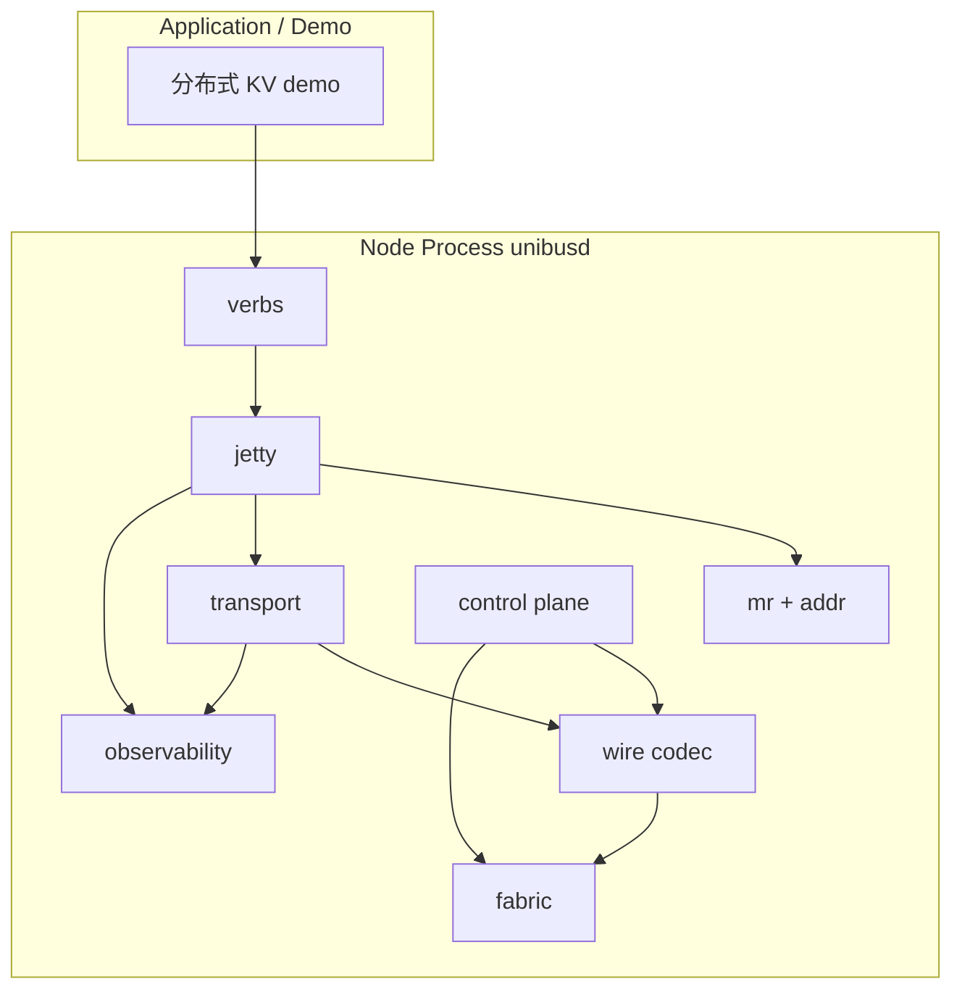

# UniBus Toy 详细设计

| 项 | 值 |
|---|---|
| **对应需求** | [REQUIREMENTS.md](./REQUIREMENTS.md)（最后对齐版本以仓库内文档为准） |
| **文档状态** | Draft（待评审） |
| **最后更新** | 2026-04-11 |

本文在需求文档已拍板的默认决策（Go、YAML、UDP 默认、HTTP `/metrics`、128 bit UB 地址等）基础上，给出**可实现**的模块划分、协议头、状态机与关键算法约定；未写死的字段保留「实现可调整但须回归需求 FR」的弹性。

---

## 1. 设计目标与原则

1. **语义优先于性能**：严格满足 FR-REL（至多一次）、FR-MEM-7（非原子无顺序）、FR-MSG-5（消息序仅 per jetty 对）、FR-FLOW（按 WR 的信用流控）。
2. **逼近用户态软件上限**（与需求 1、2.2 一致）：首版以 **单 reactor + worker** 与 **零拷贝尽量局部化**（如 `[]byte` 视图、池化 buffer）为目标；**不**在首版绑定 RDMA/DPDK，但在 **§12 Fabric 抽象** 预留替换点，便于后续里程碑切换。
3. **控制面 / 数据面隔离**：独立 goroutine 与独立 socket（或独立 QUIC 式多路前的双端口），避免控制 RPC 阻塞数据面。
4. **可测试**：传输层、分片重组、序号去重可纯单元测试；跨进程用脚本起 `unibusd`。

---

## 2. 总体架构

### 2.1 分层（对应 US-8）

| 层 | 包（建议） | 职责 |
|---|---|---|
| **Verb / 事务层** | `pkg/verbs`（或并入 `pkg/jetty`） | 将 `ub_read` / `ub_write` / `ub_send` 等转为 WR，投递 JFS；从 JFC 交付 CQE；同步 API 在此层封装 `Wait` |
| **Jetty 资源层** | `pkg/jetty` | JFS/JFR/JFC 队列、深度、背压；`jetty_id` 分配；`flushed` CQE |
| **MR / 地址** | `pkg/mr`, `pkg/addr` | 本地 MR 表、UB→VA 翻译；对齐检查；权限检查 |
| **可靠传输** | `pkg/transport` | 每对 `(src_node, dst_node)` 的序号、ACK/SACK、重传定时器、去重窗口 |
| **分片与重组** | `pkg/transport/fragment`（子目录） | 大于 PMTU 的 payload 切分；重组超时与内存上限 |
| **网络成帧** | `pkg/wire` 或 `pkg/codec` | 定长头 + payload + 可选扩展头；版本、魔数 |
| **Fabric** | `pkg/fabric` | UDP / TCP / UDS 实现 `Send`/`Recv`；连接表（TCP） |
| **控制面** | `pkg/control` | 成员关系、MR 目录广播/拉取、心跳、节点状态机 |
| **可观测** | `pkg/obs` | 计数器、日志、`/metrics`、tracing 钩子 |
| **进程入口** | `cmd/unibusd` | 读配置、拉起各子系统 |
| **CLI** | `cmd/unibusctl` | 子命令通过本地 HTTP admin 接口调用 `unibusd`（与 `/metrics` 共端口，path 前缀 `/admin`，见 §10） |



### 2.2 并发模型（Q6）

- **Reactor（1 个 goroutine）**：阻塞或 `epoll` 风格事件循环（Go 中可用 `net.Conn` + `SetReadDeadline` 轮询或多 conn per peer）；负责 **所有 fabric 读**、将完整 **帧** 投递到每 peer 的 inbound channel；负责 **定时器 tick**（心跳、RTO）信号。
- **Workers（默认 `runtime.NumCPU()`）**：
  - 从 JFS 取 WR、组帧、交给 transport 发送队列；
  - 处理 inbound 帧：控制面消息、数据面 ACK、数据 payload、完成 JFC；
  - 不得在执行路径上直接阻塞于应用回调；CQE 入队由 worker 完成。
- **顺序保证**：同一 `(src_jetty_id, dst_jetty_id)` 的 **消息** 有序，在 **transport 层按 jetty 对建子队列** 或在 **jetty 层串行化 send 路径** 二选一；详细设计推荐 **jetty 层 per-dst 串行化 + transport 每 peer 总序**，避免 TCP 多流乱序（若未来一连接多 jetty）破坏 FR-MSG-5。首版 **建议每 (src_node, dst_node) 一条 TCP 连接或一条 UDP 会话上下文**，消息头带 `src_jetty/dst_jetty`，接收端按 `dst_jetty` 入队。

---

## 3. 标识与地址

### 3.1 128 bit UB 地址（FR-ADDR-1）

内存布局（大端序列化到 on-wire 16 字节）：

| 字段 | 位宽 | 说明 |
|---|---|---|
| PodID | 16 | 配置 `pod_id`，默认 1 |
| NodeID | 16 | 控制面分配，静态配置或 seed 分配 |
| DeviceID | 16 | 首版仅 `MEMORY` device，默认 0 |
| Offset | 64 | **字节**偏移，相对 MR 起始 |
| Reserved | 16 | 填 0；扩展 Tenant/VC |

**MR 与 UB 关系**：注册 MR 时选定 `base_ub_addr`（通常由 `(PodID, NodeID, DeviceID)` + 选定 `offset_base` 组成）；有效区间为 `[base, base+len)`。**FR-ADDR-3**：Offset 空间在节点内由 MR 分配器管理，保证不重叠。

**文本表示**（与 FR-API 示例一致）：`0x{pod}:{node}:{dev}:{off64}:{res}` 共五段十六进制，冒号分隔；`off64` 固定 16 个十六进制字符。

### 3.2 Jetty 标识

- **JettyID**：节点内 `uint32` 自增分配器；**不得**跨节点唯一（跨节点需 `(NodeID, JettyID)`）。
- **对端寻址**：数据面头携带 `dst_node_id` + `dst_jetty_id`；源携带 `src_jetty_id`。

---

## 4. Wire 协议（数据面）

### 4.1 帧类型

`uint8`：

| 值 | 名称 | 方向 | 说明 |
|---|---|---|---|
| 0x01 | `DATA` | 双向 | 携带 verb 或消息 payload 分片 |
| 0x02 | `ACK` | 双向 | 累积 ACK + 可选 SACK 位图 |
| 0x03 | `CREDIT` | 双向 | 通告/更新 WR 级信用 |

控制面帧类型单独枚举（见 §7），**不与数据面混用同一端口**（FR-CTRL-3）。心跳走控制面（`HEARTBEAT` / `HEARTBEAT_ACK`，§7.2），**数据面不承载心跳**——避免 data plane 积压时心跳被阻塞而误判节点失联。

### 4.2 通用帧头（建议 32 字节对齐前 24～32 B）

字段（逻辑顺序，实际打包用 `encoding/binary` BigEndian）：

| 偏移 | 长度 | 字段 |
|---|---|---|
| 0 | 4 | Magic `0x55425459`（"UBTY"） |
| 4 | 1 | Version，首版 `1` |
| 5 | 1 | Type（上表） |
| 6 | 2 | Flags（ACK 请求、分片首/中/尾、是否 imm 等） |
| 8 | 2 | SrcNodeID（`uint16`，与 FR-ADDR-1 NodeID:16 对齐） |
| 10 | 2 | DstNodeID（`uint16`） |
| 12 | 4 | Reserved（首版填 0；高 8 bit 预留源路由扩展偏移，对应 FR-CTRL-5 预留点） |
| 16 | 8 | **StreamSeq**：本 `(src,dst)` 会话单调递增序号（见 §5） |
| 24 | 4 | PayloadLen |
| 28 | 4 | HeaderCRC（可选；首版可 0 表示禁用） |

**DATA 扩展头**（固定 48 B，紧随通用头后；Imm 仅当 `ExtFlags.HAS_IMM` 置位时追加 8 B）：

| 偏移 | 长度 | 字段 | 说明 |
|---|---|---|---|
| 0 | 1 | Verb | `uint8`：`READ_REQ=1` / `READ_RESP=2` / `WRITE=3` / `ATOMIC_CAS=4` / `ATOMIC_FAA=5` / `SEND=6` / `WRITE_IMM=7` |
| 1 | 1 | ExtFlags | `uint8`：bit0=`HAS_IMM`，bit1=`FRAG`，bit2=`ERR_RESP`（回错响应），其余保留 |
| 2 | 2 | Reserved | 填 0，对齐到 4 B |
| 4 | 4 | MRHandle | `uint32`：对端 MR 本地句柄，由 `MR_PUBLISH`（§7.2）下发；无 remote 地址语义时填 0 |
| 8 | 4 | JettySrc | `uint32` |
| 12 | 4 | JettyDst | `uint32` |
| 16 | 8 | Opaque | `uint64`：发送端 `wr_id`；接收端用作分片重组键的一部分（§4.3） |
| 24 | 4 | FragID | `uint32`：同一 WR 的所有分片共享此 ID（即 `Opaque` 低 32 位的快照，便于位运算） |
| 28 | 2 | FragIndex | `uint16`：本片索引，0 起 |
| 30 | 2 | FragTotal | `uint16`：总片数，1 表示无分片 |
| 32 | 16 | UBAddr | 目标 UB 地址；非地址类 verb（SEND）填 0 |
| 48 | 8 | Imm | `uint64`，仅当 `ExtFlags.HAS_IMM` 置位时存在 |

**PMTU**：默认 **1400** 字节 UDP 载荷上限（与需求 9.1 一致）；TCP 路径可使用相同逻辑 PMTU 简化实现。通用头 32 B + DATA 扩展头 48 B = 固定 80 B 头部开销（不含 Imm）。

### 4.3 分片（FR-MEM-6）

- 发送端：`payload > PMTU - 80` 时切分；每片带 **相同 `Opaque`** 与 **`FragIndex` / `FragTotal`**，并设置 `ExtFlags.FRAG`。
- 接收端：按 `(src_node, Opaque)` 作为重组表索引键（选择理由：`Opaque` 已是发送端 `wr_id`，天然对一个 WR 唯一；`StreamSeq` 每片不同不适合作键）；所有片到齐后交付上层。
- **重组超时**：**inactivity** 超时 2s（距离最近一片到达时间），到期释放缓冲并向上报 `UB_ERR_TIMEOUT`；单节点重组缓冲总大小上限 `reassembly_budget_bytes`（默认 64 MiB），超限时拒绝新 WR 的首片并计数 `unibus_reassembly_rejects_total`，已接收的片不变，测试用例须断言无内存泄漏。

---

## 5. 可靠传输（FR-REL）

### 5.1 会话与序号

- **每有序通道**：定义 `ReliableSession` keyed by `(local_node, remote_node, fabric_kind, epoch)`。`epoch` 是 `uint32` 会话代号，见下节"崩溃恢复"。首版 **UDP 与 TCP 各一条会话** 不混用序号；切 fabric 即新会话。
- **StreamSeq**：单调递增 `uint64`，在 **发送端** 每帧 +1。接收端维护 `next_expected` 实现累积确认。
- **去重**：接收端维护大小为 W 的滑动窗口（如 1024）；`seq < next_expected` 且已确认 → 丢弃；`seq` 在窗口内重复 → 丢弃；**绝不再次执行写副作用**（FR-REL-5/6）。

**崩溃恢复（会话 epoch）**：
- 节点启动时生成一个进程级 `local_epoch`（`time.Now().UnixNano()` 低 32 位或 `crypto/rand`），在控制面 `HELLO` 消息里通告。
- 对端收到 `HELLO` 后，若发现 `remote_epoch` 与自己缓存中的不同（意味着对端重启过），**立即**失效旧 `ReliableSession`：未完成 WR 投递 `UB_ERR_LINK_DOWN`，重组表清空，dedup 窗口清空，按新 epoch 建会话。
- 帧头 `Reserved` 4 B 的低 24 bit 首版不使用，高 8 bit 未来若需源路由再启用；epoch 不放在数据面帧头里（控制面交换 epoch 已足够），避免膨胀每帧。
- **副作用**：对端重启期间未收到 ACK 的写会被本地标记为失败，应用感知到 `UB_ERR_LINK_DOWN` 后自行决定是否重试；与 **FR-REL-5 至多一次** 的承诺保持一致（重启=会话结束，不跨 epoch 补发）。

### 5.2 ACK / SACK（FR-REL-2）

- **累积 ACK**：`ack_seq = 最后一个连续已处理 seq`。
- **SACK 简化版**：通用头 `Flags` 的 bit0 = `HAS_SACK`，表示 payload 区携带 **256 bit 位图**（32 B），相对 `ack_seq+1` 的缺失包标记；触发快速重传。
- **ACK 策略**：每收到 N 个包或每 T ms 发送 ACK（可配置），避免纯停等。

**ACK 帧 payload 布局**（紧随通用帧头之后）：

| 偏移 | 长度 | 字段 | 说明 |
|---|---|---|---|
| 0 | 8 | AckSeq | `uint64`，累积已处理的最后 seq |
| 8 | 4 | CreditGrant | `uint32`，顺带通告 credit 数（嵌入式 CREDIT，可省独立 CREDIT 帧） |
| 12 | 4 | Reserved | 填 0 |
| 16 | 32 | SackBitmap | 仅当 `Flags.HAS_SACK` 置位时存在；bit i 表示 `ack_seq+1+i` 是否已收到 |

ACK 帧通用头的 `PayloadLen` = 16（无 SACK）或 48（含 SACK）。

### 5.3 重传与 RTO（FR-REL-3/4）

- 未 ACK 段进入 `retransmit_queue`，每条记录 `first_sent_at`, `rto_deadline`。
- **指数退避**：`RTO = min(RTO_max, RTO_0 * 2^k)`。
- **上限**：超过 `max_retries` → 会话进入 `DEAD`，对该 peer 上所有未完成 WR 投递 `UB_ERR_LINK_DOWN`（FR-FAIL-3 联动）。

### 5.4 读路径重复（FR-REL-6）

- **读请求**去重：接收端维护 LRU 响应缓存 `resp_cache: (src_node, Opaque) → READ_RESP_payload`，容量默认 1024 条、TTL 5s。
  - 首次 `READ_REQ` 到达 → 执行本地读 → 写入缓存 → 发送 `READ_RESP`。
  - 重复 `READ_REQ` 到达 → **从缓存取出 RESP 重发**，**不能**简单丢弃（否则首次 RESP 丢失时请求永久 stuck）。
  - 缓存 miss（已过期）：允许重新执行本地读——读是幂等的，重复执行无副作用。
  - 缓存命中路径走 worker goroutine，与本地读路径共享读锁即可，**禁止**阻塞读线程等待去重锁链导致死锁。
- **读响应**重复：`READ_RESP` 带相同 `Opaque`；发送端若对应 WR 已完成则直接忽略。

### 5.5 写路径幂等（FR-REL-6）

- 对 `WRITE` / `WRITE_IMM` / `ATOMIC_*`：**以 StreamSeq 或 (Opaque + 首次执行表)** 保证同一数据帧只应用一次；重复帧仅回 ACK。

---

## 6. 流控（FR-FLOW）

- **信用粒度**：**WR 个数**（需求已明确）。
- **初始窗口协商**：两端配置各自的 `flow.initial_credits`（如 64）；`HELLO` 消息里通告本端 `initial_credits`，会话建立后 **双方各自**以 `min(local_initial, remote_initial)` 作为对端发送窗口上限。首次数据面写在应用 post WR 之前，若尚未收到对端 `HELLO`，则发送端阻塞等待（与控制面 bootstrap 语义一致）。
- **信用返还**：接收端在应用 **poll/取走 CQE** 时（即 CQE 被消费，与 FR-FLOW-1「消费一个 CQE 返还 1 credit」一致），本地 `credits_to_grant++`，并通过 `CREDIT` 帧或嵌入 ACK 通告发送端；**注意**：credit 返还时机是 CQE 被取走，而非内部交付到 JFC——两者存在时间差，应用积压 CQE 不取则自然形成背压。
- **背压（FR-FLOW-2）**：接收端 JFR 或 JFC 槽紧张时，**停止返还** credit（`credits_to_grant` 保持 0，不发负向 CREDIT 帧）；发送端未收到新 grant，`credits` 归零后停止取新 WR（**禁止**无限堆内存）；与 **FR-JETTY-3** 一致：JFC 高水位满时同样阻止新发送。
- **AIMD（FR-FLOW-3）**：在检测到持续 `NO_CREDIT` 或 RTT 上升时减小窗口；恢复时线性增（具体参数放配置文件）。

---

## 7. 控制面（FR-CTRL）

### 7.1 传输

- **独立监听端口**：`control_listen: <addr>`，TCP 优先（消息小、需可靠）；UDP 亦可但需自建 ACK（首版推荐 TCP）。
- **Static 模式**：配置列出所有节点；启动顺序任意；**全连接控制 TCP mesh** 或 **星形连 hub**（二选一，推荐 **星形减 O(N²)**：指定 `hub_node_id`，非 hub 仅连 hub，由 hub 转发广播）。
- **Seed 模式**：新节点连 seed → `JOIN` → seed `MEMBER_SNAPSHOT` 下发 → 新节点再与必要 peer 建立数据面会话（全连接则连所有人）。

### 7.2 消息类型（示例）

| 类型 | 内容 |
|---|---|
| `HELLO` | NodeID, 数据面地址, 版本, `local_epoch`（§5.1）, `initial_credits`（§6） |
| `MEMBER_UP` / `MEMBER_DOWN` | 节点状态 |
| `MR_PUBLISH` / `MR_REVOKE` | `owner_node`, `mr_handle`（owner 本地 uint32 句柄，供 DATA 扩展头 O(1) 查表）, UB 区间起始/长度, `perms` |
| `HEARTBEAT` / `HEARTBEAT_ACK` | 时间戳；走控制面 TCP 共用连接，**不**独立线程（FR-CTRL-3） |

**FR-CTRL-4**：`last_seen` + 超时（默认 1s * 3）将节点标为 `DOWN`，广播 `MEMBER_DOWN`，并通知 transport 失效该 peer 会话。

### 7.3 MR 目录（FR-MR-4）

**首版推荐**：**广播式 `MR_PUBLISH`**（简单，符合 M2）；可选增加 `MR_QUERY`（按需拉取）作为优化。与 **FR-ADDR-4** 一致：广播仅 **元数据**，不含 VA。

**注册同步语义**：
- `ub_mr_register` **本地**同步返回 UB 地址 + handle；此时本地 MR 已可用。
- 控制面 `MR_PUBLISH` 异步投递（fire-and-forget 至 hub / 全网），远端可见性是 **最终一致**。
- **应用契约**：注册完成到远端首次可访问之间存在"可见窗口"（最长约一个控制面 RTT）；应用若需等远端感知，应主动 `ub_send` 一条同步消息作为 barrier，或重试直到 `ub_read` 不返 `UB_ERR_ADDR_INVALID`。
- 远端在 MR 可见前发起的访问：返回 `UB_ERR_ADDR_INVALID`，应用应视作可重试错误。

### 7.4 Fan-out（FR-CTRL-6）

- API 层提供 `ub_notify_many(dst_list []JettyAddr, ...)`（命名随意），内部 **for each dst** 调用单播路径；**独立计数器** `fanout_ok/err`；**不**保证顺序。

---

## 8. Jetty 与 Verb 路径

### 8.1 队列参数

- 配置项：`jfs_depth`, `jfr_depth`, `jfc_depth`；满足 **FR-JETTY-3**：当 `unacked_cqe >= jfc_high_water` 时，`Send` 路径阻塞或返回 `UB_ERR_NO_RESOURCES`（**必须**文档化选择；推荐异步 API 返回 `EAGAIN` 风格 + 同步 API 阻塞带超时）。

### 8.2 WR → CQE

- 每个 WR 分配 `wr_id`（uint64）；完成时 CQE 带 `wr_id`, `status`, `imm`（若有）, `byte_len`。
- **flushed**（FR-JETTY-5）：`jetty_close` 时对未完成 WR 批量生成错误完成，`status = UB_ERR_FLUSHED`（需求 FR-ERR 已新增该码）。

### 8.3 内存 verb 与 Jetty

- 需求 FR-MEM-5：内存操作通过 JFC；实现上 **允许** 使用「内部 jetty」或显式 `ub_jetty_default()`；详细设计推荐 **每线程或每节点一个默认 Jetty**，CLI/bench 可覆盖。

### 8.4 消息有序与 JFS 并发（FR-MSG-5）

- **JFS 并发语义**：**多生产者 / 单消费者（MPSC）**。多个 app goroutine 可并发 `ub_send` / `ub_post_send` 同一 Jetty；实现用 Go 标准库 `sync.Mutex` 保护一个环形 buffer，或用无锁 MPSC 队列（如 `atomic.Pointer` + treiber stack 变种）。消费者固定为该 Jetty 绑定的一个 worker goroutine，取出顺序 = 入队顺序。
- **同 (src, dst) 顺序**：对 **同一** `(dst_node, dst_jetty)` 的 WR 在 **src** 侧以入队顺序串行化组帧和交付 transport；在 **dst** 侧按 `StreamSeq` 重排后入对应 JFR，匹配 `post_recv` 顺序。
- **不同 dst 之间不保证顺序**：与 FR-MSG-5 一致，两个 dst_jetty 之间的 WR 可以在 worker 间并行处理。

### 8.5 跨语义顺序

- **不**在协议层提供 fence；若 demo 需要，用 `write_with_imm` 或应用层协议序号。

### 8.6 MR 注销时 inflight 处理（FR-ADDR-5）

`ub_mr_deregister(handle)` 是 **同步** API，调用方可以在返回后安全 `free(buf)`。实现细节：

1. **状态机**：MR 有三态 `ACTIVE` → `REVOKING` → `RELEASED`。
2. **引用计数**：MR 维护 `inflight_refs atomic.Int64`，在 **通过权限检查后、实际访问 buffer 前** `+1`，操作完成（或错误返回）后 `-1`。
3. **deregister 流程**：
   - 原子置 `state = REVOKING`（后续新到达帧会 short-circuit 到错误路径，**不再** `+1`）。
   - 发送 `MR_REVOKE` 广播（fire-and-forget 至 hub / 全网）。
   - **阻塞等待** `inflight_refs` 归零，或超时 `deregister_timeout_ms`（默认 500ms）→ 超时返回 `UB_ERR_TIMEOUT`，caller 决定是否重试（此时 `free(buf)` **不安全**）。
   - `inflight_refs == 0` 后置 `state = RELEASED`，释放本地 MR 表项，返回 `UB_OK`。
4. **新到达帧处理**：`state == REVOKING/RELEASED` 时，接收端返回 `ERR_RESP` 帧（`ExtFlags.ERR_RESP=1`，`status = UB_ERR_ADDR_INVALID`），**不** `inflight_refs++`、**不**访问 buffer。
5. **本地 WR 未发出**：MR 已进入 `REVOKING` 时，直接在 JFC 生成 `UB_ERR_ADDR_INVALID` CQE，不发送网络帧。
6. **peer 端缓存**：peer 收到 `MR_REVOKE` 后立即在本地 MR 元数据缓存中标记该区间无效；后续 WR 在本地就会被短路拒绝，不会再发出网络帧，从而加速 `inflight_refs` 归零。

---

## 9. 错误码映射（FR-ERR）

全路径统一 `ub_status`；transport / mr / jetty 各层映射到需求表中的码。扩展内部错误可用 `UB_ERR_INTERNAL`（若需求未列，可在实现中保留，CLI 显示为字符串）。

---

## 10. 可观测（FR-OBS）

- **计数器**（Prometheus gauge/counter 名称示例）：`unibus_tx_pkts_total`, `unibus_rx_pkts_total`, `unibus_retrans_total`, `unibus_drops_total`, `unibus_cqe_ok_total`, `unibus_cqe_err_total`, `unibus_mr_count`, `unibus_jetty_count`, `unibus_peer_rtt_ms`（histogram 可选）。
- **`/metrics`**：默认绑定 `127.0.0.1:9090`（可配置），**仅本机** 以降低 toy 暴露面；需要远程采集时显式 `0.0.0.0`。
- **Tracing（FR-OBS-4）**：定义接口 `type Tracer interface { Span(ctx, name string) func()` }`；默认 `noopTracer`。

---

## 11. 配置（YAML 草案）

```yaml
pod_id: 1
node_id: 42
# 本节点是否是 hub：程序运行时由 `node_id == control.hub_node_id` 直接判断，
# 不在配置里单独维护 role 字段，避免双字段相互矛盾。
control:
  listen: "0.0.0.0:7900"
  bootstrap: static           # static | seed
  peers: ["10.0.0.1:7900", "10.0.0.2:7900"]  # static 模式：列出所有节点地址
  # seed_addrs: ["10.0.0.1:7900"]             # seed 模式：报到地址（与 peers 二选一）
  hub_node_id: 0              # 星形拓扑时指定 hub 的 NodeID；0 = 全连接模式（无 hub）
data:
  listen: "0.0.0.0:7901"
  fabric: udp             # udp | tcp | uds
  mtu: 1400
mr:
  deregister_timeout_ms: 500    # §8.6：ub_mr_deregister 等待 inflight 归零的上限
transport:
  rto_ms: 200
  max_retries: 8
  sack_bitmap_bits: 256
  reassembly_budget_bytes: 67108864   # §4.3：64 MiB 重组缓冲总上限
flow:
  initial_credits: 64
jetty:
  jfs_depth: 1024
  jfr_depth: 1024
  jfc_depth: 1024
  jfc_high_watermark: 896
obs:
  metrics_listen: "127.0.0.1:9090"
heartbeat:
  interval_ms: 1000
  fail_after: 3
```

---

## 12. Fabric 抽象（扩展点）

```go
type Fabric interface {
    Kind() string // "udp" | "tcp" | "uds"
    // Listen 启动本端监听，返回 Listener 供 Accept 接受入站会话。
    // UDP 实现：Listen 绑定本地 UDPConn；Accept 从 "首次见到的 peer 地址"
    //          触发并返回一个以该地址为对端的 Session（demux 由 fabric 层完成）。
    // TCP / UDS：对应标准 Listen + Accept 语义。
    Listen(local PeerAddr) (Listener, error)
    // Dial 主动建立到远端 data 地址的会话；UDP 可视为无连接 sendto 封装。
    Dial(peer PeerAddr) (Session, error)
}

type Listener interface {
    // Accept 阻塞直到有新会话到来或 ctx 取消。
    Accept(ctx context.Context) (Session, error)
    Close() error
}

type Session interface {
    Peer() PeerAddr
    Send(ctx context.Context, pkt []byte) error
    // Recv 返回的 []byte 归 Session 所有；调用方必须在下次 Recv 调用前完成读取或自行拷贝。
    // transport 层应通过 sync.Pool 复用 buffer 以避免频繁分配。
    Recv(ctx context.Context) ([]byte, error)
    Close() error
}
```

- **UDP**：`ReliableSession` 完全在 `pkg/transport`；fabric 层用单条 `UDPConn` + `src_addr → Session` map 做 demux。
- **TCP / UDS**：`Listener` 接收连接后用 `HELLO` 交换 `(NodeID, epoch)`，完成后把 `Session` 交给 transport。**推荐 TCP 仍走 transport 统一路径**（帧格式 + 可靠逻辑一致），只是在 TCP 下丢包概率为 0，RTO 重传几乎不触发，连接断开视作 `UB_ERR_LINK_DOWN`。

---

## 13. 分布式 KV Demo（Q4）映射

| 能力 | UB 能力 |
|---|---|
| put / get | `ub_write` / `ub_read` 到 owner 节点 MR |
| cas 更新 | `ub_atomic_cas` |
| 通知副本 | `ub_send` 或 `write_with_imm` |
| 故障 | 节点 DOWN 后 client 收到 `UB_ERR_LINK_DOWN`，CLI 切换 |

---

## 14. 测试计划（对齐需求 6 / M2–M5）

| 类型 | 内容 |
|---|---|
| 单元 | 分片重组、序号窗口、SACK 解码、credit 窗口、YAML 解析、MR 引用计数（§8.6）、读重复缓存（§5.4） |
| 集成 | 两进程本机 UDP/TCP 互打；1% 随机丢包注入（udp wrapper），断言 FR-REL-5 至多一次 |
| 并发 | 多 goroutine `atomic_cas` 同一 UB 字；多 goroutine 并发 `ub_send` 同一 JFS（§8.4 MPSC） |
| 故障注入 | (a) 被动 kill peer → 本端 ≤5s 感知并把未完成 WR 置 `UB_ERR_LINK_DOWN`；(b) peer 重启（换新 epoch）→ 本端旧 session 正确失效；(c) `ub_mr_deregister` 期间 peer 仍在发 WRITE → ref-count 归零后才返回 |
| 性能 | `unibusctl bench write --size 1024` 本机 loopback 吞吐 ≥ 50K ops/s；端到端延迟 P50 < 200μs（需求非功能指标） |
| E2E | shell 脚本起 3×`unibusd` + `unibusctl` 断言 `node list` / `mr list`；跑完 KV demo |

---

## 15. 里程碑与代码交付映射

| 里程碑 | 主要代码落点 |
|---|---|
| M1 | `pkg/control`, `cmd/unibusd`, `cmd/unibusctl node` |
| M2 | `pkg/mr`, `pkg/addr`, `pkg/transport` + verbs read/write/atomic |
| M3 | `pkg/jetty`, send/recv/imm |
| M4 | 完整 FR-REL + FR-FLOW + FR-FAIL |
| M5 | `pkg/obs`, bench, KV demo |

---

## 16. 公开评审清单（给 reviewer）

1. **TCP 上是否重复实现可靠层**：已推荐「帧格式+完成模型一致，TCP 下 RTO 近乎不触发」（§12）。若 reviewer 认为应追加 FR 明确 fabric 差异，告知我补一条。
2. **控制面星形 vs 全连接**：N=64 时 hub 单点故障对 toy 是否可接受？（§7.1 默认星形可切换全连接）
3. **默认 Jetty 与显式 Jetty**：§8.3 推荐「每节点一个默认 Jetty」但未强制；是否在 SDK 文档里硬性要求 verb 必须显式传 Jetty？
4. **读重复缓存**（§5.4）已强制 LRU，默认 1024 条 / TTL 5s，是否需要改为更小或做成可配置？
5. **MR 注销同步等待**（§8.6）默认 500ms 超时是否合理？更长可能拖累控制面，更短可能让正常 inflight 被误判超时。
6. **会话 epoch** 来源（§5.1）：用 `UnixNano` 还是 `crypto/rand`？前者在 1ns 分辨率下重启极难重复，后者更"正确"但多一行代码。
7. **HELLO 交换**里 `initial_credits` 是否应该对称（两端相同）还是允许各自不同取 min（§6 目前选 min）。

---

## 17. 参考资料

与需求文档 [REQUIREMENTS.md](./REQUIREMENTS.md) 中「参考资料」一节保持一致；实现时不依赖外链内容的正确性。
