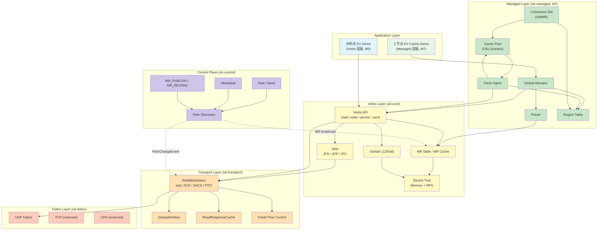
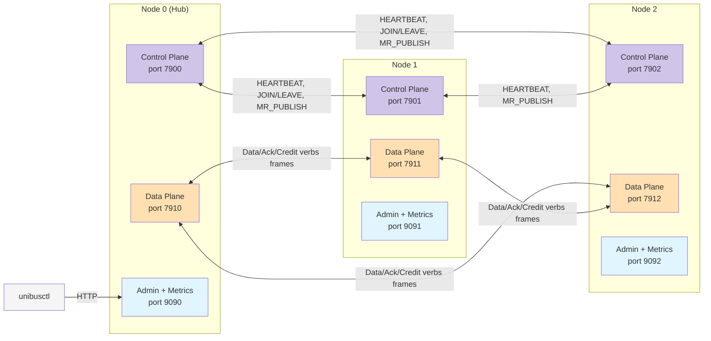
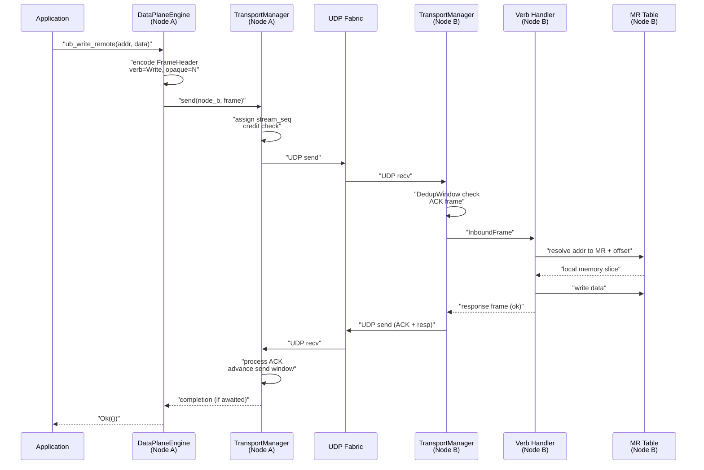
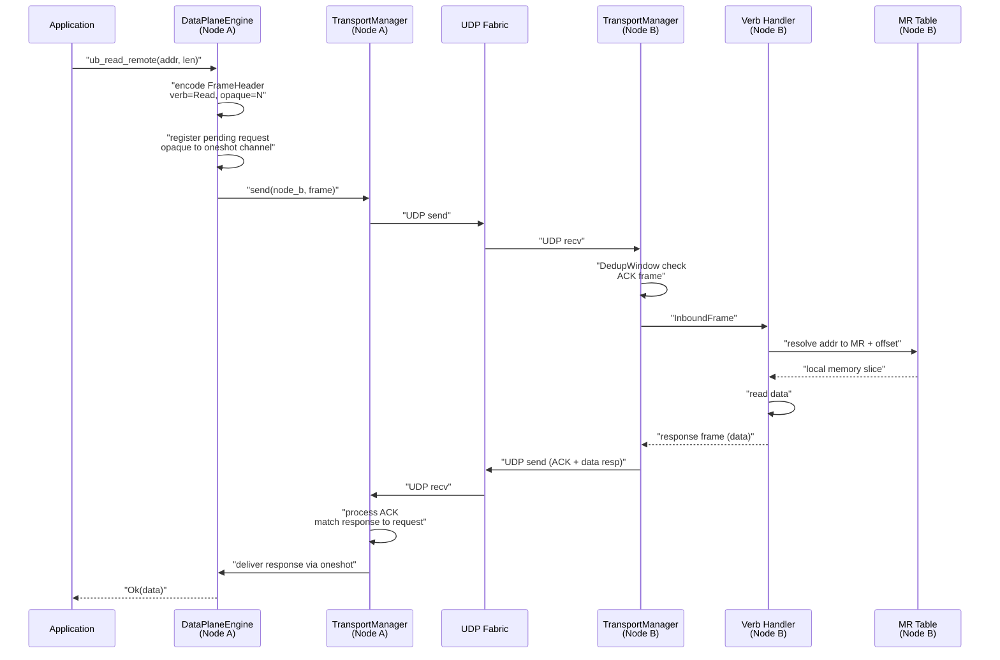
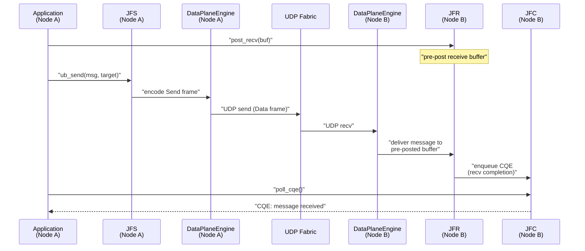
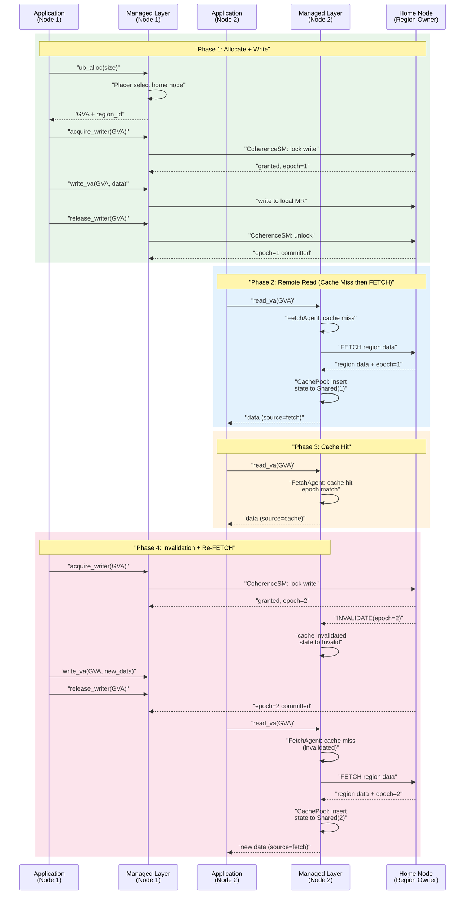
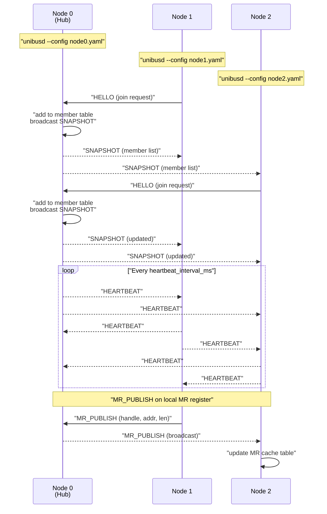
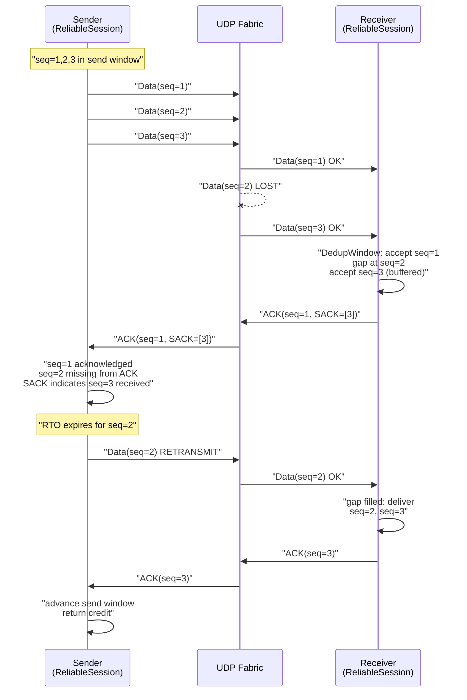

# UniBus Toy

一个纯软件实现的、面向 Scale-Up 域的统一编址互联协议玩具实现。灵感来源：华为灵衢（UnifiedBus / UB）。

---

## 项目状态

**M1–M7 全部完成。** 64/64 强制需求 + 6/6 FR-GVA 可选需求全部实现，254 单元测试 + 6 套 E2E 测试全部通过。

| 指标 | 值 |
|---|---|
| 代码规模 | 16,020 行 Rust |
| Crate 数量 | 10 |
| 单元测试 | 254 |
| E2E 测试脚本 | 6 (M1–M5 + M7) |
| Admin API | 31 endpoints |
| Prometheus 指标 | 15 项 |
| 强制需求覆盖 | 64/64 (100%) |

---

## 背景

AI 大模型时代，"Scale-Up 域"（一个紧耦合的计算单元集合，对外像一台超大服务器）成为新的设计中心。华为灵衢（UB）协议把 CPU / NPU / GPU / 内存 / SSD / 交换芯片统一在一套互联协议下，做到**全局统一编址 + 内存语义/消息语义融合 + 对等访问**，并在海思芯片里做了硬件实现。

本项目用**纯软件**方式，做一个"麻雀虽小五脏俱全"的 UB-like 协议 Toy，以**在软件范畴内尽量逼近性能上限**为目标，重点走通从地址翻译到端到端语义的全链路。

---

## 功能概览

| 能力 | 说明 |
|---|---|
| **统一编址** | 128 bit UB 地址，`[PodID:16 \| NodeID:16 \| DeviceID:16 \| Offset:64 \| Reserved:16]`，全局唯一 |
| **内存语义（单边）** | `ub_read` / `ub_write` / `ub_atomic_cas` / `ub_atomic_faa`，远端 CPU 不参与 |
| **消息语义（双边）** | `ub_send` / `ub_recv` / `ub_write_with_imm` |
| **Jetty 抽象** | 无连接的 JFS（发送队列）/ JFR（接收队列）/ JFC（完成队列）|
| **多类型 Device** | CPU 内存 + 模拟 NPU 显存共存，远端访问完全透明 |
| **可靠传输** | 序号 + ACK/SACK + RTO 重传 + DedupWindow 去重 + ReadResponseCache 读去重 |
| **流控** | 信用（credit）流控 + 速率反压 |
| **故障检测** | 心跳 + EWMA RTT 动态 RTO + 秒级链路故障感知 |
| **CLI / SDK** | `unibusd` 守护进程 + `unibusctl` 命令行 + HTTP admin API |
| **可观测** | 日志 / 计数器 / `tracing` span / HTTP `/metrics`（Prometheus 格式）|
| **Managed 层** | 全局虚拟地址 + Placer 自动放置 + Region 级缓存 + SWMR 一致性协议 + INVALIDATE/re-FETCH |
| **分布式 KV Demo** | Verbs 层 KV (M5) + Managed 层 KV cache (M7) |

---

## 架构

### 分层架构图



- **M1–M5 可独立交付演示**：verbs API（`ub_read/write/atomic/send` + NodeID 编址）不依赖 managed 层。
- **Managed 层是叠加上层**：`ub_alloc` 内部调用 verbs 层接口，verbs 层不感知 managed 层存在。
- **控制面横跨两层**：verbs 的 `MR_PUBLISH/HEARTBEAT` 与 managed 的 `ALLOC_REQ/INVALIDATE` 共用同一 `ub-control` 通道。
- **控制/数据面隔离**：独立 tokio task + 独立 socket，控制 RPC 不阻塞数据路径。

### 集群拓扑与双面分离



### Verbs 层远程写数据流



### Verbs 层远程读数据流



### Jetty 消息发送流程



### Managed 层 SWMR 一致性生命周期



### 控制面集群形成流程



### 可靠传输与丢包恢复流程



---

## Workspace Crates

| Crate | 行数 | 测试 | 职责 |
|---|---|---|---|
| `ub-core` | ~3,260 | 77 | 地址、MR、Device（CPU + NPU）、Jetty、verbs 同步 API |
| `ub-control` | ~2,498 | 31 | 控制面消息、成员管理、心跳、MR 目录广播 |
| `ub-transport` | ~2,203 | 49 | 可靠传输、DedupWindow、ReadResponseCache、ReliableSession |
| `ub-dataplane` | ~1,790 | 3 | 数据面引擎、verbs 远程调用、TransportManager 集成 |
| `ub-managed` | ~2,640 | 65 | GlobalAllocator、Placer、RegionTable、CoherenceSM、CachePool、FetchAgent |
| `unibusd` | ~1,620 | — | 守护进程入口、HTTP admin、Managed 层接线 |
| `unibusctl` | ~760 | — | CLI 工具、子命令通过 HTTP admin API 交互 |
| `ub-wire` | ~511 | 11 | 线协议编解码（FrameHeader + Data/Ack/Credit） |
| `ub-obs` | ~247 | 3 | 可观测（metrics 注册 + Prometheus 渲染） |
| `ub-fabric` | ~305 | — | UDP Fabric/Session trait 实现 |

---

## 技术选型

| 项 | 选择 |
|---|---|
| 实现语言 | **Rust + tokio**（多线程 runtime） |
| 配置格式 | YAML (serde + serde_yaml) |
| 默认 Fabric | UDP（Fabric trait 预留 TCP / UDS 扩展点） |
| 线协议 | 手写 `byteorder` 二进制编解码，不依赖 protobuf |
| 可观测端点 | HTTP `/metrics`（Prometheus 文本格式）+ `/admin/*`（管理 API） |
| HTTP 框架 | axum |
| 同步原语 | parking_lot (Mutex/RwLock) + tokio::sync (async) |
| 锁 free 队列 | crossbeam::queue::ArrayQueue |
| Metrics | metrics + metrics-exporter-prometheus |
| 错误处理 | thiserror + anyhow |
| Benchmark | criterion |

---

## 里程碑

| 里程碑 | 主要内容 | 状态 |
|---|---|---|
| **M1** | `ub-fabric` UDP；`ub-control` 心跳与节点状态机；`unibusd` 骨架 | **DONE** |
| **M2** | `ub-core` MR / addr / device（CPU + NPU 模拟后端）；verbs read/write/atomic | **DONE** |
| **M3** | Jetty / send / recv / write_with_imm | **DONE** |
| **M4** | 可靠传输（FR-REL）+ 流控（FR-FLOW）+ 故障检测（FR-FAIL）| **DONE** |
| **M5** | 可观测（FR-OBS）+ 分布式 KV demo | **DONE** |
| **M6** | Verbs 层特性补全（fan-out、DeviceProfile、JFC poll 优化等） | **DONE** |
| **M7** | Managed 层：GVA + Placer + Region cache + SWMR 一致性 + KV cache demo | **DONE** |

---

## 需求覆盖

### FR-* 需求达成度

| 类别 | 总数 | 完成 | 说明 |
|---|---|---|---|
| FR-ADDR (编址) | 5 | 5 | 128-bit UB 地址 + 跨节点翻译 + 多设备编址 |
| FR-MR (内存区域) | 5 | 5 | 注册/注销/权限/广播/缓存 |
| FR-MEM (内存语义) | 7 | 7 | read/write/atomic_cas/atomic_faa + 对齐 + 线性化 |
| FR-MSG (消息语义) | 5 | 5 | send/recv/CQE/write_with_imm/per-jetty 序 |
| FR-JETTY | 5 | 5 | 无连接 JFS/JFR/JFC |
| FR-CTRL (控制面) | 6 | 6 | 加入/心跳/下线/MR目录/成员查询/广播 |
| FR-REL (可靠传输) | 6 | 6 | 去重/序号ACK/重传/SACK/读去重/丢包恢复 |
| FR-FLOW (流控) | 3 | 3 | credit/阻塞/反压 |
| FR-FAIL (故障) | 3 | 3 | 心跳超时/链路故障/上层通知 |
| FR-API (接口) | 3 | 3 | 同步verbs/HTTP admin/CLI |
| FR-OBS (可观测) | 4 | 4 | 计数器/Prometheus/tracing |
| FR-DEV (设备) | 7 | 6+1NG | Device trait/memory/NPU/多设备/能力/热插拔; FR-DEV-7(真NPU)为不做项 |
| FR-GVA (全局地址) | 6 | 6 | alloc/free/翻译/Placer/SWMR/INVALIDATE |
| **合计** | **65** | **64+1NG** | **所有强制需求 100% 覆盖** |

### 已知差距（低优先级）

| 事项 | 说明 |
|---|---|
| TCP/UDS Fabric | Fabric trait 已定义，仅有 UDP 实现 |
| 分片/重组 | 线协议预留 FRAG 字段，传输层无实际逻辑 |
| SACK 快速重传 | `dup_ack_count` 字段存在，未接入主发送循环 |
| AIMD 拥塞控制 | `cwnd` 字段存在，未实现 AIMD 窗口调整 |
| ub_try_local_map | GVA → 本地 MR 优化路径未实现 |
| ub_sync | 屏障原语未实现 |
| 故障注入 E2E | kill peer / restart / MR deregister 场景未测试 |
| 性能基准 | criterion 框架已搭建，未产出正式数据 |

---

## 快速上手

### 环境要求

- Rust 1.75+ (edition 2021)
- Linux (已验证: EL8 kernel 4.18+)
- Python 3 (E2E 测试 JSON 解析)

### 构建

```bash
# Debug 构建
cargo build

# Release 构建（推荐，E2E 测试和性能基准使用 release）
cargo build --release
```

### 运行单元测试

```bash
# 全量测试
cargo test --workspace

# 单 crate 测试
cargo test -p ub-core
cargo test -p ub-managed
cargo test -p ub-transport
```

### 运行 E2E 测试

详见下方 [部署与测试](#部署与测试) 章节。

---

## 部署与测试

### 方式一：运行全量 E2E 测试脚本

项目提供 6 套 E2E 测试脚本，自动编译、启动集群、执行验证、清理进程：

```bash
# M1-M4 基础功能（2-3 节点）
bash tests/m1_e2e.sh
bash tests/m2_e2e.sh
bash tests/m3_e2e.sh
bash tests/m4_e2e.sh

# M5 Verbs 层全功能 + KV demo（3 节点）
bash tests/m5_e2e.sh

# M7 Managed 层 + SWMR 一致性（3 节点，独立端口）
bash tests/m7_e2e.sh
```

每套脚本流程：编译 release → 启动 unibusd 集群 → 等待集群形成 → 执行功能验证 → 清理进程。脚本退出码 0 表示全部通过。

### 方式二：手动部署 3 节点集群

#### 1. 构建 release 二进制

```bash
cargo build --release
```

产物位于 `target/release/unibusd` 和 `target/release/unibusctl`。

#### 2. 启动 Verbs 层集群（M1–M5）

使用 `configs/node{0,1,2}.yaml`，admin 端口分别为 9090/9091/9092：

```bash
# 终端 1 — node0 (hub)
./target/release/unibusd --config configs/node0.yaml

# 终端 2 — node1
./target/release/unibusd --config configs/node1.yaml

# 终端 3 — node2
./target/release/unibusd --config configs/node2.yaml
```

#### 3. 启动 Managed 层集群（M7）

使用 `configs/m7_node{0,1,2}.yaml`，admin 端口分别为 9190/9191/9192，`managed.enabled: true`：

```bash
./target/release/unibusd --config configs/m7_node0.yaml
./target/release/unibusd --config configs/m7_node1.yaml
./target/release/unibusd --config configs/m7_node2.yaml
```

#### 4. 等待集群形成

```bash
# 等待约 6 秒让心跳完成集群发现
sleep 6

# 验证：所有节点应看到 3 个成员
curl -s http://127.0.0.1:9090/admin/node/list | python3 -m json.tool
```

#### 5. 使用 unibusctl 交互

```bash
# 查看集群成员
./target/release/unibusctl --addr http://127.0.0.1:9090 node-list

# 注册 MR
./target/release/unibusctl --addr http://127.0.0.1:9090 mr-list

# 创建 Jetty
./target/release/unibusctl --addr http://127.0.0.1:9090 jetty-create

# 查看 metrics
curl http://127.0.0.1:9090/metrics
```

#### 6. 使用 HTTP Admin API 交互

```bash
# 节点列表
curl -s http://127.0.0.1:9090/admin/node/list

# MR 列表
curl -s http://127.0.0.1:9090/admin/mr/list

# 注册 MR
curl -s -X POST http://127.0.0.1:9090/admin/mr/register \
  -H "Content-Type: application/json" \
  -d '{"size":1048576,"access":"rw"}'

# 远程写
curl -s -X POST http://127.0.0.1:9091/admin/verb/write \
  -H "Content-Type: application/json" \
  -d '{"addr":"0x00010000000000000000000000000000","data":[72,101,108,108,111]}'

# 远程读
curl -s -X POST http://127.0.0.1:9091/admin/verb/read \
  -H "Content-Type: application/json" \
  -d '{"addr":"0x00010000000000000000000000000000","len":5}'
```

### 方式三：Managed 层 (M7) 操作步骤

以下演示完整的 SWMR 一致性生命周期：分配 → 写 → 远端缓存读 → 失效 → 重取。

```bash
ADMIN0="http://127.0.0.1:9190"
ADMIN1="http://127.0.0.1:9191"
ADMIN2="http://127.0.0.1:9192"

# 1. 在 node1 分配一个 region
ALLOC_RESP=$(curl -s -X POST "$ADMIN1/admin/region/alloc" \
  -H "Content-Type: application/json" \
  -d '{"size":4096,"latency_class":"normal","capacity_class":"small"}')
VA=$(echo "$ALLOC_RESP" | python3 -c "import sys,json; print(json.load(sys.stdin)['va'])")
REGION_ID=$(echo "$ALLOC_RESP" | python3 -c "import sys,json; print(json.load(sys.stdin)['region_id'])")
HOME_NODE=$(echo "$ALLOC_RESP" | python3 -c "import sys,json; print(json.load(sys.stdin)['home_node_id'])")

# 2. 在 node1 获取写锁
curl -s -X POST "$ADMIN1/admin/verb/acquire-writer" \
  -H "Content-Type: application/json" \
  -d "{\"va\":\"$VA\"}"

# 3. 写入数据 "Hello"
curl -s -X POST "$ADMIN1/admin/verb/write-va" \
  -H "Content-Type: application/json" \
  -d "{\"va\":\"$VA\",\"offset\":0,\"data\":[72,101,108,108,111]}"

# 4. 释放写锁
curl -s -X POST "$ADMIN1/admin/verb/release-writer" \
  -H "Content-Type: application/json" \
  -d "{\"va\":\"$VA\"}"

# 5. 在 node2 注册远程 region 并读取（cache miss → FETCH）
curl -s -X POST "$ADMIN2/admin/region/register-remote" \
  -H "Content-Type: application/json" \
  -d "{\"region_id\":$REGION_ID,\"home_node_id\":$HOME_NODE,\"device_id\":0,\"mr_handle\":0,\"base_offset\":0,\"len\":4096,\"epoch\":0}"

curl -s -X POST "$ADMIN2/admin/verb/read-va" \
  -H "Content-Type: application/json" \
  -d "{\"va\":\"$VA\",\"offset\":0,\"len\":5}"
# → source=fetch, data=[72,101,108,108,111]

# 6. 在 node2 再次读取（cache hit）
curl -s -X POST "$ADMIN2/admin/verb/read-va" \
  -H "Content-Type: application/json" \
  -d "{\"va\":\"$VA\",\"offset\":0,\"len\":5}"
# → source=cache, data=[72,101,108,108,111]

# 7. node1 再次获取写锁（使 node2 缓存失效）
ACQ_RESP=$(curl -s -X POST "$ADMIN1/admin/verb/acquire-writer" \
  -H "Content-Type: application/json" \
  -d "{\"va\":\"$VA\"}")
NEW_EPOCH=$(echo "$ACQ_RESP" | python3 -c "import sys,json; print(json.load(sys.stdin)['epoch'])")

# 8. 在 node2 执行 invalidation
curl -s -X POST "$ADMIN2/admin/region/invalidate" \
  -H "Content-Type: application/json" \
  -d "{\"region_id\":$REGION_ID,\"new_epoch\":$NEW_EPOCH}"

# 9. node1 写入新数据 "World"
curl -s -X POST "$ADMIN1/admin/verb/write-va" \
  -H "Content-Type: application/json" \
  -d "{\"va\":\"$VA\",\"offset\":0,\"data\":[87,111,114,108,100]}"

curl -s -X POST "$ADMIN1/admin/verb/release-writer" \
  -H "Content-Type: application/json" \
  -d "{\"va\":\"$VA\"}"

# 10. node2 再次读取（re-FETCH，得到新数据）
curl -s -X POST "$ADMIN2/admin/verb/read-va" \
  -H "Content-Type: application/json" \
  -d "{\"va\":\"$VA\",\"offset\":0,\"len\":5}"
# → source=fetch, data=[87,111,114,108,100]
```

### 方式四：分布式 KV Demo

```bash
ADMIN0="http://127.0.0.1:9090"
ADMIN1="http://127.0.0.1:9091"

# 1. 在 node0 初始化 KV store
curl -s -X POST "$ADMIN0/admin/kv/init" \
  -H "Content-Type: application/json" \
  -d '{"slots":16,"device_kind":"memory"}'

# 2. 写入 KV
curl -s -X POST "$ADMIN0/admin/kv/put" \
  -H "Content-Type: application/json" \
  -d '{"ub_addr":"0x...","slot":0,"key":"hello","value":"world"}'

# 3. 读取 KV
curl -s -X POST "$ADMIN1/admin/kv/get" \
  -H "Content-Type: application/json" \
  -d '{"ub_addr":"0x...","slot":0,"key":"hello"}'

# 4. 原子 CAS
curl -s -X POST "$ADMIN0/admin/kv/cas" \
  -H "Content-Type: application/json" \
  -d '{"ub_addr":"0x...","slot":0,"key":"hello","expect_version":1,"value":"updated"}'
```

### 性能基准

```bash
# 运行 criterion benchmark（需要 release 构建）
cargo bench
```

Benchmark 框架已搭建（`crates/ub-dataplane/benches/`），可产出延迟/吞吐数据。

---

## 配置参考

以 `configs/node0.yaml` 为例：

```yaml
pod_id: 1                    # SuperPod ID
node_id: 1                   # 本节点 ID (0-based hub, 其余 join)
control:
  listen: "0.0.0.0:7900"    # 控制面监听地址
  bootstrap: static          # 静态配置 (当前仅支持 static)
  peers:                     # 已知对端列表
    - "127.0.0.1:7901"
  hub_node_id: 0             # Hub 节点 ID
data:
  listen: "0.0.0.0:7910"    # 数据面监听地址
  fabric: udp                # Fabric 类型 (当前仅 udp)
  mtu: 1400                  # MTU
mr:
  deregister_timeout_ms: 500
device:
  npu:
    enabled: true             # 启用模拟 NPU 设备
    mem_size_mib: 64          # NPU 显存大小 (MiB)
transport:
  rto_ms: 200                # 初始 RTO (ms)
  max_retries: 8             # 最大重传次数
flow:
  initial_credits: 64        # 初始信用数
jetty:
  jfs_depth: 1024            # 发送队列深度
  jfr_depth: 1024            # 接收队列深度
  jfc_depth: 1024            # 完成队列深度
  jfc_high_watermark: 896    # 完成队列高水位
obs:
  metrics_listen: "127.0.0.1:9090"  # metrics + admin 监听地址
heartbeat:
  interval_ms: 1000          # 心跳间隔
  fail_after: 3              # 连续 N 次未收到心跳视为故障
managed:
  enabled: false             # 是否启用 Managed 层 (M7)
  # 以下仅 managed.enabled=true 时生效
  # placer_node_id: 1
  # pool:
  #   memory_reserve_ratio: 0.25
  #   npu_reserve_ratio: 0.50
  # writer_lease_ms: 5000
  # cache:
  #   max_bytes: 8388608
  #   eviction: lru
```

---

## Admin API 参考

### 集群与节点

| Endpoint | Method | 说明 |
|---|---|---|
| `/admin/node/list` | GET | 列出集群所有成员 |
| `/admin/node/info` | GET | 查询指定节点详细信息 |

### MR（内存区域）

| Endpoint | Method | 说明 |
|---|---|---|
| `/admin/mr/list` | GET | 列出本地 MR |
| `/admin/mr/cache` | GET | 列出远程 MR 缓存 |
| `/admin/mr/register` | POST | 注册本地 MR |
| `/admin/mr/deregister` | POST | 注销本地 MR |

### Jetty

| Endpoint | Method | 说明 |
|---|---|---|
| `/admin/jetty/create` | POST | 创建 Jetty |
| `/admin/jetty/list` | GET | 列出本地 Jetty |
| `/admin/jetty/post-recv` | POST | 预投递接收缓冲区 |
| `/admin/jetty/poll-cqe` | POST | 轮询完成事件 |

### Verbs 操作

| Endpoint | Method | 说明 |
|---|---|---|
| `/admin/verb/write` | POST | 远程写 |
| `/admin/verb/read` | POST | 远程读 |
| `/admin/verb/atomic-cas` | POST | 远程原子 CAS |
| `/admin/verb/atomic-faa` | POST | 远程原子 FAA |
| `/admin/verb/send` | POST | 发送消息 |
| `/admin/verb/send-with-imm` | POST | 带立即数发送 |
| `/admin/verb/write-imm` | POST | 带立即数写 |

### KV Demo

| Endpoint | Method | 说明 |
|---|---|---|
| `/admin/kv/init` | POST | 初始化 KV store |
| `/admin/kv/put` | POST | KV 写入 |
| `/admin/kv/get` | POST | KV 读取 |
| `/admin/kv/cas` | POST | KV 原子 CAS |

### Managed 层（M7）

| Endpoint | Method | 说明 |
|---|---|---|
| `/admin/device/list` | GET | 列出设备 profile |
| `/admin/region/alloc` | POST | 分配全局 region (ub_alloc) |
| `/admin/region/free` | POST | 释放全局 region (ub_free) |
| `/admin/region/list` | GET | 列出 region 及一致性信息 |
| `/admin/region/register-remote` | POST | 注册远端 region |
| `/admin/region/invalidate` | POST | 使缓存失效 |
| `/admin/verb/read-va` | POST | 按虚拟地址读 |
| `/admin/verb/write-va` | POST | 按虚拟地址写 |
| `/admin/verb/acquire-writer` | POST | 获取写锁 |
| `/admin/verb/release-writer` | POST | 释放写锁 |

### 可观测

| Endpoint | Method | 说明 |
|---|---|---|
| `/metrics` | GET | Prometheus 文本格式指标 |

---

## Prometheus 指标

| 指标名 | 类型 | 说明 |
|---|---|---|
| `unibus_tx_pkts_total` | Counter | 发送包总数 |
| `unibus_rx_pkts_total` | Counter | 接收包总数 |
| `unibus_retrans_total` | Counter | 重传包总数 |
| `unibus_drops_total` | Counter | 丢弃包总数 |
| `unibus_cqe_ok_total` | Counter | CQE 成功总数 |
| `unibus_cqe_err_total` | Counter | CQE 失败总数 |
| `unibus_mr_count` | Gauge | 当前 MR 数量 (label: device) |
| `unibus_jetty_count` | Gauge | 当前 Jetty 数量 |
| `unibus_peer_rtt_ms` | Histogram | 对端 RTT |
| `unibus_placement_decision_total` | Counter | 放置决策总数 (label: tier) |
| `unibus_region_cache_hit_total` | Counter | 缓存命中数 |
| `unibus_region_cache_miss_total` | Counter | 缓存未命中数 |
| `unibus_invalidate_sent_total` | Counter | 失效消息数 |
| `unibus_write_lock_wait_ms` | Histogram | 写锁等待时间 |
| `unibus_region_count` | Gauge | 当前 region 数 (label: state) |

---

## 文档

| 文档 | 说明 |
|---|---|
| [docs/REQUIREMENTS.md](./docs/REQUIREMENTS.md) | 功能需求、用户故事、验收标准 |
| [docs/DESIGN.md](./docs/DESIGN.md) | 详细设计：Part I verbs 层 / Part II managed 层 / Part III 测试与里程碑 |
| [docs/PROGRESS_AUDIT.md](./docs/PROGRESS_AUDIT.md) | 全局进度盘点（FR 需求覆盖 + DESIGN.md 逐节审计） |
| [docs/M7_DEV_SUMMARY.md](./docs/M7_DEV_SUMMARY.md) | M7 开发总结 |
| [docs/M5_DEV_SUMMARY.md](./docs/M5_DEV_SUMMARY.md) | M5 开发总结 |
| [docs/M4_DEV_SUMMARY.md](./docs/M4_DEV_SUMMARY.md) | M4 开发总结 |

---

## 许可证

MIT
