# UniBus Toy 详细设计文档

| 项 | 值 |
|---|---|
| **对应需求** | [REQUIREMENTS.md](./REQUIREMENTS.md) |
| **文档状态** | Draft |
| **最后更新** | 2026-04-13 |

---

## 目录

- [1. 项目概述与设计原则](#1-项目概述与设计原则)
- [2. 总体架构](#2-总体架构)
- [3. 地址与标识体系](#3-地址与标识体系)
- [4. Wire 协议](#4-wire-协议)
- [5. 可靠传输](#5-可靠传输)
- [6. 流控与拥塞](#6-流控与拥塞)
- [7. 控制面](#7-控制面)
- [8. Jetty 与 Verb 路径](#8-jetty-与-verb-路径)
- [9. Fabric 抽象](#9-fabric-抽象)
- [10. 可观测与运维](#10-可观测与运维)
- [11. 错误处理体系](#11-错误处理体系)
- [12. 配置与部署](#12-配置与部署)
- [13. Managed 全局虚拟地址层](#13-managed-全局虚拟地址层)
- [14. Demo 与验收](#14-demo-与验收)
- [15. 测试计划](#15-测试计划)
- [16. 里程碑与交付映射](#16-里程碑与交付映射)
- [17. 补充设计：跨模块衔接与实现细节](#17-补充设计跨模块衔接与实现细节)

---

## 1. 项目概述与设计原则

### 1.1 项目定位

UniBus Toy 是一个纯软件实现的、面向 Scale-Up 域的统一编址互联协议玩具实现，灵感来自华为灵衢（UnifiedBus / UB）。目标是在软件范畴内尽量逼近性能上限，重点走通从地址翻译到端到端语义的全链路。

### 1.2 设计原则

1. **语义优先于性能**：严格满足 FR-REL（至多一次）、FR-MEM-7（非原子无顺序）、FR-MSG-5（消息序仅 per jetty 对）、FR-FLOW（按 WR 的信用流控）。
2. **逼近用户态软件上限**：首版以单 reactor + worker 与零拷贝尽量局部化（`Bytes` 视图、池化 buffer）为目标；不在首版绑定 RDMA/DPDK，但 Fabric 抽象层预留替换点。
3. **控制面 / 数据面隔离**：独立 tokio task 与独立 socket，避免控制 RPC 阻塞数据面。
4. **可测试**：传输层、分片重组、序号去重可纯单元测试；跨进程用脚本起 `unibusd`。
5. **分层不泄漏**：Verbs 层与 Managed 层通过单向依赖耦合——Managed 层只调用 Verbs 层公开接口；Verbs 层不感知 Managed 层存在。
6. **零配置可跑**：默认配置下 `unibusd` 可直接启动，进阶配置通过 YAML 文件覆盖。

---

## 2. 总体架构

### 2.1 两层总览

```
┌───────────────────────────────────────────────────────────────┐
│ Application                                                   │
│  ├─ 分布式 KV demo（verbs 层版，M5 交付）                    │
│  └─ 3 节点 KV cache demo（managed 层版，M7 交付）            │
├───────────────────────────────────────────────────────────────┤
│ ub-managed    (M7 / exploratory)                              │
│   Global allocator · Placer · Region table · Coherence SM     │
│   Cache tier controller · LRU eviction                        │
├───────────────────────────────────────────────────────────────┤
│ ub-core verbs   (M1–M5)                                       │
│   addr · jetty · verbs (read/write/atomic/send/recv)          │
│   Device trait · memory / npu backends                        │
├───────────────────────────────────────────────────────────────┤
│ ub-transport  序号 · ACK/SACK · 重传 · 分片重组 · 流控       │
├───────────────────────────────────────────────────────────────┤
│ ub-fabric     UDP(默认) / TCP / UDS Fabric trait              │
└───────────────────────────────────────────────────────────────┘
         ▲
         │ ub-control   hub · 心跳 · MR 目录 · 成员关系
```

关键约束：

- **M1–M5 可独立交付可演示**：应用用 verbs API + NodeID 编址直接写跨节点程序，不需要 managed 层存在。
- **Managed 层是叠加的上层**：`ub_alloc` 内部会调 verbs 层的 `ub_mr_register`、`ub_read/write`，不会自己实现传输与 MR。
- **控制面横跨两层**：verbs 层的 `MR_PUBLISH / HEARTBEAT` 与 managed 层的 `DEVICE_PROFILE_PUBLISH / ALLOC_REQ / INVALIDATE` 都走同一个 `ub-control` 通道，只是消息类型枚举的不同分支。

### 2.2 Crate 划分

| Crate | 职责 | 里程碑 |
|---|---|---|
| `ub-core` | addr、mr、jetty、verbs、device（memory + npu 后端） | M2 |
| `ub-wire` | Wire 协议编码/解码（定长头 + payload + 可选扩展头） | M2 |
| `ub-transport` | 可靠传输、流控、分片/重组 | M2/M4 |
| `ub-fabric` | UDP/TCP/UDS 的 Fabric/Session trait 实现 | M1 |
| `ub-control` | 成员关系、MR 目录广播/拉取、心跳、节点状态机 | M1 |
| `ub-obs` | 计数器、日志、/metrics、tracing span 钩子 | M5 |
| `ub-managed` | 全局分配器、placer、region 表、coherence（M7） | M7 |
| `unibusd` | 守护进程二进制（进程入口） | M1 |
| `unibusctl` | CLI 二进制（子命令通过本地 HTTP admin 接口调用） | M1 |

### 2.3 数据流总览

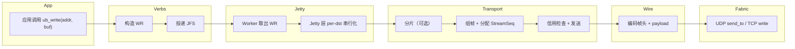
```mermaid
flowchart LR
  subgraph App
    A1["应用调用 ub_write(addr, buf)"]
  end
  subgraph Verbs
    V1["构造 WR"]
    V2["投递 JFS"]
  end
  subgraph Jetty
    J1["Worker 取出 WR"]
    J2["Jetty 层 per-dst 串行化"]
  end
  subgraph Transport
    T1["分片（可选）"]
    T2["组帧 + 分配 StreamSeq"]
    T3["信用检查 + 发送"]
  end
  subgraph Wire
    W1["编码帧头 + payload"]
  end
  subgraph Fabric
    F1["UDP send_to / TCP write"]
  end
  A1 --> V1 --> V2 --> J1 --> J2 --> T1 --> T2 --> T3 --> W1 --> F1
```

### 2.4 接收端数据流

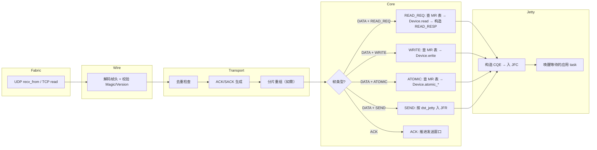
```mermaid
flowchart LR
  subgraph Fabric
    F1["UDP recv_from / TCP read"]
  end
  subgraph Wire
    W1["解码帧头 + 校验 Magic/Version"]
  end
  subgraph Transport
    T1["去重检查"]
    T2["ACK/SACK 生成"]
    T3["分片重组（如需）"]
  end
  subgraph Core
    C1{"帧类型?"}
    C2["READ_REQ: 查 MR 表 → Device.read → 构造 READ_RESP"]
    C3["WRITE: 查 MR 表 → Device.write"]
    C4["ATOMIC: 查 MR 表 → Device.atomic_*"]
    C5["SEND: 按 dst_jetty 入 JFR"]
    C6["ACK: 推进发送窗口"]
  end
  subgraph Jetty
    J1["构造 CQE → 入 JFC"]
    J2["唤醒等待的应用 task"]
  end
  F1 --> W1 --> T1 --> T2 --> T3 --> C1
  C1 -->|"DATA + READ_REQ"| C2 --> J1
  C1 -->|"DATA + WRITE"| C3 --> J1
  C1 -->|"DATA + ATOMIC"| C4 --> J1
  C1 -->|"DATA + SEND"| C5 --> J1
  C1 -->|"ACK"| C6
  J1 --> J2
```

### 2.5 并发模型

- **Runtime**：`tokio` 多线程 runtime，工作线程数默认 `num_cpus::get()`。
- **Reactor（1 个专用 tokio task）**：以 `tokio::select!` 驱动事件循环，多路复用 `UdpSocket::recv_from` / `TcpListener::accept` / `tokio::time::interval`（心跳、RTO tick）；将收到的完整帧通过 `tokio::sync::mpsc` 投递到每 peer 的 inbound channel。
- **Workers（若干 tokio task）**：
  - 从 JFS 取 WR、组帧、交给 transport 发送队列；
  - 处理 inbound 帧：控制面消息、数据面 ACK、数据 payload、完成 JFC；
  - 不得在执行路径上直接阻塞于应用回调；CQE 入队由 worker 完成。
- **顺序保证**：同一 `(src_jetty_id, dst_jetty_id)` 的消息有序，首版推荐 **jetty 层 per-dst 串行化 + transport 每 peer 总序**。

### 2.6 关键 Crate 选型

| 用途 | Crate | 说明 |
|---|---|---|
| 异步 runtime | `tokio` | 多线程 runtime、`net`、`sync`、`time` |
| Trait 上 async | `async-trait` | 供 `Fabric` / `Session` / `Device` 等 trait 用 |
| buffer | `bytes` | `Bytes` / `BytesMut` 零拷贝切片与池化 |
| wire 编解码 | `byteorder` / `u64::to_be_bytes` | 不引入 serde 做反射序列化；不用 protobuf |
| 错误类型 | `thiserror` | 定义 `UbError` enum 映射到 `UB_ERR_*` |
| 同步原语 | `parking_lot` | `Mutex` / `RwLock`；异步场景用 `tokio::sync` |
| 无锁队列 | `crossbeam::queue::ArrayQueue` | JFS MPSC 实现备选 |
| 配置 | `serde` + `serde_yaml` | YAML 解析 |
| 日志 / tracing | `tracing` + `tracing-subscriber` | 结构化日志 + span |
| Prometheus | `metrics` + `metrics-exporter-prometheus` | `/metrics` 输出 |
| HTTP admin | `axum` | 承载 `/metrics` 与 `/admin` |
| bench | `criterion` | `cargo bench` 性能验证 |

---

## 3. 地址与标识体系

### 3.1 设计目的

统一编址是 UB 协议的核心卖点——将 SuperPod 内所有可访问资源（CPU 内存、NPU 显存、未来 SSD 等）映射到一个全局唯一的 128 bit 地址空间，使任意节点可根据 UB 地址直接访问对端资源，无需感知底层 device 差异。

### 3.2 UB 地址格式

128 bit，大端序列化到 on-wire 16 字节：

| 字段 | 位宽 | 偏移（bit） | 说明 |
|---|---|---|---|
| PodID | 16 | 0–15 | 配置 `pod_id`，默认 1；标识 SuperPod |
| NodeID | 16 | 16–31 | 控制面分配；标识节点 |
| DeviceID | 16 | 32–47 | 节点内 device 身份：`0` = CPU memory，`1+` = NPU/扩展 |
| Offset | 64 | 48–111 | 字节偏移，相对 MR 起始 |
| Reserved | 16 | 112–127 | 填 0；扩展 Tenant/VC |

文本表示：`0x{pod}:{node}:{dev}:{off64}:{res}`，五段十六进制冒号分隔，`off64` 固定 16 个十六进制字符。示例：`0x0001:0042:0000:00000000DEADBEEF:0000`。

### 3.3 UB 地址的分配与唯一性

**分配原则**：

- FR-ADDR-3：Offset 空间在节点内由 MR 分配器管理，保证不重叠。
- FR-ADDR-2：SuperPod 内 UB 地址全局唯一——由 `(PodID, NodeID, DeviceID, Offset)` 四元组的结构化保证，不需要中心化分配。
- 注册 MR 时选定 `base_ub_addr`（由 `(PodID, NodeID, DeviceID)` + 选定的 `offset_base` 组成），有效区间为 `[base, base + len)`。

**地址翻译流程**：

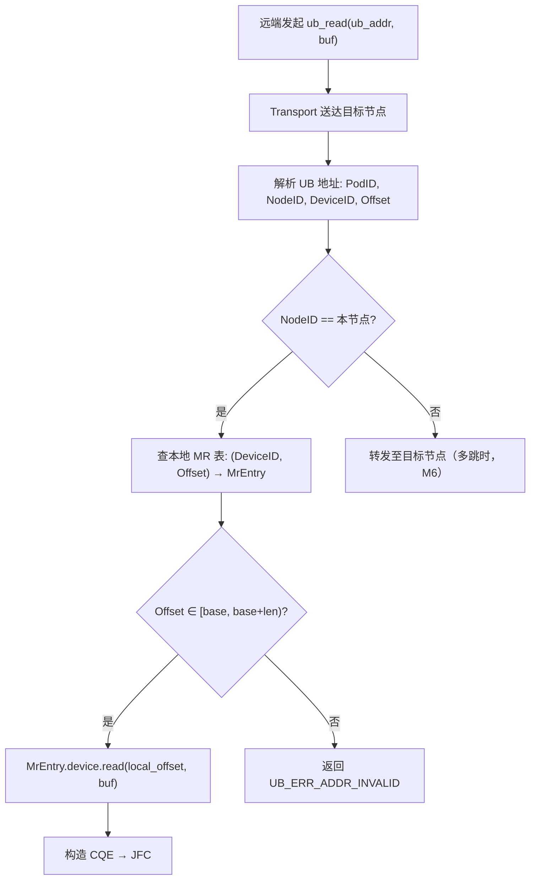
```mermaid
flowchart TD
  A["远端发起 ub_read(ub_addr, buf)"] --> B["Transport 送达目标节点"]
  B --> C["解析 UB 地址: PodID, NodeID, DeviceID, Offset"]
  C --> D{"NodeID == 本节点?"}
  D -->|"是"| E["查本地 MR 表: (DeviceID, Offset) → MrEntry"]
  D -->|"否"| F["转发至目标节点（多跳时，M6）"]
  E --> G{"Offset ∈ [base, base+len)?"}
  G -->|"是"| H["MrEntry.device.read(local_offset, buf)"]
  G -->|"否"| I["返回 UB_ERR_ADDR_INVALID"]
  H --> J["构造 CQE → JFC"]
```

### 3.4 MR 注册与生命周期

#### MR 数据结构

```rust
pub struct MrEntry {
    pub handle: u32,              // 本地 MR 句柄
    pub device: Arc<dyn Device>,  // 所属 device
    pub base_offset: u64,         // device 内偏移起始
    pub len: u64,                 // MR 长度
    pub perms: MrPerms,           // READ / WRITE / ATOMIC 权限位
    pub state: MrState,           // Active / Revoking / Released
    pub inflight_refs: AtomicI64, // 正在执行的远端访问引用计数
    pub revoke_notify: Notify,    // inflight 归零时唤醒
}

bitflags! {
    pub struct MrPerms: u8 {
        const READ   = 0b001;
        const WRITE  = 0b010;
        const ATOMIC = 0b100;
    }
}

pub enum MrState {
    Active,    // 正常可访问
    Revoking,  // 正在注销，拒绝新访问，等待 inflight 归零
    Released,  // 已释放
}
```

#### MR 注册流程

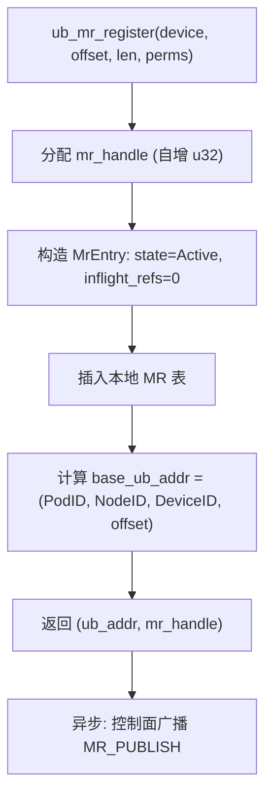
```mermaid
flowchart TD
  A["ub_mr_register(device, offset, len, perms)"] --> B["分配 mr_handle (自增 u32)"]
  B --> C["构造 MrEntry: state=Active, inflight_refs=0"]
  C --> D["插入本地 MR 表"]
  D --> E["计算 base_ub_addr = (PodID, NodeID, DeviceID, offset)"]
  E --> F["返回 (ub_addr, mr_handle)"]
  F --> G["异步: 控制面广播 MR_PUBLISH"]
```

**关键语义**：
- `ub_mr_register` 本地同步返回 UB 地址 + handle，此时本地 MR 已可用。
- 控制面 `MR_PUBLISH` 异步投递（fire-and-forget），远端可见性是最终一致。
- 应用契约：注册完成到远端首次可访问之间存在"可见窗口"（最长约一个控制面 RTT）；应用若需等远端感知，应主动 `ub_send` 一条同步消息作为 barrier，或重试直到 `ub_read` 不返 `UB_ERR_ADDR_INVALID`。

#### MR 注销流程（FR-ADDR-5, FR-JETTY-5）

MR 注销是系统中最复杂的同步操作之一，核心难点在于**如何安全释放正在被远端访问的内存**。

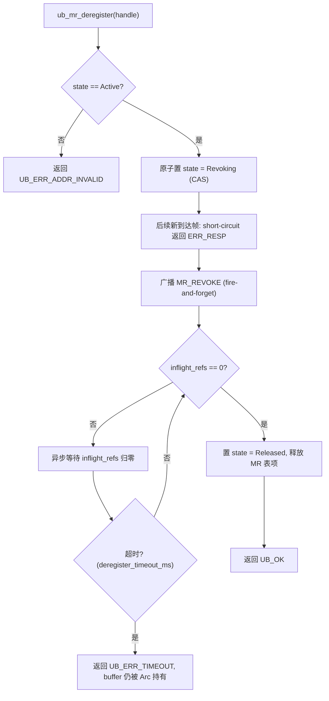
```mermaid
flowchart TD
  A["ub_mr_deregister(handle)"] --> B{"state == Active?"}
  B -->|"否"| C["返回 UB_ERR_ADDR_INVALID"]
  B -->|"是"| D["原子置 state = Revoking (CAS)"]
  D --> E["后续新到达帧: short-circuit 返回 ERR_RESP"]
  E --> F["广播 MR_REVOKE (fire-and-forget)"]
  F --> G{"inflight_refs == 0?"}
  G -->|"是"| K["置 state = Released, 释放 MR 表项"]
  G -->|"否"| H["异步等待 inflight_refs 归零"]
  H --> I{"超时? (deregister_timeout_ms)"}
  I -->|"是"| J["返回 UB_ERR_TIMEOUT, buffer 仍被 Arc 持有"]
  I -->|"否"| G
  K --> L["返回 UB_OK"]
```

**引用计数机制**：

- 在通过权限检查后、实际访问 buffer 前：`inflight_refs.fetch_add(1, Acquire)`。
- 操作完成（或错误返回）后：`inflight_refs.fetch_sub(1, Release)`；若归零则 `revoke_notify.notify_one()`。
- `state == Revoking/Released` 时，新到达帧直接返回 `ERR_RESP`（`status = UB_ERR_ADDR_INVALID`），不 `+1`、不访问 buffer。
- peer 收到 `MR_REVOKE` 后在本地 MR 元数据缓存中标记该区间无效，后续 WR 在本地短路拒绝，加速 `inflight_refs` 归零。

### 3.5 Jetty 标识

- **JettyID**：节点内 `uint32` 自增分配器；不得跨节点唯一（跨节点需 `(NodeID, JettyID)` 元组）。
- **对端寻址**：数据面头携带 `dst_node_id` + `dst_jetty_id`；源携带 `src_jetty_id`。
- 一个进程可创建多个 Jetty（FR-JETTY-4），用于隔离不同业务流，避免 HOL 阻塞。

### 3.6 Device 抽象

#### 设计目的

使远端访问对 device 类型完全透明——远端只看到 UB 地址，发起 `ub_read` / `ub_write` / `ub_atomic_*` 时不区分 device 类型，接收端根据本地 MR Handle 分派到对应 Device 后端执行（FR-DEV-3/5）。

#### Device trait

```rust
#[derive(Copy, Clone, Debug, PartialEq, Eq)]
pub enum DeviceKind { Memory, Npu }

pub trait Device: Send + Sync {
    fn kind(&self) -> DeviceKind;
    fn device_id(&self) -> u16;
    fn capacity(&self) -> u64;

    /// 从 device 偏移 offset 处读取 len 字节到 buf
    fn read(&self, offset: u64, buf: &mut [u8]) -> Result<(), UbError>;

    /// 将 buf 写入 device 偏移 offset 处
    fn write(&self, offset: u64, buf: &[u8]) -> Result<(), UbError>;

    /// 8 字节原子比较交换，offset 必须 8 字节对齐
    fn atomic_cas(&self, offset: u64, expect: u64, new: u64) -> Result<u64, UbError>;

    /// 8 字节原子加，offset 必须 8 字节对齐
    fn atomic_faa(&self, offset: u64, add: u64) -> Result<u64, UbError>;
}
```

#### MemoryDevice 实现

- Backing 为节点进程自身堆内存（`Box<[u8]>` 或 `&mut [u8]`）。
- `read/write` 直接 `copy_from_slice` / `copy_to_slice`。
- `atomic_cas` 用 `AtomicU64::compare_exchange(Ordering::AcqRel)`。
- `atomic_faa` 用 `AtomicU64::fetch_add(Ordering::AcqRel)`。
- `device_id` 固定为 `0`。

#### NpuDevice 实现（纯软件模拟，FR-DEV-2）

- Backing 为进程内分配的 `Vec<u8>` + `parking_lot::RwLock` 包装（toy 级足够）。
- **不**引入 CUDA / ROCm / Vulkan 依赖，不模拟 HBM 延迟/带宽（FR-DEV-7）。
- `ub_npu_open(size)` 启动时调用一次，分配指定大小的模拟显存。
- `ub_npu_alloc(handle, len, align)` 用简单 bump allocator 维护游标；首版回收为 no-op（接受碎片）。
- `atomic_*` 对 NPU 显存的语义与 CPU 内存一致，backing 本质仍是进程内存。
- 每个 `ub_npu_open` 调用分配一个 `≥ 1` 的自增 `device_id`。

#### MR → Device 路由

本地 MR 表以 `mr_handle: u32` 为主键，条目包含 `Arc<dyn Device>` + `offset_base` + `len` + `perms`。数据面收到 DATA 帧后：

1. `mr_table.lookup(handle)` O(1) 拿到 `Arc<dyn Device>`。
2. `device.read/write(offset_base + frame.offset - mr.base_offset, ...)`。

这条路径对 CPU / NPU **无分支**，满足 FR-DEV-3 的"远端透明"。

---

## 4. Wire 协议

### 4.1 设计目的

Wire 协议定义节点间数据面帧的二进制格式，是所有上层协议的传输基础。设计约束：
- 手写 `byteorder` 二进制编解码，不依赖 protobuf/Serde（避免反射开销与版本耦合）。
- 所有整数大端序（网络字节序），与 UB 地址大端序列化保持一致。
- 固定头部 + 可变 payload，便于硬件/零拷贝解析。
- 独立于底层 fabric（UDP/TCP/UDS 统一帧格式）。

### 4.2 帧类型

`uint8` 帧类型字段：

| 值 | 名称 | 方向 | 说明 |
|---|---|---|---|
| 0x01 | `DATA` | 双向 | 携带 verb 或消息 payload 分片 |
| 0x02 | `ACK` | 双向 | 累积 ACK + 可选 SACK 位图 |
| 0x03 | `CREDIT` | 双向 | 通告/更新 WR 级信用 |

控制面帧类型单独枚举（见 §7），不与数据面混用同一端口（FR-CTRL-3）。

### 4.3 通用帧头（32 字节）

| 偏移 | 长度 | 字段 | 说明 |
|---|---|---|---|
| 0 | 4 | Magic `0x55425459`（"UBTY"） | 快速过滤非法包 |
| 4 | 1 | Version | 首版 `1` |
| 5 | 1 | Type | 帧类型（上表） |
| 6 | 2 | Flags | bit0=`ACK_REQ`, bit1=`FRAG_FIRST`, bit2=`FRAG_MIDDLE`, bit3=`FRAG_LAST`, bit4=`HAS_IMM`, bit5=`HAS_SACK`, bit6=`ERR_RESP`, bit7=保留 |
| 8 | 2 | SrcNodeID | `uint16`，与 UB 地址 NodeID:16 对齐 |
| 10 | 2 | DstNodeID | `uint16` |
| 12 | 4 | Reserved | 首版填 0；高 8 bit 预留源路由扩展 |
| 16 | 8 | StreamSeq | 本 `(src, dst)` 会话单调递增序号 |
| 24 | 4 | PayloadLen | payload 区字节数（不含头部） |
| 28 | 4 | HeaderCRC | 可选 CRC32；首版可填 0 表示禁用 |

### 4.4 DATA 扩展头（固定 48 字节，紧跟通用头后）

| 偏移 | 长度 | 字段 | 说明 |
|---|---|---|---|
| 0 | 1 | Verb | `READ_REQ=1` / `READ_RESP=2` / `WRITE=3` / `ATOMIC_CAS=4` / `ATOMIC_FAA=5` / `SEND=6` / `WRITE_IMM=7` |
| 1 | 1 | ExtFlags | bit0=`HAS_IMM`, bit1=`FRAG`, bit2=`ERR_RESP`, 其余保留 |
| 2 | 2 | Reserved | 填 0，4 B 对齐 |
| 4 | 4 | MRHandle | 对端本地 MR 句柄（由 `MR_PUBLISH` 下发） |
| 8 | 4 | JettySrc | `uint32` |
| 12 | 4 | JettyDst | `uint32` |
| 16 | 8 | Opaque | 发送端 `wr_id`；也用作分片重组键 |
| 24 | 4 | FragID | 同一 WR 的所有分片共享此 ID |
| 28 | 2 | FragIndex | 本片索引，0 起 |
| 30 | 2 | FragTotal | 总片数，1 = 无分片 |
| 32 | 16 | UBAddr | 目标 UB 地址；非地址类 verb 填 0 |
| 48 | 8 | Imm | `uint64`，仅当 `ExtFlags.HAS_IMM` 置位时存在 |

### 4.5 ACK 帧.Payload 布局

| 偏移 | 长度 | 字段 | 说明 |
|---|---|---|---|
| 0 | 8 | AckSeq | 累积已处理的最后 seq |
| 8 | 4 | CreditGrant | 顺带通告 credit（嵌入式 CREDIT） |
| 12 | 4 | Reserved | 填 0 |
| 16 | 32 | SackBitmap | 仅当 `Flags.HAS_SACK` 置位；bit i 表示 `ack_seq+1+i` 已收到 |

### 4.6 CREDIT 帧.Payload 布局

| 偏移 | 长度 | 字段 | 说明 |
|---|---|---|---|
| 0 | 4 | Credits | 本次授予的信用数 |
| 4 | 4 | Reserved | 填 0 |

### 4.7 分片与重组（FR-MEM-6）

**PMTU**：默认 1400 字节 UDP 载荷上限。通用头 32 B + DATA 扩展头 48 B = 80 B 固定头部开销（不含 Imm），因此单片最大 payload = `1400 - 80 - 8(if imm)` 字节。

**发送端分片流程**：

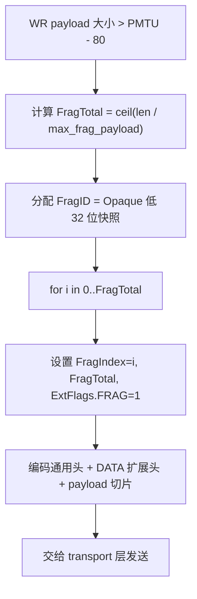
```mermaid
flowchart TD
  A["WR payload 大小 > PMTU - 80"] --> B["计算 FragTotal = ceil(len / max_frag_payload)"]
  B --> C["分配 FragID = Opaque 低 32 位快照"]
  C --> D["for i in 0..FragTotal"]
  D --> E["设置 FragIndex=i, FragTotal, ExtFlags.FRAG=1"]
  E --> F["编码通用头 + DATA 扩展头 + payload 切片"]
  F --> G["交给 transport 层发送"]
```

**接收端重组流程**：

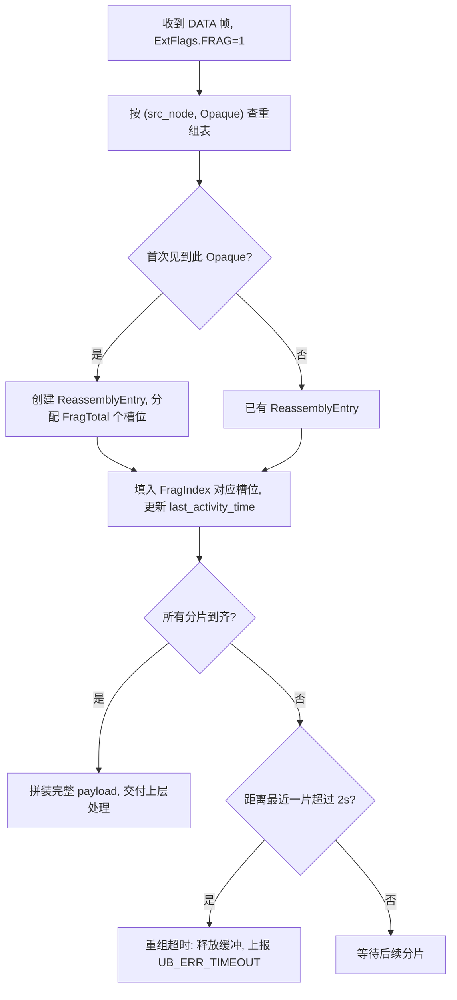
```mermaid
flowchart TD
  A["收到 DATA 帧, ExtFlags.FRAG=1"] --> B["按 (src_node, Opaque) 查重组表"]
  B --> C{"首次见到此 Opaque?"}
  C -->|"是"| D["创建 ReassemblyEntry, 分配 FragTotal 个槽位"]
  C -->|"否"| E["已有 ReassemblyEntry"]
  D --> F["填入 FragIndex 对应槽位, 更新 last_activity_time"]
  E --> F
  F --> G{"所有分片到齐?"}
  G -->|"是"| H["拼装完整 payload, 交付上层处理"]
  G -->|"否"| I{"距离最近一片超过 2s?"}
  I -->|"是"| J["重组超时: 释放缓冲, 上报 UB_ERR_TIMEOUT"]
  I -->|"否"| K["等待后续分片"]
```

**重组保护**：
- **Inactivity 超时**：2s（距最近一片到达时间）。
- **总缓冲上限**：`reassembly_budget_bytes` 默认 64 MiB。超限时拒绝新 WR 首片，计数 `unibus_reassembly_rejects_total`。
- **重组键选择**：`(src_node, Opaque)`——`Opaque` 已是发送端 `wr_id`，天然对一个 WR 唯一；`StreamSeq` 每片不同不适合作键。

### 4.8 Wire 编解码实现

```rust
// ub-wire crate

pub struct FrameHeader {
    pub magic: u32,          // 0x55425459
    pub version: u8,         // 1
    pub frame_type: FrameType,
    pub flags: FrameFlags,
    pub src_node: u16,
    pub dst_node: u16,
    pub reserved: u32,
    pub stream_seq: u64,
    pub payload_len: u32,
    pub header_crc: u32,
}

pub struct DataExtHeader {
    pub verb: Verb,
    pub ext_flags: ExtFlags,
    pub mr_handle: u32,
    pub jetty_src: u32,
    pub jetty_dst: u32,
    pub opaque: u64,
    pub frag_id: u32,
    pub frag_index: u16,
    pub frag_total: u16,
    pub ub_addr: UbAddr,
    pub imm: Option<u64>,
}

pub fn encode_frame(header: &FrameHeader, ext: Option<&DataExtHeader>, payload: &[u8]) -> BytesMut;
pub fn decode_frame(buf: &[u8]) -> Result<(FrameHeader, Option<DataExtHeader>, &[u8]), UbError>;
```

---

## 5. 可靠传输

### 5.1 设计目的

在不可靠的 UDP 之上提供"至多一次"（at-most-once）的可靠交付语义，具体包括：
- 保证数据不丢失（超时重传 + SACK 快速重传）。
- 保证数据不重复执行（去重窗口 + 写路径幂等）。
- 保证数据有序到达上层（按 StreamSeq 重排）。
- 崩溃恢复后旧会话正确失效（epoch 机制）。

### 5.2 会话模型

#### ReliableSession

每个有序通道定义一个 `ReliableSession`，keyed by `(local_node, remote_node, fabric_kind, epoch)`。

```rust
pub struct ReliableSession {
    pub local_node: u16,
    pub remote_node: u16,
    pub fabric_kind: FabricKind,  // Udp | Tcp | Uds
    pub epoch: u32,               // 会话代号，崩溃恢复用

    // 发送侧
    pub next_seq: AtomicU64,           // 下一个待发送的 StreamSeq
    pub send_window: SendWindow,       // 发送窗口（信用控制）
    pub retransmit_queue: VecDeque<RetransmitEntry>,

    // 接收侧
    pub next_expected: AtomicU64,      // 累积确认的下一个期望 seq
    pub dedup_window: DedupWindow,     // 去重滑动窗口
    pub reassembly: ReassemblyTable,   // 分片重组表
    pub resp_cache: LruCache<(u16, u64), Bytes>, // 读响应缓存

    // 配置
    pub rto_ms: u64,
    pub max_retries: u32,
    pub state: SessionState,
}

pub enum SessionState {
    Active,
    Dead,  // 超过 max_retries 或 peer 失联
}
```

**首版约束**：UDP 与 TCP 各一条会话，不混用序号；切 fabric 即新会话。

#### 崩溃恢复（Epoch 机制）

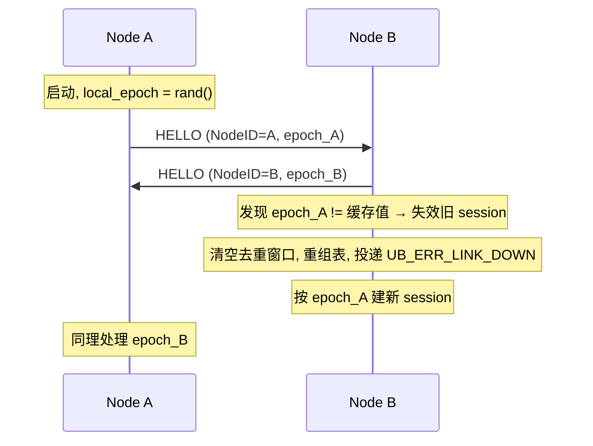
```mermaid
sequenceDiagram
  participant A as Node A
  participant B as Node B
  Note over A: 启动, local_epoch = rand()
  A->>B: HELLO (NodeID=A, epoch_A)
  B->>A: HELLO (NodeID=B, epoch_B)
  Note over B: 发现 epoch_A != 缓存值 → 失效旧 session
  Note over B: 清空去重窗口, 重组表, 投递 UB_ERR_LINK_DOWN
  Note over B: 按 epoch_A 建新 session
  Note over A: 同理处理 epoch_B
```

- 节点启动时生成 `local_epoch: u32`（`rand::random::<u32>()`），在控制面 `HELLO` 消息里通告。
- 对端收到 `HELLO` 后，若发现 `remote_epoch` 与缓存不同 → 立即失效旧 `ReliableSession`：未完成 WR 投递 `UB_ERR_LINK_DOWN`，重组表清空，dedup 窗口清空，按新 epoch 建会话。
- epoch 不放在数据面帧头（控制面交换已足够），避免膨胀每帧。

### 5.3 序号与去重

- **StreamSeq**：单调递增 `uint64`，发送端每帧 +1。
- **接收端去重窗口**：大小 W（默认 1024）的滑动窗口。

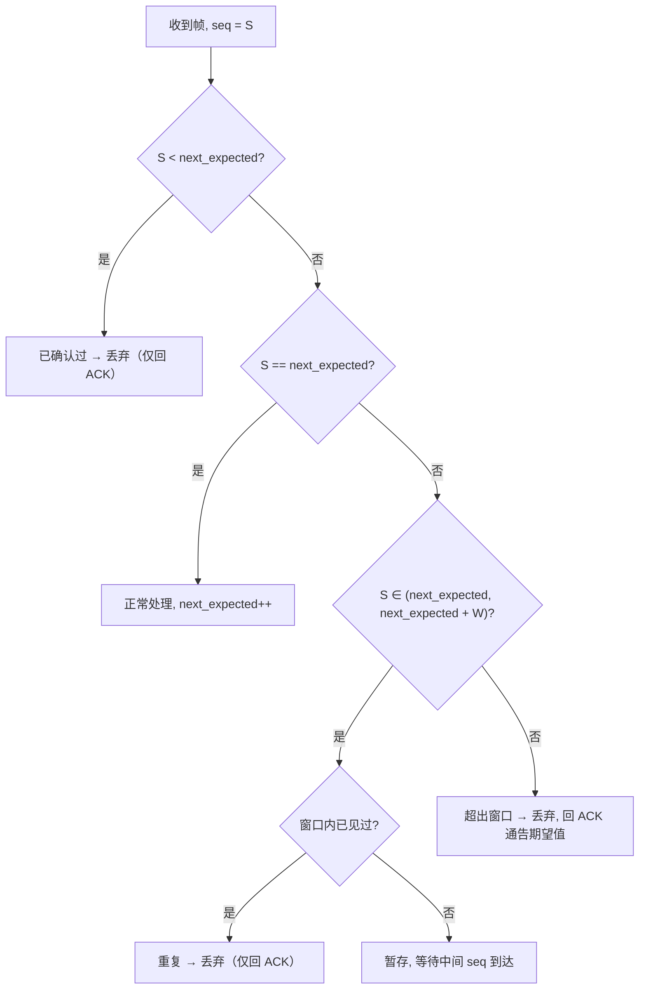
```mermaid
flowchart TD
  A["收到帧, seq = S"] --> B{"S < next_expected?"}
  B -->|"是"| C["已确认过 → 丢弃（仅回 ACK）"]
  B -->|"否"| D{"S == next_expected?"}
  D -->|"是"| E["正常处理, next_expected++"]
  D -->|"否"| F{"S ∈ (next_expected, next_expected + W)?"}
  F -->|"是"| G{"窗口内已见过?"}
  G -->|"是"| H["重复 → 丢弃（仅回 ACK）"]
  G -->|"否"| I["暂存, 等待中间 seq 到达"]
  F -->|"否"| J["超出窗口 → 丢弃, 回 ACK 通告期望值"]
```

### 5.4 ACK / SACK 机制（FR-REL-2）

**累积 ACK**：`ack_seq = 最后一个连续已处理的 seq`。

**SACK 简化版**：通用头 `Flags.HAS_SACK` 置位时，payload 区携带 256 bit 位图（32 B），相对 `ack_seq + 1` 的缺失包标记，触发快速重传。

**ACK 策略**：
- 每收到 N 个包（默认 8）或每 T ms（默认 50ms）发送 ACK。
- 读请求（READ_REQ）立即触发 ACK，减少读延迟。
- 避免纯停等，充分利用管道。

### 5.5 重传与 RTO（FR-REL-3/4）

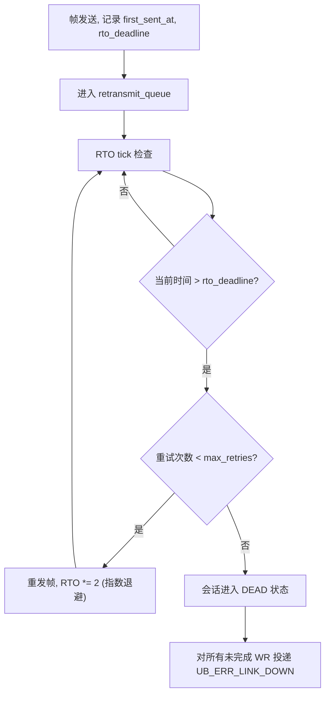
```mermaid
flowchart TD
  A["帧发送, 记录 first_sent_at, rto_deadline"] --> B["进入 retransmit_queue"]
  B --> C["RTO tick 检查"]
  C --> D{"当前时间 > rto_deadline?"}
  D -->|"否"| C
  D -->|"是"| E{"重试次数 < max_retries?"}
  E -->|"是"| F["重发帧, RTO *= 2 (指数退避)"]
  F --> C
  E -->|"否"| G["会话进入 DEAD 状态"]
  G --> H["对所有未完成 WR 投递 UB_ERR_LINK_DOWN"]
```

- **指数退避**：`RTO = min(RTO_max, RTO_0 * 2^k)`，`RTO_0` 默认 200ms，`RTO_max` 默认 10s。
- **max_retries**：默认 8 次。
- 收到 ACK 后从 `retransmit_queue` 移除已确认段，重置 RTO 计数器。

### 5.6 读路径重复处理（FR-REL-6）

读请求是幂等的，但重复处理需要谨慎——既不能让请求永久 stuck，也不能返回过时数据。

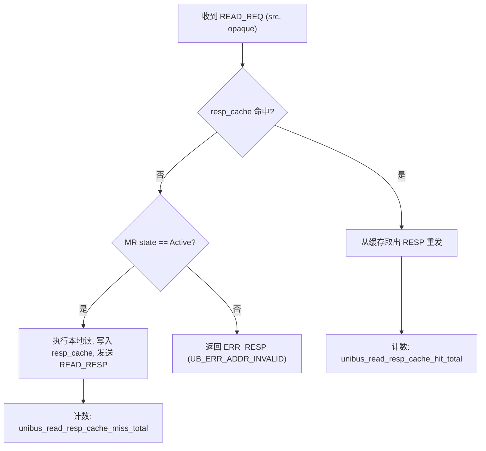
```mermaid
flowchart TD
  A["收到 READ_REQ (src, opaque)"] --> B{"resp_cache 命中?"}
  B -->|"是"| C["从缓存取出 RESP 重发"]
  B -->|"否"| D{"MR state == Active?"}
  D -->|"是"| E["执行本地读, 写入 resp_cache, 发送 READ_RESP"]
  D -->|"否"| F["返回 ERR_RESP (UB_ERR_ADDR_INVALID)"]
  C --> G["计数: unibus_read_resp_cache_hit_total"]
  E --> H["计数: unibus_read_resp_cache_miss_total"]
```

**响应缓存配置**：容量 1024 条，TTL 5s。缓存 miss 时允许重新执行本地读——读是幂等的。

### 5.7 写路径幂等（FR-REL-5/6）

对 `WRITE` / `WRITE_IMM` / `ATOMIC_*` 这类有副作用的操作，**绝不重复执行**：

- 接收端维护 **已执行表** `(StreamSeq → result)`，窗口大小与去重窗口一致。
- 首次到达：执行写操作，记录 `(seq → Ok)`。
- 重复到达：仅回 ACK，不再次执行写。

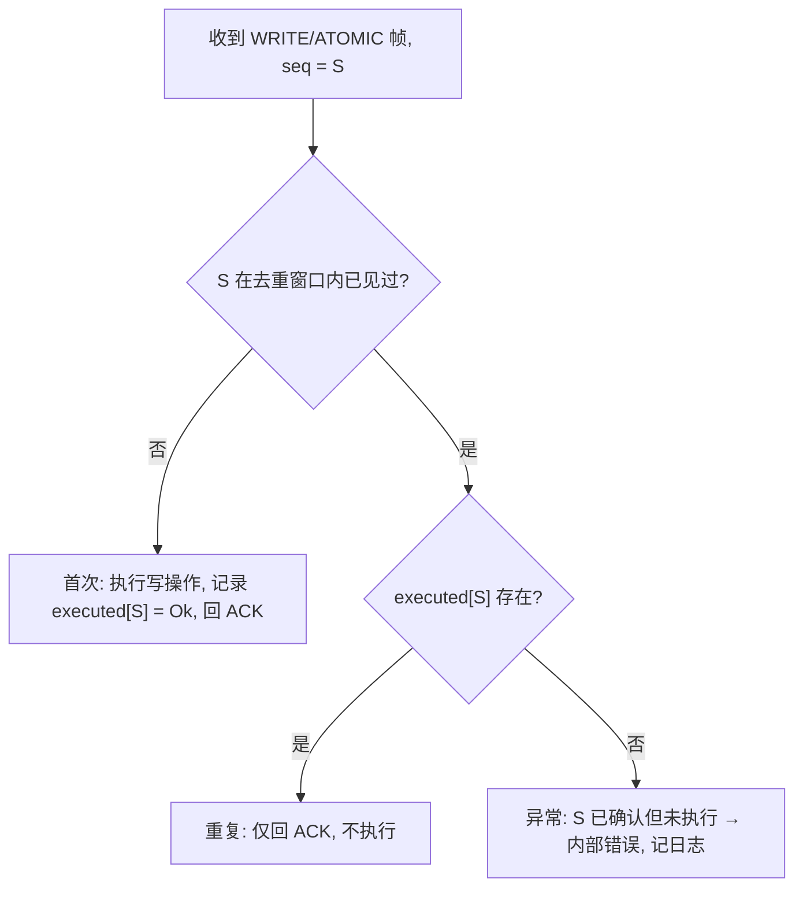
```mermaid
flowchart TD
  A["收到 WRITE/ATOMIC 帧, seq = S"] --> B{"S 在去重窗口内已见过?"}
  B -->|"否"| C["首次: 执行写操作, 记录 executed[S] = Ok, 回 ACK"]
  B -->|"是"| D{"executed[S] 存在?"}
  D -->|"是"| E["重复: 仅回 ACK, 不执行"]
  D -->|"否"| F["异常: S 已确认但未执行 → 内部错误, 记日志"]
```

---

## 6. 流控与拥塞

### 6.1 设计目的

防止发送端压垮接收端，保证：
- 接收端 JFR / JFC 槽不溢出（FR-FLOW-2）。
- 发送端在信用耗尽时正确背压（FR-JETTY-3）。
- 拥塞时优雅降速而非丢包重传风暴（FR-FLOW-3）。

### 6.2 信用流控（FR-FLOW-1）

**信用粒度**：WR 个数（不按字节计）。

**初始窗口协商**：

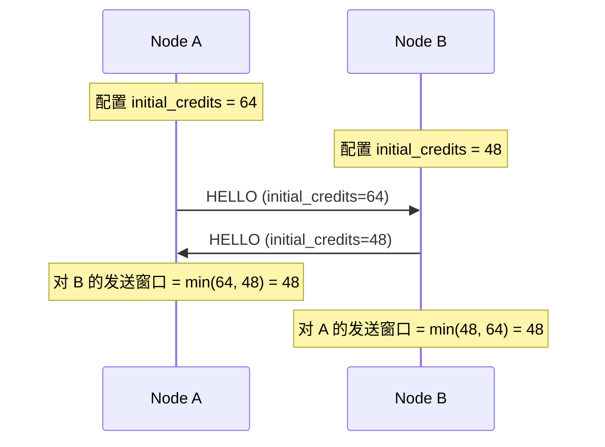
```mermaid
sequenceDiagram
  participant A as Node A
  participant B as Node B
  Note over A: 配置 initial_credits = 64
  Note over B: 配置 initial_credits = 48
  A->>B: HELLO (initial_credits=64)
  B->>A: HELLO (initial_credits=48)
  Note over A: 对 B 的发送窗口 = min(64, 48) = 48
  Note over B: 对 A 的发送窗口 = min(48, 64) = 48
```

两端各自以 `min(local_initial, remote_initial)` 作为对端发送窗口上限。

### 6.3 信用返还机制

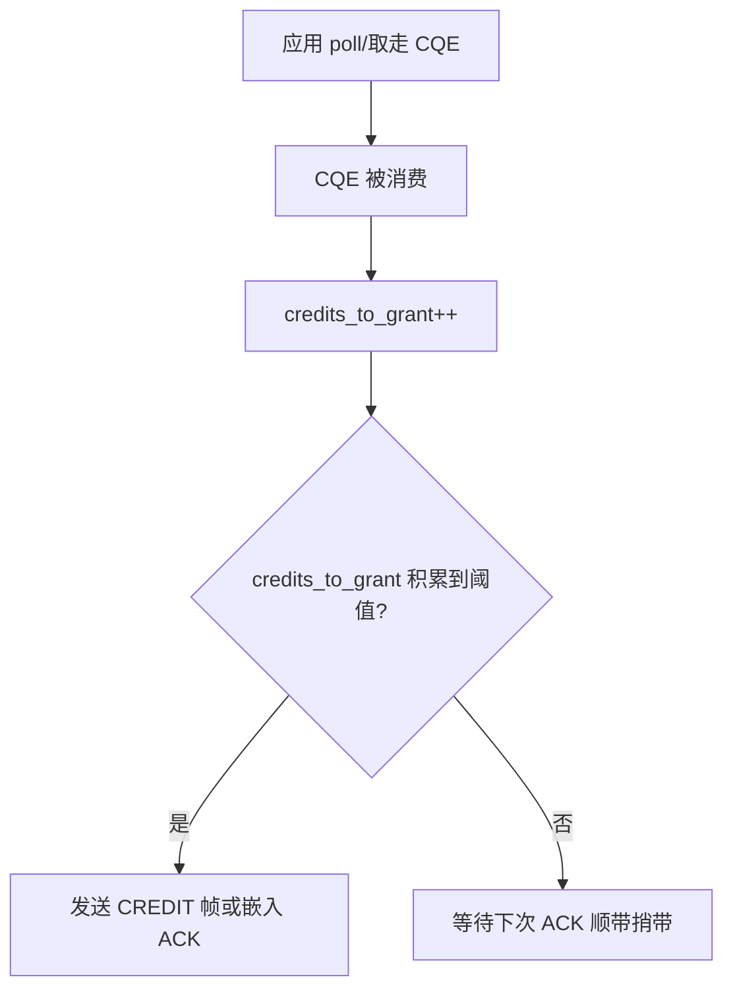
```mermaid
flowchart TD
  A["应用 poll/取走 CQE"] --> B["CQE 被消费"]
  B --> C["credits_to_grant++"]
  C --> D{"credits_to_grant 积累到阈值?"}
  D -->|"是"| E["发送 CREDIT 帧或嵌入 ACK"]
  D -->|"否"| F["等待下次 ACK 顺带捎带"]
```

**关键语义**：credit 返还时机是 **CQE 被取走**，而非内部交付到 JFC。两者存在时间差——应用积压 CQE 不取则自然形成背压。

### 6.4 背压（FR-FLOW-2, FR-JETTY-3）

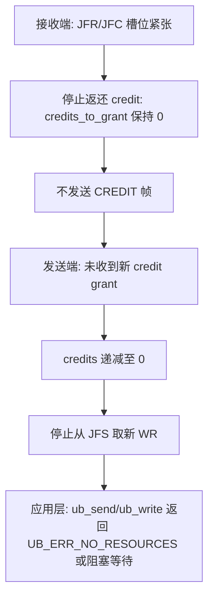
```mermaid
flowchart TD
  A["接收端: JFR/JFC 槽位紧张"] --> B["停止返还 credit: credits_to_grant 保持 0"]
  B --> C["不发送 CREDIT 帧"]
  C --> D["发送端: 未收到新 credit grant"]
  D --> E["credits 递减至 0"]
  E --> F["停止从 JFS 取新 WR"]
  F --> G["应用层: ub_send/ub_write 返回 UB_ERR_NO_RESOURCES 或阻塞等待"]
```

**三层背压级联**：

| 层级 | 触发条件 | 行为 |
|---|---|---|
| JFC 高水位 | `unacked_cqe >= jfc_high_watermark` | 阻止新发送 |
| 信用耗尽 | `credits == 0` | 停止从 JFS 取新 WR |
| JFS 队列满 | `jfs.len() == jfs_depth` | `ub_send` 返回 `UB_ERR_NO_RESOURCES`（异步 API）或阻塞（同步 API） |

### 6.5 AIMD 拥塞控制（FR-FLOW-3）

首版采用最简 AIMD：

- **检测拥塞**：持续 `NO_CREDIT` 超过阈值，或 RTT 上升超过 2 倍基线。
- **减窗**：`cwnd = max(cwnd / 2, min_cwnd)`。
- **增窗**：每收到 `cwnd` 个 ACK，`cwnd += 1`。
- **参数**：`min_cwnd = 4`，`initial_cwnd = initial_credits`。
- 拥塞窗口与信用窗口取 `min(cwnd, credits)` 作为实际发送窗口。

---

## 7. 控制面

### 7.1 设计目的

控制面负责：
- 节点发现与拓扑管理（FR-CTRL-1/2/5）。
- MR 元数据广播与查询（FR-MR-4）。
- 心跳与故障检测（FR-FAIL）。
- 节点状态管理（上线/下线/失联）。
- 为 Managed 层提供控制消息通道（§13）。

### 7.2 传输方式

- **独立监听端口**：`control_listen`，TCP 优先（消息小、需可靠）。
- **数据面与控制面隔离**：独立 socket，避免相互阻塞（FR-CTRL-3）。
- 心跳走控制面 TCP 连接，不独立线程。

### 7.3 Bootstrap 模式

#### Static 模式

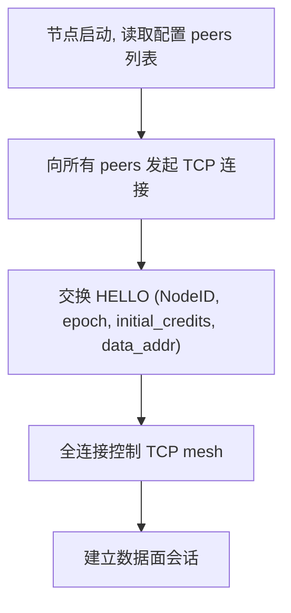
```mermaid
flowchart TD
  A["节点启动, 读取配置 peers 列表"] --> B["向所有 peers 发起 TCP 连接"]
  B --> C["交换 HELLO (NodeID, epoch, initial_credits, data_addr)"]
  C --> D["全连接控制 TCP mesh"]
  D --> E["建立数据面会话"]
```

#### Seed 模式

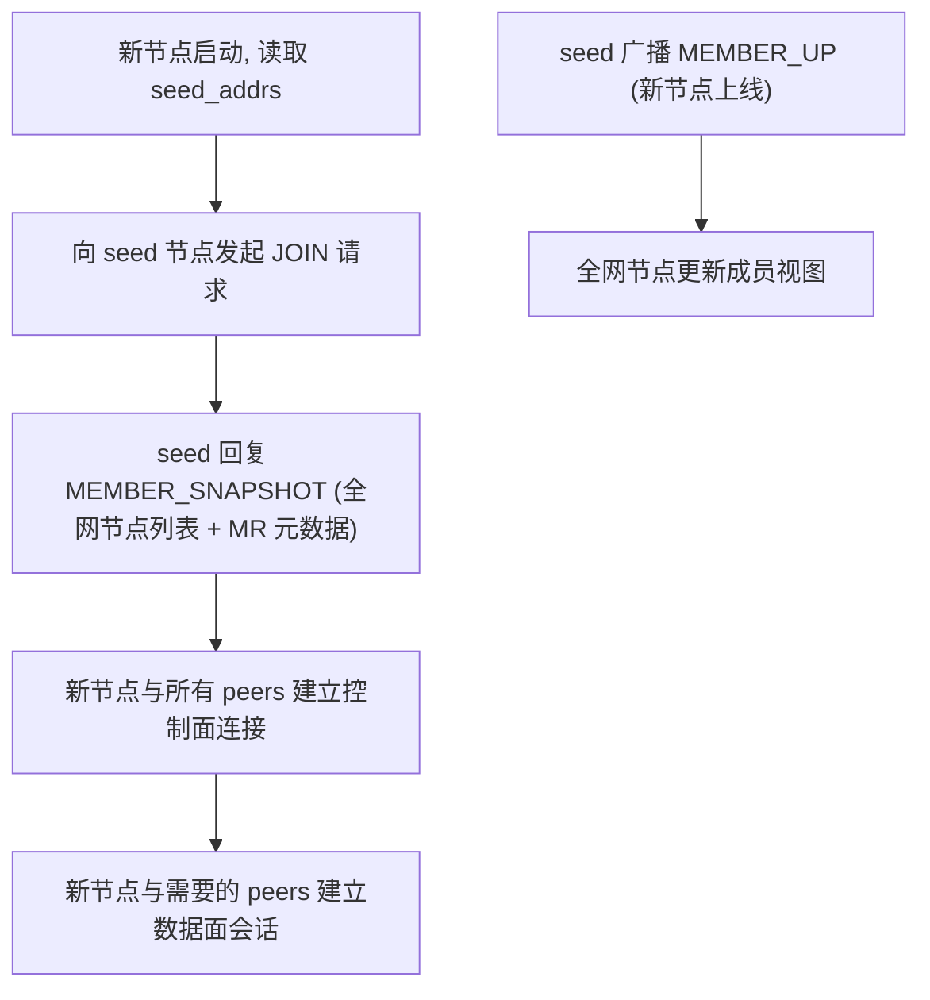
```mermaid
flowchart TD
  A["新节点启动, 读取 seed_addrs"] --> B["向 seed 节点发起 JOIN 请求"]
  B --> C["seed 回复 MEMBER_SNAPSHOT (全网节点列表 + MR 元数据)"]
  C --> D["新节点与所有 peers 建立控制面连接"]
  D --> E["新节点与需要的 peers 建立数据面会话"]
  F["seed 广播 MEMBER_UP (新节点上线)"] --> G["全网节点更新成员视图"]
```

#### Hub 星形模式

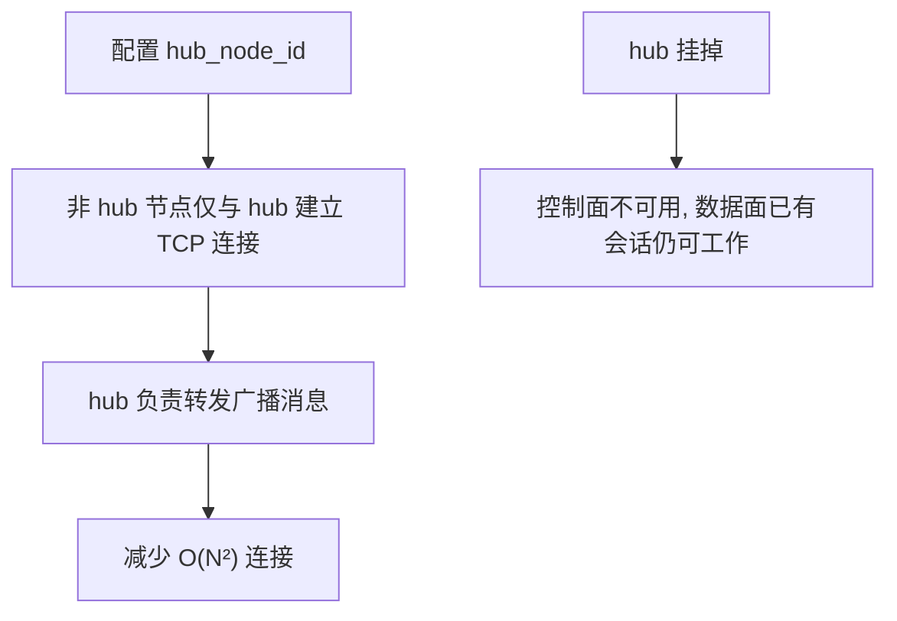
```mermaid
flowchart TD
  A["配置 hub_node_id"] --> B["非 hub 节点仅与 hub 建立 TCP 连接"]
  B --> C["hub 负责转发广播消息"]
  C --> D["减少 O(N²) 连接"]
  E["hub 挂掉"] --> F["控制面不可用, 数据面已有会话仍可工作"]
```

**推荐**：N ≤ 8 时全连接，N > 8 时星形（减少连接数）。

### 7.4 节点状态机

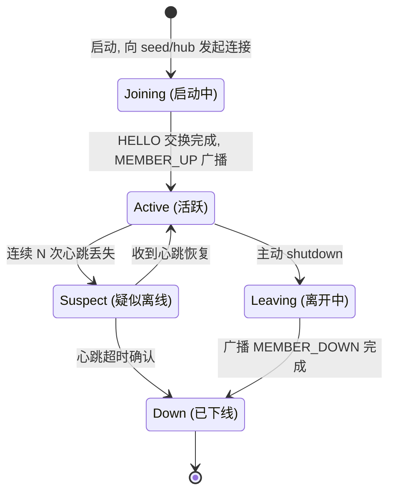
```mermaid
stateDiagram-v2
  state "Joining (启动中)" as Joining
  state "Active (活跃)" as Active
  state "Leaving (离开中)" as Leaving
  state "Suspect (疑似离线)" as Suspect
  state "Down (已下线)" as Down

  [*] --> Joining: 启动, 向 seed/hub 发起连接
  Joining --> Active: HELLO 交换完成, MEMBER_UP 广播
  Active --> Leaving: 主动 shutdown
  Active --> Suspect: 连续 N 次心跳丢失
  Suspect --> Active: 收到心跳恢复
  Suspect --> Down: 心跳超时确认
  Leaving --> Down: 广播 MEMBER_DOWN 完成
  Down --> [*]
```

**状态说明**：

| 状态 | 含义 | 数据面行为 |
|---|---|---|
| Joining | 正在加入 SuperPod | 不接受数据面流量 |
| Active | 正常工作 | 全功能 |
| Suspect | 心跳丢失，可能失联 | 继续工作，但准备降级 |
| Leaving | 主动离开，优雅关闭 | 拒绝新 WR，等待 inflight 完成 |
| Down | 已失联/已离开 | 所有相关 WR 投递 `UB_ERR_LINK_DOWN` |

### 7.5 心跳机制（FR-FAIL）

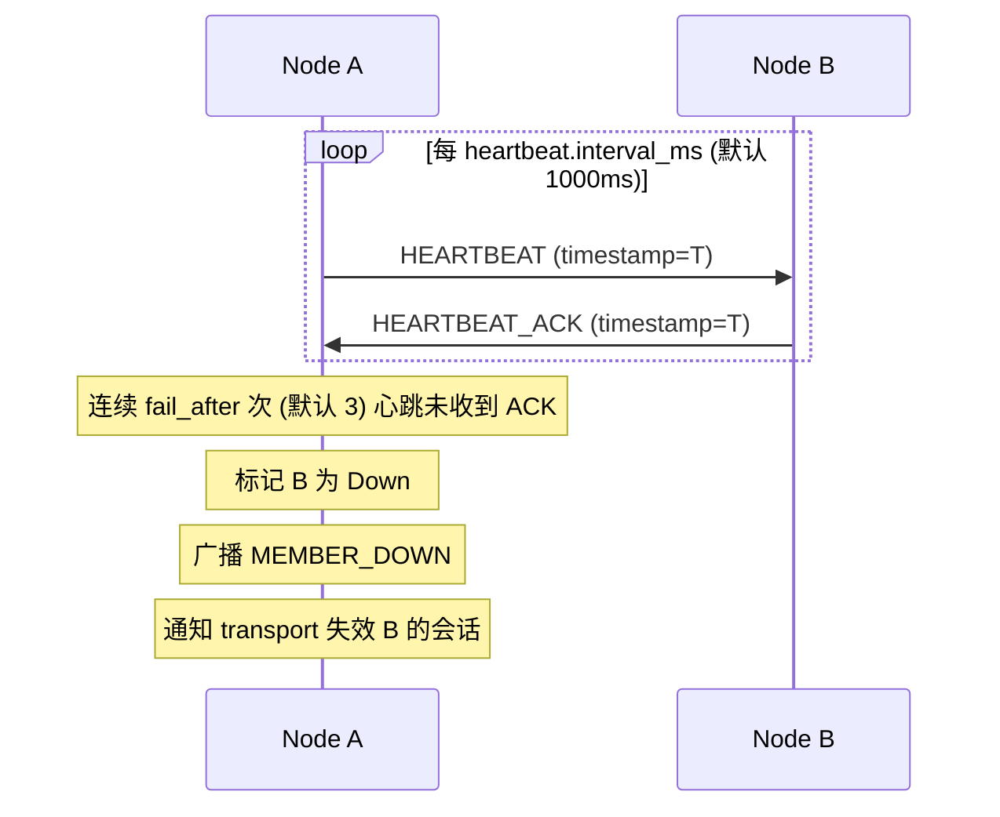
```mermaid
sequenceDiagram
  participant A as Node A
  participant B as Node B
  loop 每 heartbeat.interval_ms (默认 1000ms)
    A->>B: HEARTBEAT (timestamp=T)
    B->>A: HEARTBEAT_ACK (timestamp=T)
  end
  Note over A: 连续 fail_after 次 (默认 3) 心跳未收到 ACK
  Note over A: 标记 B 为 Down
  Note over A: 广播 MEMBER_DOWN
  Note over A: 通知 transport 失效 B 的会话
```

- 心跳走控制面 TCP，不独占线程。
- `fail_after` 默认 3（即 3s 无响应判定失联，FR-FAIL-1/2）。
- 失联事件触发（FR-FAIL-3）：相关重传终止 / 相关 JFC 投递错误 CQE / 控制面广播节点状态变化。

### 7.6 控制面消息类型

#### Verbs 层消息（M1–M5 需全部实现）

| 类型 | 方向 | 内容 | 说明 |
|---|---|---|---|
| `HELLO` | 双向 | NodeID, 数据面地址, 版本, `local_epoch`, `initial_credits` | 会话建立 |
| `MEMBER_UP` | hub→all | 新节点信息 | 新节点加入 |
| `MEMBER_DOWN` | hub→all | 下线节点 NodeID, 原因 | 节点离开/失联 |
| `MR_PUBLISH` | owner→all | `owner_node`, `mr_handle`, UB 区间起始/长度, `perms`, `device_kind` | MR 上线广播 |
| `MR_REVOKE` | owner→all | `owner_node`, `mr_handle` | MR 注销广播 |
| `HEARTBEAT` | 双向 | 时间戳 | 保活 |
| `HEARTBEAT_ACK` | 双向 | 回显时间戳 | 保活确认 |

#### Managed 层消息（M7 再引入）

| 类型 | 方向 | 内容 |
|---|---|---|
| `DEVICE_PROFILE_PUBLISH` | node→hub | 节点各 device 的静态画像 + 动态负载 |
| `ALLOC_REQ` / `ALLOC_RESP` | node↔placer | `ub_alloc` 请求 / 分配结果 |
| `REGION_CREATE` / `REGION_DELETE` | placer→node | 通知 node 创建 / 删除 region |
| `FETCH` / `FETCH_RESP` | reader→home | Reader 向 home 拉取 region 数据 |
| `WRITE_LOCK_REQ` / `WRITE_LOCK_GRANTED` / `WRITE_UNLOCK` | writer→home | Writer guard 获取 / 释放 |
| `INVALIDATE` / `INVALIDATE_ACK` | home→reader | Home 失效 reader 本地副本 |

### 7.7 MR 目录（FR-MR-4）

**首版推荐**：广播式 `MR_PUBLISH`（简单，符合 M2）。

- 广播仅 **元数据**（UB 地址区间、长度、权限、device_kind），不含 VA（FR-ADDR-4）。
- 远端可缓存 MR 元数据用于路由与访问校验，但不得据此推导对端进程内指针。
- 可选增加 `MR_QUERY`（按需拉取）作为优化。

### 7.8 Fan-out 广播（FR-CTRL-6）

```mermaid
flowchart TD
  A["ub_notify_many(dst_list, ...)"] --> B["for each dst in dst_list"]
  B --> C["调用单播路径 ub_send(dst, ...)"]
  C --> D["独立计数: fanout_ok / fanout_err"]
  D --> E["不保证顺序, best-effort"]
```

首版不要求硬件式多播树；"一对多通知"实现为向订阅表中的多个 `(node_id, jetty_id)` 顺序或并发发送的 fan-out。

---

## 8. Jetty 与 Verb 路径

### 8.1 设计目的

Jetty 是 UB 的核心抽象，模仿硬件 UB Jetty 的无连接发送/接收模型。设计要点：
- 无需预先建立 QP 连接——发送时只需指定目标 `(node_id, jetty_id)`。
- 提供完成队列（JFC）统一交付所有操作的完成事件。
- 支持背压——JFC 积压时阻止新发送。

### 8.2 Jetty 数据结构

```rust
pub struct Jetty {
    pub jetty_id: u32,
    pub node_id: u16,           // 所属节点

    // 发送队列
    pub jfs: JfsQueue,          // MPSC, 多个 app task 可并发 post
    pub jfs_depth: u32,

    // 接收队列
    pub jfr: JfrQueue,          // 接收端 post_recv 的 buffer
    pub jfr_depth: u32,

    // 完成队列
    pub jfc: JfcQueue,          // CQE 交付
    pub jfc_depth: u32,
    pub jfc_high_watermark: u32, // 背压阈值
}
```

### 8.3 WR → CQE 全生命周期

```mermaid
flowchart TD
  A["应用: ub_write(addr, buf, len)"] --> B["构造 WR {wr_id, verb, addr, buf, len}"]
  B --> C["投递 JFS (try_send / send.await)"]
  C --> D["Worker task 被 Notify 唤醒"]
  D --> E["从 JFS 取出 WR"]
  E --> F["Jetty 层 per-dst 串行化"]
  F --> G["Transport: 分片(可选) + 分配 StreamSeq + 信用检查"]
  G --> H["Wire: 编码帧"]
  H --> I["Fabric: send"]
  I --> J["远端处理: 查 MR 表 → 执行操作"]
  J --> K["远端: 构造 CQE → 入 JFC"]
  K --> L["远端: 回 ACK"]
  L --> M["本端: ACK 推进发送窗口"]
  M --> N["本端: 构造 CQE → 入 JFC"]
  N --> O["唤醒等待的应用 task"]
```

### 8.4 内存 Verb 与 Jetty

FR-MEM-5 要求内存操作也通过 JFC 交付完成事件。实现上推荐 **每节点一个默认 Jetty**：

```rust
pub fn default_jetty(&self) -> &Jetty {
    &self.default_jetty
}
```

CLI / bench 使用默认 Jetty，高级应用可显式创建多个 Jetty。

### 8.5 消息语义路径

#### Send / Recv

```mermaid
sequenceDiagram
  participant AppA as Node A 应用
  participant JettyA as Node A Jetty
  participant Transport as 传输层
  participant JettyB as Node B Jetty
  participant AppB as Node B 应用

  AppB->>JettyB: ub_post_recv(jetty, buf, len)
  AppA->>JettyA: ub_send(jetty, dst, buf, len)
  JettyA->>Transport: WR → 组帧 → 发送
  Transport->>JettyB: 收到 SEND 帧
  JettyB->>JettyB: 匹配 post_recv buffer
  JettyB->>AppB: CQE 入 JFC (status=OK, byte_len)
```

#### Write-with-Immediate

```mermaid
sequenceDiagram
  participant AppA as Node A 应用
  participant JettyA as Node A Jetty
  participant Transport as 传输层
  participant MR_B as Node B MR
  participant JettyB as Node B Jetty
  participant AppB as Node B 应用

  AppA->>JettyA: ub_write_with_imm(addr, buf, len, imm=42)
  JettyA->>Transport: WRITE_IMM 帧 (HAS_IMM=1)
  Transport->>MR_B: 查 MR 表 → Device.write
  Transport->>JettyB: 额外生成 CQE (imm=42)
  JettyB->>AppB: JFC 上获得带立即数的完成事件
```

### 8.6 JFS 并发语义（FR-MSG-5, FR-JETTY-3）

**MPSC 模型**：多个 app task / 线程可并发 `ub_send` 同一 Jetty。

实现选择（按推荐顺序）：

1. **简洁版**：`parking_lot::Mutex<VecDeque<WorkRequest>>`，适合首版调试。
2. **无锁版**：`crossbeam::queue::ArrayQueue<WorkRequest>`，避免写路径竞争。
3. **async 场景**：`tokio::sync::mpsc::channel`，`send().await` 在满队列时挂起；若需非阻塞，用 `try_send`。

**消费端**：固定为该 Jetty 绑定的一个 worker task，取出顺序 = 入队顺序。

**同 (src, dst) 顺序保证**：

```mermaid
flowchart TD
  A["WR1: dst=(Node2, Jetty5)"] --> B["WR2: dst=(Node2, Jetty5)"]
  B --> C["WR3: dst=(Node3, Jetty1)"]
  D["per-dst 串行化"] --> E{"dst 相同?"}
  E -->|"是"| F["按入队顺序组帧发送"]
  E -->|"否"| G["可并行处理"]
```

- 同一 `(dst_node, dst_jetty)` 的 WR 在 src 侧以入队顺序串行化组帧和交付 transport。
- 不同 dst 之间不保证顺序（与 FR-MSG-5 一致）。

### 8.7 Jetty 销毁（FR-JETTY-5）

```mermaid
flowchart TD
  A["jetty_close(jetty_id)"] --> B["停止从 JFS 取新 WR"]
  B --> C["对所有未完成 WR 批量生成 CQE (status=UB_ERR_FLUSHED)"]
  C --> D["CQE 入 JFC"]
  D --> E["等待应用消费所有 flushed CQE"]
  E --> F["释放 Jetty 资源"]
```

### 8.8 跨语义顺序

不在协议层提供 fence。若 demo 需要，用 `write_with_imm` 或应用层协议序号同步。

---

## 9. Fabric 抽象

### 9.1 设计目的

将底层传输（UDP/TCP/UDS）抽象为统一的 `Fabric` / `Session` / `Listener` trait，使上层 transport 和控制面不感知具体传输方式。同时为未来 RDMA / DPDK / io_uring 等高性能路径预留替换点。

### 9.2 Trait 定义

```rust
#[async_trait]
pub trait Fabric: Send + Sync {
    fn kind(&self) -> &'static str;  // "udp" | "tcp" | "uds"

    /// 启动本端监听，返回 Listener 供 accept 接受入站会话
    async fn listen(&self, local: PeerAddr) -> Result<Box<dyn Listener>, UbError>;

    /// 主动建立到远端 data 地址的会话
    async fn dial(&self, peer: PeerAddr) -> Result<Box<dyn Session>, UbError>;
}

#[async_trait]
pub trait Listener: Send {
    async fn accept(&mut self) -> Result<Box<dyn Session>, UbError>;
}

#[async_trait]
pub trait Session: Send {
    fn peer(&self) -> PeerAddr;
    async fn send(&mut self, pkt: &[u8]) -> Result<(), UbError>;
    async fn recv(&mut self) -> Result<BytesMut, UbError>;
}
```

### 9.3 UDP 实现

```mermaid
flowchart TD
  A["UdpFabric::listen(bind_addr)"] --> B["绑定 tokio::net::UdpSocket"]
  B --> C["Reactor task: recv_from 循环"]
  C --> D["按 src_addr 查 Demux 表"]
  D --> E{"首次见到此 peer?"}
  E -->|"是"| F["懒创建 UdpSession, 插入 Demux 表"]
  E -->|"否"| G["投递到已有 Session 的 inbound channel"]
  F --> G
  G --> H["Session::recv() 从 inbound channel 取数据"]
```

- 用 `DashMap<PeerAddr, mpsc::Sender<BytesMut>>` 做 demux。
- `UdpSession::send()` 直接 `socket.send_to(pkt, peer_addr)`。
- 无连接：首次 `dial` 不真正发包，仅创建 Session 对象。

### 9.4 TCP 实现

```mermaid
flowchart TD
  A["TcpFabric::listen(bind_addr)"] --> B["绑定 tokio::net::TcpListener"]
  B --> C["Listener::accept() 等待新连接"]
  C --> D["新连接: 交换 HELLO (NodeID, epoch)"]
  D --> E["创建 TcpSession, 交给 transport"]
```

- `TcpSession::send()` 用 `AsyncWrite::write_all` 发送帧。
- `TcpSession::recv()` 需要帧边界解析：先读 4 字节 Magic + 28 字节剩余头 + PayloadLen 字节 payload。
- **推荐 TCP 仍走 transport 统一路径**（帧格式 + 可靠逻辑一致），只是 TCP 下丢包概率为 0，RTO 重传几乎不触发。连接断开视作 `UB_ERR_LINK_DOWN`。

### 9.5 UDS 实现

与 TCP 实现基本相同，用 `tokio::net::UnixListener` / `UnixStream` 替代。仅限本机通信，用于测试和低延迟本机场景。

### 9.6 为什么用 Box<dyn Trait>

fabric 选择在运行时由配置决定，动态分发开销可忽略。若后续 bench 显示虚表调用成为瓶颈，可局部替换成 enum 派发或泛型。

---

## 10. 可观测与运维

### 10.1 设计目的

可观测性是分布式系统调试的基础。本系统提供三个层度的可观测：
- **计数器**：量化系统行为（吞吐、错误率、资源使用）。
- **Tracing**：请求级全链路追踪。
- **HTTP Admin**：运行时查询与管理。

### 10.2 计数器体系

| 计数器名 | 类型 | 标签 | 说明 |
|---|---|---|---|
| `unibus_tx_pkts_total` | Counter | | 发送帧总数 |
| `unibus_rx_pkts_total` | Counter | | 接收帧总数 |
| `unibus_retrans_total` | Counter | | 重传帧总数 |
| `unibus_drops_total` | Counter | | 丢弃帧总数（去重/无效） |
| `unibus_cqe_ok_total` | Counter | | 成功 CQE 总数 |
| `unibus_cqe_err_total` | Counter | `status` | 错误 CQE 总数，按错误码分 |
| `unibus_mr_count` | Gauge | `device=memory\|npu` | 当前 MR 数量 |
| `unibus_jetty_count` | Gauge | | 当前 Jetty 数量 |
| `unibus_peer_rtt_ms` | Histogram | `peer` | 对端 RTT 分布 |
| `unibus_read_resp_cache_hit_total` | Counter | | 读响应缓存命中 |
| `unibus_read_resp_cache_miss_total` | Counter | | 读响应缓存未命中 |
| `unibus_reassembly_rejects_total` | Counter | | 重组缓冲不足拒绝 |
| `unibus_fanout_ok_total` | Counter | | fan-out 成功 |
| `unibus_fanout_err_total` | Counter | | fan-out 失败 |

### 10.3 /metrics 端点

- 默认绑定 `127.0.0.1:9090`（可配置），仅本机以降低暴露面。
- Prometheus 文本格式输出。
- 使用 `metrics` + `metrics-exporter-prometheus` crate。

### 10.4 Tracing（FR-OBS-4）

- 直接复用 `tracing` crate 的 `#[tracing::instrument]` 宏和 `tracing::Span`。
- 默认用 `tracing_subscriber::fmt()` 输出到 stderr。
- OpenTelemetry 接入留作扩展（`tracing-opentelemetry`）。

### 10.5 HTTP Admin API

与 `/metrics` 共端口，path 前缀 `/admin`：

| 路径 | 方法 | 说明 |
|---|---|---|
| `/admin/node/list` | GET | 列出所有节点及状态 |
| `/admin/node/info?id={node_id}` | GET | 节点详情 |
| `/admin/mr/list?node={node_id}` | GET | 列出节点 MR |
| `/admin/jetty/list?node={node_id}` | GET | 列出节点 Jetty |
| `/admin/bench/read?size={bytes}` | POST | 触发读 bench |
| `/admin/bench/write?size={bytes}` | POST | 触发写 bench |

### 10.6 CLI 命令

`unibusctl` 通过本地 HTTP admin 接口调用 `unibusd`：

| 命令 | 说明 |
|---|---|
| `unibusctl node list` | 列出所有节点 |
| `unibusctl node info <id>` | 节点详情 |
| `unibusctl mr list <node>` | 列出节点 MR |
| `unibusctl jetty list <node>` | 列出节点 Jetty |
| `unibusctl bench read\|write` | 内置 micro-benchmark |

---

## 11. 错误处理体系

### 11.1 错误码定义（FR-ERR）

| 错误码 | 值 | 含义 | 触发场景 |
|---|---|---|---|
| `UB_OK` | 0 | 操作成功 | CQE 正常完成 |
| `UB_ERR_ADDR_INVALID` | 1 | 地址无效 | 访问未注册或已注销的 UB 地址 |
| `UB_ERR_PERM_DENIED` | 2 | 权限不足 | 对只读 MR 执行 write |
| `UB_ERR_ALIGNMENT` | 3 | 对齐错误 | atomic 操作地址未 8 字节对齐 |
| `UB_ERR_LINK_DOWN` | 4 | 链路失效 | 超过最大重传次数或目标节点失联 |
| `UB_ERR_NO_RESOURCES` | 5 | 资源耗尽 | JFS/JFR/JFC 队列满 |
| `UB_ERR_TIMEOUT` | 6 | 操作超时 | 异步操作在指定时间内未完成 |
| `UB_ERR_PAYLOAD_TOO_LARGE` | 7 | 载荷过大 | 超过协议层或 MR 尺寸限制 |
| `UB_ERR_FLUSHED` | 8 | WR 被冲刷 | Jetty 销毁或 peer 失联 |
| `UB_ERR_INTERNAL` | 9 | 内部错误 | 不可预期的内部故障 |

### 11.2 错误码在各层的映射

```mermaid
flowchart TD
  subgraph "Fabric 层"
    F1["连接被拒 → UB_ERR_LINK_DOWN"]
    F2["I/O 错误 → UB_ERR_LINK_DOWN"]
  end
  subgraph "Transport 层"
    T1["重传耗尽 → UB_ERR_LINK_DOWN"]
    T2["重组超时 → UB_ERR_TIMEOUT"]
    T3["信用耗尽 → UB_ERR_NO_RESOURCES"]
  end
  subgraph "MR 层"
    M1["MR 不存在 → UB_ERR_ADDR_INVALID"]
    M2["权限不匹配 → UB_ERR_PERM_DENIED"]
    M3["对齐错误 → UB_ERR_ALIGNMENT"]
    M4["MR 注销超时 → UB_ERR_TIMEOUT"]
  end
  subgraph "Jetty 层"
    J1["JFS 满 → UB_ERR_NO_RESOURCES"]
    J2["Jetty 销毁 → UB_ERR_FLUSHED"]
  end
```

### 11.3 错误传播路径

```mermaid
flowchart LR
  A["底层错误"] --> B["构造 ErrResp 帧 (ExtFlags.ERR_RESP=1)"]
  B --> C["发送端收到 ErrResp"]
  C --> D["构造 CQE (status=UB_ERR_xxx)"]
  D --> E["CQE 入 JFC"]
  E --> F["应用 poll CQE 获知错误"]
```

---

## 12. 配置与部署

### 12.1 配置格式（YAML）

```yaml
# === SuperPod 标识 ===
pod_id: 1
node_id: 42

# === 控制面 ===
control:
  listen: "0.0.0.0:7900"           # 控制面监听地址
  bootstrap: static                 # static | seed
  peers: ["10.0.0.1:7900", "10.0.0.2:7900"]  # static 模式
  # seed_addrs: ["10.0.0.1:7900"]  # seed 模式（与 peers 二选一）
  hub_node_id: 0                    # 星形拓扑 hub 的 NodeID；0 = 全连接

# === 数据面 ===
data:
  listen: "0.0.0.0:7901"           # 数据面监听地址
  fabric: udp                       # udp | tcp | uds
  mtu: 1400                         # PMTU

# === MR ===
mr:
  deregister_timeout_ms: 500        # 注销等待 inflight 归零的上限

# === Device ===
device:
  npu:
    enabled: true                   # 启用模拟 NPU
    mem_size_mib: 256               # 模拟显存大小

# === Transport ===
transport:
  rto_ms: 200                       # 初始重传超时
  max_retries: 8                    # 最大重传次数
  sack_bitmap_bits: 256             # SACK 位图大小
  reassembly_budget_bytes: 67108864 # 64 MiB 重组缓冲上限

# === 流控 ===
flow:
  initial_credits: 64               # 初始信用窗口

# === Jetty ===
jetty:
  jfs_depth: 1024
  jfr_depth: 1024
  jfc_depth: 1024
  jfc_high_watermark: 896

# === 可观测 ===
obs:
  metrics_listen: "127.0.0.1:9090"

# === 心跳 ===
heartbeat:
  interval_ms: 1000
  fail_after: 3                     # 连续 N 次心跳丢失判定失联

# === Managed 层 (M7, verbs 层忽略) ===
managed:
  enabled: false
  placer_node_id: 0
  pool:
    memory_reserve_ratio: 0.25
    npu_reserve_ratio: 0.50
  writer_lease_ms: 5000
  fetch_block_on_writer: true
  cache:
    max_bytes: 536870912            # 512 MiB
    eviction: lru
  cost_weights:
    latency: 1.0
    capacity: 0.3
    tier_match: 0.5
    load: 0.2
```

### 12.2 启动流程

```mermaid
flowchart TD
  A["unibusd --config node.yaml"] --> B["解析 YAML 配置"]
  B --> C["初始化 tokio runtime"]
  C --> D["创建 Device: MemoryDevice(device_id=0)"]
  D --> E{"npu.enabled?"}
  E -->|"是"| F["创建 NpuDevice(device_id=1, mem_size)"]
  E -->|"否"| G["跳过"]
  F --> H["初始化 Fabric (UDP/TCP/UDS)"]
  G --> H
  H --> I["启动控制面 listener"]
  I --> J["Bootstrap: static/seed 模式"]
  J --> K["交换 HELLO, 建立 ReliableSession"]
  K --> L["启动 Reactor task"]
  L --> M["启动 Worker tasks"]
  M --> N["启动心跳定时器"]
  N --> O["启动 HTTP admin + /metrics server"]
  O --> P["节点就绪, 进入 Active 状态"]
```

### 12.3 进程模型

- **一个节点 = 一个进程**（首版不考虑多节点共进程）。
- **纯软件**：不依赖任何特殊硬件或内核模块，跑在普通 Linux / macOS 用户态。

### 12.4 部署拓扑示例

#### 3 节点全连接

```
N0 (hub) ─── N1
   │           │
   └─── N2 ────┘
```

每个节点与其他两个节点建立控制面 TCP 连接 + 数据面 UDP 会话。

#### 3 节点星形

```
N0 (hub)
  ├── N1
  └── N2
```

N1、N2 仅与 N0 建立连接，N0 负责转发广播。

---

## 13. Managed 全局虚拟地址层（M7, Vision Track）

> **状态**：Managed 层是 vision track，不阻塞 M1–M5 主线。应用在 M5 交付时可以完全不使用本层，直接用 verbs API 跑通 KV demo。

### 13.1 动机与定位

#### 为什么 verbs 层不够

Part I 交付的 verbs 层本质是 IB verbs 的软件翻版：

- **应用 node-aware**：必须知道 `owner_node`、自己选 device、自己决定数据放 CPU 还是 NPU。
- **手动生命周期**：应用自己 `malloc` → `register` → 算 UB 地址 → 让 peer 知道 → 用完 `dereg`。
- **拓扑变化应用要管**：节点上下线、device 画像变化、热点迁移，全部由应用代码响应。

而 AI 训练/推理里最典型的两类数据——**KV cache** 和 **模型权重**——的访问模式高度一致：大对象、字节级随机访问、**单一 writer**、**多个 reader**、读者分布在多个 node、延迟敏感、存储天然分层（HBM / DRAM / CXL / NVMe）。让应用代码直接管这些事情不合理。

#### 一句话定义

> **UB Managed Memory Layer** = 把 SuperPod 内所有 verbs 层 MR 抽象成一个带性能画像的全局堆，通过中心 placer 做首次放置、通过 region 级 SWMR 缓存协议做多点读取，让应用用不透明 `ub_va_t` 访问数据而无需知道 NodeID / DeviceID / 拓扑。

### 13.2 与 Verbs 层的边界规则

1. **应用只选一层**：使用 managed 层的应用不得持有 verbs 层 `UB Address`；混用留到 M7 之后。
2. **Managed 层对下只调用** verbs 层公开接口；verbs 层不感知 managed 层存在。
3. Managed 层的每个 region 在内部对应 1 个或多个 verbs 层 MR。
4. **首次 alloc 性能**允许慢（走控制面 RPC），但**稳态数据面**（本地 cache 命中）必须直达 verbs 层零拷贝路径。

### 13.3 核心概念

| 概念 | 说明 | 类比 |
|---|---|---|
| `ub_va_t` | 全局逻辑地址，`u128` 不透明 handle，内部 `[region_id:64 \| offset:64]` | Plan 9 全局 namespace |
| Region | 一次 `ub_alloc` 的粒度；迁移、cache、失效都以 region 为单位 | RADOS object |
| Device Capability Profile | 每个 device 的静态+动态元数据：带宽、时延、容量、tier、利用率 | NUMA distance matrix |
| Placement Policy | `ub_alloc` 时 placer 用 cost function 选 home device | OS 调度器 |
| Home Node | Region 的权威副本所在 node；所有写操作直达 home | Directory-based DSM home |
| Cache Replica | Reader 本地的只读副本，按需从 home 拉 | CDN edge / CPU L2 cache |
| Coherence Protocol | SWMR + write-through + invalidation | 简化 MESI 的 M/S/I 三态 |
| Writer Guard | 应用显式 `ub_acquire_writer(va)` 拿到的独占写许可；带 lease | 分布式锁 |
| Epoch | 每次 writer release 时 home 单调递增；reader 副本带 epoch | Raft term |

### 13.4 应用层 API

```rust
// 句柄
#[derive(Copy, Clone, Eq, PartialEq, Hash)]
pub struct UbVa(u128);

// 分配 hint
pub enum AccessPattern {
    ReadMostly,             // KV cache 权重类
    SingleWriterReadOften,  // KV cache decode 段
    Scratch,                // 临时缓冲
}
pub enum LatencyClass  { Critical, Normal, Bulk }
pub enum CapacityClass { Small, Large, Huge }

pub struct AllocHints {
    pub access: AccessPattern,
    pub latency_class: LatencyClass,
    pub capacity_class: CapacityClass,
    pub pin: Option<DeviceKind>,           // 逃生门：强制绑 device 类型
    pub expected_readers: Option<Vec<u16>>, // 可选：预告 reader 集合
}

// 分配 / 释放
pub async fn ub_alloc(size: u64, hints: AllocHints) -> Result<UbVa, UbError>;
pub async fn ub_free(va: UbVa) -> Result<(), UbError>;

// 读写
pub async fn ub_read_va(va: UbVa, offset: u64, buf: &mut [u8]) -> Result<(), UbError>;
pub async fn ub_write_va(va: UbVa, offset: u64, buf: &[u8]) -> Result<(), UbError>;
pub fn ub_try_local_map(va: UbVa, perms: Perms) -> Result<Option<LocalView<'_>>, UbError>;

// 一致性同步
pub async fn ub_acquire_writer(va: UbVa) -> Result<WriterGuard, UbError>;
pub async fn ub_sync(va: UbVa) -> Result<(), UbError>;
```

**要点**：
- `ub_alloc` 异步（走控制面 RPC 到 placer）。
- 稳态数据面 `ub_read_va` / `ub_write_va` 尽量 fast path。
- 应用代码里**没有任何 NodeID**。

### 13.5 Device Capability Registry

```rust
pub struct DeviceProfile {
    pub device_key: (NodeId, DeviceId),
    pub kind: DeviceKind,
    pub tier: StorageTier,                // Hot | Warm | Cold
    pub capacity_bytes: u64,
    pub peak_read_bw_mbps: u32,
    pub peak_write_bw_mbps: u32,
    pub read_latency_ns_p50: u32,
    pub write_latency_ns_p50: u32,
    // 动态部分（heartbeat piggyback 更新）
    pub used_bytes: u64,
    pub recent_rps: u32,
}
```

- 静态字段首版写死默认值（反正是 toy）。
- 动态字段 piggyback 在心跳里，周期 1s。
- 通过 `DEVICE_PROFILE_PUBLISH` 控制面消息广播到 placer。

### 13.6 中心 Placer

**部署**：placer 是 hub node 上的一个 tokio task。首版不做 failover（hub 挂 = managed 层不可用，verbs 层仍可工作）。

**ub_alloc 流程**：

```mermaid
flowchart TD
  A["应用: ub_alloc(size, hints)"] --> B["Local agent → ALLOC_REQ 到 placer"]
  B --> C["Placer: 查 device registry, 跑 cost function"]
  C --> D["score(d) = w_lat * latency + w_cap * (1-free_ratio) + w_tier * mismatch + w_load * load"]
  D --> E["选 score 最小的 device"]
  E --> F["Placer → REGION_CREATE 到 home node"]
  F --> G["Home node: 在本地 pool 切出 verbs MR"]
  G --> H["Home → REGION_CREATE_OK(mr_handle, base_offset)"]
  H --> I["Placer: 记录 region_id → home/mr/offset"]
  I --> J["Placer → ALLOC_RESP(ub_va) 给 requester"]
```

**本地 pool**：每个 node 启动时对每个 device **预先 `ub_mr_register` 一个大 MR**（NPU 的 50%、CPU 的 25%），managed 层后续的 region 都在这个大 MR 内部做 sub-allocation。好处：避免每次 alloc 都做一次 `MR_PUBLISH` 广播。

### 13.7 Coherence 协议（SWMR + write-through + invalidate）

#### Region 状态

| 状态 | 含义 |
|---|---|
| `Invalid` | 本地无数据 |
| `Shared` | 本地有只读副本（带 epoch） |
| `Home` | 本节点是 home，持有权威副本 |

#### Home 节点额外状态

```rust
struct RegionHomeState {
    mr_handle: u32,
    base_offset: u64,
    len: u64,
    epoch: u64,                       // 单调递增
    readers: HashSet<NodeId>,         // 持有 Shared 副本的 node
    writer: Option<(NodeId, Instant)>,// 当前 writer + lease deadline
}
```

#### 5 个协议事件

**事件 1：Reader 首次读，本地 Invalid**

```mermaid
sequenceDiagram
  participant App as Reader App
  participant Agent as Reader Agent
  participant Home as Home Node
  App->>Agent: ub_read_va(va, offset, buf)
  Agent->>Agent: 查本地 region table → miss
  Agent->>Home: FETCH(region_id, offset, len)
  Home->>Home: 加入 readers set
  Home->>Agent: FETCH_RESP(epoch, payload)
  Agent->>Agent: 存入本地 cache, state → Shared(epoch)
  Agent->>App: 返回数据
```

**事件 2：Reader 本地命中 Shared**

直接从本地 cache MR 读，**全程不走网络**，零拷贝。这是稳态热路径。

**事件 3：Writer acquire_writer**

```mermaid
sequenceDiagram
  participant Writer as Writer App
  participant Home as Home Node
  participant Reader as Reader Node
  Writer->>Home: WRITE_LOCK_REQ(region_id)
  Home->>Home: 检查: 无现有 writer
  Home->>Reader: INVALIDATE(region_id, new_epoch=epoch+1)
  Reader->>Reader: 本地 state → Invalid
  Reader->>Home: INVALIDATE_ACK
  Home->>Home: 收齐 ACK (或超时踢出 readers)
  Home->>Home: epoch += 1, writer = (writer_node, deadline)
  Home->>Writer: WRITE_LOCK_GRANTED(epoch)
```

**事件 4：Writer 持锁期间写**

- **Write-through**：若 writer 在 home 上 → 本地写 verbs MR。否则向 home 发 `WRITE(region_id, offset, payload)`，home 执行本地写后回 ACK。
- 持锁期间所有写都走 home，不在 writer 侧积累脏数据。

**事件 5：Writer drop guard / ub_sync**

```mermaid
sequenceDiagram
  participant Writer as Writer App
  participant Home as Home Node
  Writer->>Home: WRITE_UNLOCK(region_id)
  Home->>Home: 清空 writer, readers set 此时为空
  Note over Home: epoch 已在第3步递增
  Note over Home: 新一轮 FETCH 会看到新 epoch 数据
```

#### Writer Lease

- 默认 5s（`managed.writer_lease_ms`）。
- Writer 崩溃/网络隔离时自动释放，home 丢弃该 writer。
- Lease 过期不会回滚已执行的 writes（它们已 apply 到 home），reader 可能看到 partial update——这对 KV cache 幂等重算场景可接受。

### 13.8 一致性保证

#### 保证

1. `WriterGuard` drop 后，任何新发起的 `ub_read_va` 都能看到该 writer 写入的值。
2. 同一 writer 在持锁期间的写按提交顺序 apply 到 home。
3. Reader 本地 `Shared` 副本在被 invalidate 前是内部一致的快照。

#### 不保证

1. **跨 region 写入顺序**：应用要靠自己用"同步 region"做版本号。
2. **持锁中间可见性**：writer 持锁期间写了一半，reader 不能偷看。
3. **崩溃原子性**：writer lease 超时 = 部分写已 apply，reader 可能看到 partial update。
4. **多 writer**：完全不支持。并发 acquire 会排队或超时。

### 13.9 Migration 与 Eviction

- **Reader 侧 eviction**：本地 cache MR 满时按 LRU 淘汰 `Shared` 副本；淘汰不通知 home（home 的 readers set 允许 stale）。
- **Home 迁移**：首版不做，留扩展点。
- **Region 删除**：`ub_free` 向 placer 发 `REGION_DELETE`，placer 通知 home + 所有 readers，home 释放 sub-allocation。

---

## 14. Demo 与验收

### 14.1 分布式 KV Demo（Verbs 层版，M5 交付）

| KV 能力 | 对应 UB 能力 |
|---|---|
| put / get | `ub_write` / `ub_read` 到 owner 节点 MR |
| cas 更新 | `ub_atomic_cas` |
| 通知副本 | `ub_send` 或 `write_with_imm` |
| 故障 | 节点 DOWN 后 client 收到 `UB_ERR_LINK_DOWN` |
| NPU MR（可选变体） | value 区注册在 NPU MR 上，client 完全不感知 |

### 14.2 3 节点 KV Cache Demo（Managed 层版，M7 交付）

```
┌──────────── N0 (hub + placer) ────────────┐
│  Device: CPU 256 MiB + 模拟 NPU 256 MiB   │
│  Role: 控制面 hub、placer、region home     │
└────────────────────────────────────────────┘
       ▲                       ▲
       │ control               │ data
       │                       │
┌──── N1 (writer) ────┐  ┌──── N2 (reader) ────┐
│  KV cache producer  │  │  KV cache consumer  │
│  (模拟 decode step) │  │  (模拟 attention)   │
└─────────────────────┘  └─────────────────────┘
```

**验收条件**：

- Demo 应用代码出现 **0 次 `NodeId`**（用 `grep` 强制检查）。
- `unibusctl region list` 能看到 region、home node、readers set、当前 epoch。
- N2 第 2 次读的延迟 < 第 1 次读的 1/5（本地命中效果）。
- Kill N2 → N0/N1 正常继续；重启 N2 → 重新 FETCH 从 epoch 拿最新。
- Kill N1 持锁中 → N0 lease 超时释放，后续 acquire 成功。

---

## 15. 测试计划

### 15.1 Verbs 层测试

| 类型 | 内容 | 里程碑 |
|---|---|---|
| 单元 | 分片重组、序号窗口、SACK 解码、credit 窗口、YAML 解析、MR 引用计数、读重复缓存 | M2–M4 |
| 集成 | 两进程本机 UDP/TCP 互打；1% 随机丢包注入，断言至多一次 | M4 |
| 并发 | 多 tokio task `atomic_cas` 同一 UB 字；多 task 并发 `ub_send` 同一 JFS | M3 |
| 故障注入 | (a) kill peer → 本端 ≤5s 感知 + `UB_ERR_LINK_DOWN`；(b) peer 重启换 epoch → 旧 session 失效；(c) MR 注销期间 peer 仍在发 WRITE → ref-count 归零后才返回 | M4 |
| 性能 | `unibusctl bench write --size 1024` 本机 loopback 吞吐 ≥ 50K ops/s；P50 < 200μs | M5 |
| E2E | shell 脚本起 3×`unibusd` + `unibusctl` 断言 `node list` / `mr list`；跑通 KV demo | M5 |

### 15.2 Managed 层测试

| 类型 | 内容 | 里程碑 |
|---|---|---|
| 单元 | placement cost function 单调性、region table CRUD、coherence 状态机转移、LRU 淘汰、并发 FETCH 去重 | M7 |
| 集成 | 3 节点 KV cache demo 12 步全部跑通；应用源码 `grep -r NodeId` = 0 | M7 |
| 故障注入 | writer 持锁 kill → lease 释放；reader kill → home readers set 清理；placer kill → 新 alloc 失败 + 现有 region 照常 | M7 |
| 性能 | 本地 Shared 命中延迟 < 首次 FETCH 的 1/5；placer RPC P50 < 5ms | M7 |

---

## 16. 里程碑与交付映射

### 16.1 Verbs 层主线（M1–M5）

| 里程碑 | 主要代码落点 | 验收标准 |
|---|---|---|
| **M1** | `ub-fabric`, `ub-control`, `unibusd`, `unibusctl` (node 子命令) | N 个节点组成 SuperPod；`unibusctl node list` 看到所有节点；节点 kill 后能被感知 |
| **M2** | `ub-core` (mr, addr, device), `ub-wire`, `ub-transport` 基础 | CPU / NPU 两类 MR 均可注册；跨节点 read/write 一致；atomic_cas 并发正确 |
| **M3** | `ub-core::jetty`, send/recv/write_with_imm | send/recv 单测通过；write_with_imm JFC 拿到立即数；消息有序性测试 |
| **M4** | 完整 FR-REL + FR-FLOW + FR-FAIL | 1% 丢包下端到端测试通过；链路失效返回 `UB_ERR_LINK_DOWN`；信用耗尽正确背压 |
| **M5** | `ub-obs`, `criterion` bench, 分布式 KV demo | bench 吞吐 ≥ 50K ops/s；/metrics 输出 Prometheus 格式；KV demo 可演示 |
| **M6**（可选） | 多跳/源路由/简化 nD-Mesh | 3 节点链式拓扑消息正确转发 |

### 16.2 Managed 层 Vision Track（M7）

| 子 MS | 内容 | 验收 |
|---|---|---|
| **M7.1** | Device capability profile + registry + `DEVICE_PROFILE_PUBLISH` | `unibusctl device list` 能看到所有 node device 画像 |
| **M7.2** | Placer + `ub_alloc` / `ub_free`；无 cache，读写直达 home | 跨节点 `ub_read_va` / `ub_write_va` 通；应用代码无 NodeID |
| **M7.3** | 本地 read cache + FETCH 协议（无 invalidate，epoch 对比自判过期） | cache 命中率可观测；写一次后 reader 重拉新值 |
| **M7.4** | Writer guard + invalidation 协议（SWMR 完成） | 3 节点 demo 步骤 5–12 全部通过 |
| **M7.5** | LRU eviction + 本地 cache pool 容量管理 | cache pool 满时正确淘汰，不 OOM |
| **M7.6** | 3 节点 KV cache demo + CLI/metrics 完善 | 全部验收条件满足 |

**M7.3 结束即可停**（得到一个"弱一致版 managed layer"可演示结果）——这是为什么把 cache 和 invalidate 拆成两步。

---

## 17. 补充设计：跨模块衔接与实现细节

> 本章补充前面章节中未充分展开的跨模块衔接点、实现细节与边界条件。每节标注对应的主章节，确保逻辑完整闭环。

### 17.1 Verbs 层 SDK API 完整签名（补充 §8, FR-API-2/3）

需求 FR-API-2 要求首版提供 Rust 原生 crate API；FR-API-3 要求区分 async / sync。以下给出完整的公开 API 签名：

```rust
// ========== 句柄类型 ==========

pub struct UbAddr(pub u128);       // UB 地址
pub struct MrHandle(pub u32);      // 本地 MR 句柄
pub struct JettyHandle(pub u32);   // 本地 Jetty 句柄

#[derive(Copy, Clone, Debug)]
pub struct JettyAddr {
    pub node_id: u16,
    pub jetty_id: u32,
}

// ========== MR 管理 ==========

/// 注册一段 device 存储为 MR，返回 (UB 地址, MR 句柄)
/// - CPU 内存: device 传入 DeviceKind::Memory, buf 传入 &mut [u8]
/// - NPU 显存: device 传入 DeviceKind::Npu, buf 传入 (npu_handle, offset)
pub fn ub_mr_register(
    device: DeviceKind,
    buf_or_offset: MrBacking,
    len: u64,
    perms: MrPerms,
) -> Result<(UbAddr, MrHandle), UbError>;

/// 注销 MR，等待 inflight 归零后释放
pub async fn ub_mr_deregister(handle: MrHandle) -> Result<(), UbError>;

// ========== 内存语义（异步版本） ==========

/// 单边读：从远端 UB 地址读取 len 字节到 local_buf
pub async fn ub_read(
    jetty: JettyHandle,
    remote_ub_addr: UbAddr,
    local_buf: &mut [u8],
    len: u64,
) -> Result<WrId, UbError>;

/// 单边写：将 local_buf 写入远端 UB 地址
pub async fn ub_write(
    jetty: JettyHandle,
    remote_ub_addr: UbAddr,
    local_buf: &[u8],
    len: u64,
) -> Result<WrId, UbError>;

/// 原子比较交换
pub async fn ub_atomic_cas(
    jetty: JettyHandle,
    remote_ub_addr: UbAddr,
    expect: u64,
    new: u64,
) -> Result<WrId, UbError>;

/// 原子加
pub async fn ub_atomic_faa(
    jetty: JettyHandle,
    remote_ub_addr: UbAddr,
    add: u64,
) -> Result<WrId, UbError>;

// ========== 内存语义（同步包装） ==========

/// 同步读：阻塞直到完成，直接返回结果
pub fn ub_read_sync(
    jetty: JettyHandle,
    remote_ub_addr: UbAddr,
    local_buf: &mut [u8],
    len: u64,
) -> Result<(), UbError>;

/// 同步写
pub fn ub_write_sync(
    jetty: JettyHandle,
    remote_ub_addr: UbAddr,
    local_buf: &[u8],
    len: u64,
) -> Result<(), UbError>;

// ========== 消息语义（异步版本） ==========

/// 双边发送
pub async fn ub_send(
    jetty: JettyHandle,
    dst: JettyAddr,
    buf: &[u8],
    len: u64,
) -> Result<WrId, UbError>;

/// 带立即数发送
pub async fn ub_send_with_imm(
    jetty: JettyHandle,
    dst: JettyAddr,
    buf: &[u8],
    len: u64,
    imm: u64,
) -> Result<WrId, UbError>;

/// 写后带立即数通知
pub async fn ub_write_with_imm(
    jetty: JettyHandle,
    remote_ub_addr: UbAddr,
    buf: &[u8],
    len: u64,
    imm: u64,
) -> Result<WrId, UbError>;

/// 投递接收缓冲
pub async fn ub_post_recv(
    jetty: JettyHandle,
    buf: &mut [u8],
    len: u64,
) -> Result<WrId, UbError>;

// ========== CQE 轮询 ==========

/// 非阻塞 poll：返回下一个 CQE，无就绪时返回 None
pub fn ub_poll_cqe(jetty: JettyHandle) -> Option<Cqe>;

/// 阻塞等待下一个 CQE
pub async fn ub_wait_cqe(jetty: JettyHandle) -> Cqe;

// ========== Jetty 管理 ==========

/// 创建 Jetty
pub fn ub_jetty_create(attrs: JettyAttrs) -> Result<JettyHandle, UbError>;

/// 销毁 Jetty（所有未完成 WR 生成 flushed CQE）
pub async fn ub_jetty_close(jetty: JettyHandle) -> Result<(), UbError>;

/// 获取默认 Jetty（供内存语义使用）
pub fn ub_default_jetty() -> JettyHandle;

// ========== NPU Device ==========

pub fn ub_npu_open(mem_size_mib: u64) -> Result<NpuHandle, UbError>;
pub fn ub_npu_alloc(handle: NpuHandle, len: u64, align: u64) -> Result<(u64, u64), UbError>;
```

**设计要点**：

- 所有异步 API 返回 `WrId`（即 `u64`），应用通过 `ub_poll_cqe` / `ub_wait_cqe` 取回 CQE 获知结果。
- 同步 API 内部对异步版本做 `block_on` 封装，超时由配置 `sync_api_timeout_ms` 控制（默认 5s）。
- `ub_default_jetty()` 返回进程启动时自动创建的默认 Jetty，简化 CLI / bench 的使用。
- `MrBacking` 是一个枚举，区分 CPU 内存 slice 与 NPU offset。

### 17.2 CQE 完整数据结构（补充 §8.2）

```rust
pub struct Cqe {
    pub wr_id: u64,              // 对应 WR 的标识
    pub status: UbStatus,        // UB_OK 或 UB_ERR_xxx
    pub imm: Option<u64>,        // 立即数（write_with_imm / send_with_imm）
    pub byte_len: u32,           // 实际传输字节数
    pub jetty_id: u32,           // 产生此 CQE 的 Jetty
    pub verb: Verb,              // 原始 verb 类型
}

pub type UbStatus = u32;        // 0 = UB_OK, 其他 = UB_ERR_xxx
pub type WrId = u64;
```

**关键语义**：
- 每个 CQE 与唯一的 `wr_id` 对应。
- 错误 CQE 的 `byte_len = 0`，`imm = None`。
- `flushed` CQE 的 `status = UB_ERR_FLUSHED`。

### 17.3 控制面消息成帧与编码（补充 §7）

数据面使用自定义二进制帧格式，控制面走 TCP 且消息类型差异大，需要独立的成帧协议。

#### 控制面帧格式

```
+-------------------+-------------------+-------------------+
|  Length (4B BE)   |  MsgType (1B)     |  Payload (N B)    |
+-------------------+-------------------+-------------------+
```

| 字段 | 长度 | 说明 |
|---|---|---|
| Length | 4 B, 大端 | payload 字节数（不含 Length 和 MsgType） |
| MsgType | 1 B | 控制面消息类型枚举 |
| Payload | N B | 由 MsgType 决定具体结构 |

#### 控制面消息类型枚举

| MsgType 值 | 名称 | 说明 |
|---|---|---|
| 0x01 | `HELLO` | 会话建立 |
| 0x02 | `HELLO_ACK` | 会话确认 |
| 0x03 | `MEMBER_UP` | 新节点上线 |
| 0x04 | `MEMBER_DOWN` | 节点下线 |
| 0x05 | `MEMBER_SNAPSHOT` | Seed 下发全网视图 |
| 0x06 | `MR_PUBLISH` | MR 上线广播 |
| 0x07 | `MR_REVOKE` | MR 注销广播 |
| 0x08 | `HEARTBEAT` | 心跳 |
| 0x09 | `HEARTBEAT_ACK` | 心跳确认 |
| 0x10 | `JOIN` | 新节点加入请求（seed 模式） |
| 0x20 | `DEVICE_PROFILE_PUBLISH` | M7: Device 画像 |
| 0x21 | `ALLOC_REQ` | M7: 分配请求 |
| 0x22 | `ALLOC_RESP` | M7: 分配响应 |
| 0x23 | `REGION_CREATE` | M7: Region 创建 |
| 0x24 | `REGION_DELETE` | M7: Region 删除 |
| 0x25 | `FETCH` | M7: 数据拉取 |
| 0x26 | `FETCH_RESP` | M7: 数据拉取响应 |
| 0x27 | `WRITE_LOCK_REQ` | M7: 写锁请求 |
| 0x28 | `WRITE_LOCK_GRANTED` | M7: 写锁授予 |
| 0x29 | `WRITE_UNLOCK` | M7: 写锁释放 |
| 0x2A | `INVALIDATE` | M7: 失效通知 |
| 0x2B | `INVALIDATE_ACK` | M7: 失效确认 |

Verbs 层消息（0x01–0x10）与 Managed 层消息（0x20+）分段不冲突，未识别的 MsgType 直接丢弃并记日志。

#### HELLO 消息 Payload

| 偏移 | 长度 | 字段 |
|---|---|---|
| 0 | 2 | NodeID |
| 2 | 2 | Version |
| 4 | 4 | local_epoch |
| 8 | 4 | initial_credits |
| 12 | 4 | data_addr_len |
| 16 | N | data_addr（UTF-8 字符串，如 "10.0.0.1:7901"） |

#### MR_PUBLISH 消息 Payload

| 偏移 | 长度 | 字段 |
|---|---|---|
| 0 | 2 | owner_node |
| 2 | 4 | mr_handle |
| 6 | 16 | base_ub_addr（128 bit UB 地址） |
| 22 | 8 | len |
| 30 | 1 | perms（位掩码） |
| 31 | 1 | device_kind（0=MEMORY, 1=NPU） |

### 17.4 优雅关机流程（补充 §7.4, §8.7）

当 `unibusd` 收到 SIGTERM / SIGINT 或调用 `unibusctl node stop` 时：

```mermaid
flowchart TD
  A["收到 shutdown 信号"] --> B["置节点状态 = Leaving"]
  B --> C["停止接受新 JFS 投递 (JFS 入口返回 UB_ERR_NO_RESOURCES)"]
  C --> D["广播 MEMBER_DOWN (原因=graceful)"]
  D --> E["等待所有 inflight WR 完成 (带超时)"]
  E --> F["对所有本地 Jetty 执行 jetty_close: 生成 flushed CQE"]
  F --> G["对所有本地 MR 执行 ub_mr_deregister (简化版: 不等 inflight)"]
  G --> H["关闭数据面 socket"]
  H --> I["关闭控制面 TCP 连接"]
  I --> J["停止 HTTP admin server"]
  J --> K["停止 tokio runtime, 进程退出"]
```

**超时保护**：整个优雅关机有总超时 `shutdown_timeout_ms`（默认 3s），超时后强制退出——此时 `Arc<MrInner>` 引用计数未归零的 buffer 由进程退出自动回收，不会 UAF。

**信号处理**：使用 `tokio::signal::ctrl_c()` 和 `tokio::signal::unix::SignalKind::terminate()` 注册信号 handler，通过 `CancellationToken` 通知所有 task 退出。

### 17.5 RTT 测量机制（补充 §5, §6）

RTT 是 RTO 计算和 AIMD 拥塞控制的输入，测量方式：

```mermaid
flowchart TD
  A["发送数据帧, 记录 sent_at = Instant::now()"] --> B["收到对应 ACK"]
  B --> C["rtt_sample = now - sent_at"]
  C --> D["SRTT = 7/8 * SRTT + 1/8 * rtt_sample (EWMA)"]
  D --> E["RTTVAR = 3/4 * RTTVAR + 1/4 * |SRTT - rtt_sample|"]
  E --> F["RTO_0 = SRTT + 4 * RTTVAR"]
```

- **首次 RTT 采样**：在 `ReliableSession` 建立后的第一个被 ACK 确认的数据帧。
- **重传歧义**：重传过的帧不更新 RTT 采样（Karn 算法），避免采样值偏大。
- **暴露指标**：`unibus_peer_rtt_ms{peer=N}` histogram，基于 SRTT 值。
- **心跳复用**：控制面心跳也携带时间戳，可作为备用 RTT 来源（但精度不如数据面采样）。

### 17.6 JFR 接收缓冲匹配（补充 §8.5）

SEND 帧到达接收端后需要匹配一个 post_recv 缓冲，匹配规则：

```mermaid
flowchart TD
  A["收到 SEND 帧 (dst_jetty, payload)"] --> B["查 dst_jetty 的 JFR"]
  B --> C{"JFR 中有未匹配的 post_recv?"}
  C -->|"是"| D["取出最早 post_recv buffer"]
  D --> E["将 payload 拷入 buffer (截断到 buf.len)"]
  E --> F["构造 CQE (status=OK, byte_len=payload.len) → JFC"]
  C -->|"否"| G["JFR 为空: 无接收缓冲"]
  G --> H["策略1 (首版): 丢弃消息, 计数 unibus_recv_drops_total"]
  G --> I["策略2 (后续): 暂存到 pending_recv_queue, 等 post_recv 时匹配"]
```

**首版选择策略 1**（丢弃 + 计数），理由：
- 简单，无额外内存管理。
- 符合 RDMA 行为——无 post_recv 时消息丢失。
- 应用有责任提前 post_recv，丢包是应用 bug 的信号。

### 17.7 发送端 MR 查找与远端地址解析（补充 §3, §4）

应用调用 `ub_write(remote_ub_addr, ...)` 时，发送端需要知道远端 MR 的本地句柄（`MRHandle`）才能填入 DATA 扩展头。

```mermaid
flowchart TD
  A["应用: ub_write(remote_ub_addr, buf)"] --> B["解析 UB 地址: (PodID, NodeID, DeviceID, Offset)"]
  B --> C["查本地 MR 元数据缓存: (NodeID, DeviceID, Offset) → MrCacheEntry"]
  C --> D{"缓存命中?"}
  D -->|"是"| E["取出 remote_mr_handle + 验证权限"]
  D -->|"否"| F["返回 UB_ERR_ADDR_INVALID (MR 尚未广播到本节点)"]
  E --> G{"权限检查: WR 的 verb ⊆ MR perms?"}
  G -->|"是"| H["构造 DATA 帧, 填入 MRHandle = remote_mr_handle"]
  G -->|"否"| I["返回 UB_ERR_PERM_DENIED"]
```

**MrCacheEntry 数据结构**：

```rust
pub struct MrCacheEntry {
    pub remote_mr_handle: u32,  // 远端 MR 在远端节点内的句柄
    pub owner_node: u16,
    pub base_ub_addr: UbAddr,
    pub len: u64,
    pub perms: MrPerms,
    pub device_kind: DeviceKind,
}
```

- 此缓存由控制面 `MR_PUBLISH` / `MR_REVOKE` 维护。
- 远端 MR handle 由 owner 节点在 `MR_PUBLISH` 时广播，各节点本地缓存。
- 缓存未命中 = MR 还未广播到本节点 = 返回 `UB_ERR_ADDR_INVALID`，应用应重试。

### 17.8 NpuDevice atomic 实现方案（补充 §3.6）

§3.6 提到首版用 `Vec<u8>` + `parking_lot::RwLock`，但 `RwLock<Vec<u8>>` 无法直接做 `AtomicU64` 操作。解决方案：

**方案：按 8 字节对齐的 `Vec<AtomicU64>` + 字节数组混合**

```rust
pub struct NpuDevice {
    device_id: u16,
    mem_size: u64,
    // 字节数组用于 read/write 大块数据
    data: RwLock<Vec<u8>>,
    // 8 字节对齐区域用于 atomic 操作
    // 由于模拟 NPU 的 backing 本质是进程内存，
    // atomic 操作通过对 data 的写锁 + 手动对齐检查实现
}
```

**首版简化**：NPU 的 `atomic_cas` / `atomic_faa` 实现：
1. 获取 `data.write()` 锁。
2. 检查 offset 8 字节对齐。
3. 从 `data[offset..offset+8]` 用 `u64::from_be_bytes` 读取当前值。
4. 执行 CAS/FAA 逻辑。
5. 用 `new_value.to_be_bytes()` 写回 `data[offset..offset+8]`。
6. 释放锁。

**性能说明**：NPU 是纯软件模拟，atomic 操作需要写锁是可接受的——真实 NPU 会有硬件原子指令。toy 级别不需要无锁实现。

### 17.9 协议版本不匹配处理（补充 §4.3）

通用帧头包含 `Version` 字段（首版 = 1）。收到不匹配版本时的处理：

```mermaid
flowchart TD
  A["解码帧头, 读取 Version"] --> B{"Version == 本端版本?"}
  B -->|"是"| C["正常处理"]
  B -->|"否"| D{"Version < 本端版本?"}
  D -->|"是"| E["丢弃帧, 计数 unibus_version_mismatch_total"]
  D -->|"否"| F["丢弃帧, 计数 unibus_version_mismatch_total, 记日志 WARN"]
  E --> G["回复 ACK (携带本端版本号, 供对端诊断)"]
  F --> G
```

- 首版只有 Version=1，收到任何非 1 的帧直接丢弃。
- ACK 帧的 Reserved 字段首版填 0，未来可用于携带本端版本信息。
- 不做自动版本协商——Toy 级别所有节点应运行相同版本。

### 17.10 Managed 层额外计数器（补充 §10.2）

| 计数器名 | 类型 | 标签 | 说明 |
|---|---|---|---|
| `unibus_placement_decision_total` | Counter | `tier=hot\|warm\|cold` | Placement 决策次数，按目标 tier |
| `unibus_region_cache_hit_total` | Counter | | 本地 Shared 副本命中次数 |
| `unibus_region_cache_miss_total` | Counter | | 本地 Shared 副本未命中次数 |
| `unibus_invalidate_sent_total` | Counter | | Home 发出的 invalidate 消息数 |
| `unibus_invalidate_recv_total` | Counter | | Reader 收到的 invalidate 消息数 |
| `unibus_write_lock_wait_ms` | Histogram | | Writer 等待写锁耗时分布 |
| `unibus_region_count` | Gauge | `state=home\|shared\|invalid` | 当前 region 数量，按状态分 |
| `unibus_fetch_total` | Counter | | FETCH 请求数 |
| `unibus_fetch_bytes_total` | Counter | | FETCH 传输字节数 |
| `unibus_writer_lease_timeout_total` | Counter | | Writer lease 超时次数 |

### 17.11 同节点短路路径（补充 §8）

当发送端和接收端在同一节点进程内时，数据不应走网络，应直接在进程内传递：

```mermaid
flowchart TD
  A["应用: ub_send(jetty, dst, buf)"] --> B{"dst.node_id == 本节点?"}
  B -->|"是"| C["短路路径: 直接将 payload 投递到 dst Jetty 的 JFR"]
  C --> D["构造 CQE → dst JFC"]
  D --> E["构造 CQE → src JFC (发送完成)"]
  B -->|"否"| F["正常路径: 组帧 → transport → fabric → 远端"]
```

**短路路径规则**：
- **内存语义**（read/write/atomic）：直接调用本地 `Device` trait 方法，跳过 transport 和 fabric。
- **消息语义**（send/recv）：直接从 src JFS 搬运到 dst JFR，跳过 transport 和 fabric。
- **顺序保证**：短路路径仍遵守 FR-MSG-5——同 (src_jetty, dst_jetty) 有序。
- **流控**：短路路径同样受信用流控约束——信用不足时一样背压。

### 17.12 READ_RESP 关联回 READ_REQ（补充 §5.6, §8）

READ_RESP 需要正确匹配回原始 READ_REQ，机制：

- READ_REQ 帧的 `Opaque` 字段填入 `wr_id`。
- READ_RESP 帧携带相同的 `Opaque` 值。
- 发送端收到 READ_RESP 后，通过 `Opaque` 查找对应的未完成 WR，构造 CQE 入 JFC。

```mermaid
flowchart TD
  A["发送端: 发出 READ_REQ, Opaque=wr_id"] --> B["记录 pending_reads[wr_id] = WrState"]
  B --> C["接收端: 执行本地读, 构造 READ_RESP"]
  C --> D["READ_RESP 帧携带相同 Opaque"]
  D --> E["发送端收到 READ_RESP"]
  E --> F["取出 Opaque, 查 pending_reads[wr_id]"]
  F --> G["构造 CQE (status=OK, byte_len=len) → JFC"]
  G --> H["从 pending_reads 移除 wr_id"]
```

### 17.13 控制面 TCP 断连重连（补充 §7）

控制面 TCP 连接可能因网络抖动或对端重启断开。处理策略：

```mermaid
flowchart TD
  A["检测到 TCP 连接断开"] --> B{"本端是主动连接方?"}
  B -->|"是"| C["启动重连定时器 (指数退避, 初始 1s, 上限 30s)"]
  C --> D["重新发起 TCP 连接"]
  D --> E{"连接成功?"}
  E -->|"是"| F["重新交换 HELLO (可能发现 epoch 变化)"]
  E -->|"否"| G["退避后重试"]
  B -->|"否"| H["等待对端重连 (被动方不主动)"]
  H --> I["超过 heartbeat.fail_after * interval 未重连 → 标记 Down"]
```

**规则**：
- **Static 模式**：本端在 `peers` 列表中排在对方前面的是主动连接方（避免双向同时重连）。
- **Seed/Hub 模式**：非 hub 节点总是主动重连 hub。
- 重连后必须重新交换 HELLO，检测 epoch 变化。
- 重连期间数据面会话仍可工作（数据面 UDP 不依赖控制面 TCP），但 MR 变更无法传播。

### 17.14 Payload 尺寸上限与溢出（补充 §4, FR-MEM-6）

FR-MEM-6 要求单次操作 payload 上限至少 1 MiB。具体约束：

| 场景 | 上限 | 说明 |
|---|---|---|
| 单次 WR payload | `min(MR.len - offset, max_wr_payload)` | 不超过 MR 剩余空间 |
| `max_wr_payload` | 16 MiB（配置可调） | 防止单个 WR 占满重组缓冲 |
| 单片 payload | `PMTU - 80` ≈ 1320 B | 受 UDP MTU 限制 |
| 最大分片数 | `65535`（FragTotal 为 uint16） | 理论上限 |
| 重组缓冲总大小 | `reassembly_budget_bytes` 默认 64 MiB | 全局共享 |

**溢出检查**：
- 发送端：`payload.len > max_wr_payload` → 返回 `UB_ERR_PAYLOAD_TOO_LARGE`。
- 发送端：`offset + len > MR.len` → 返回 `UB_ERR_PAYLOAD_TOO_LARGE`。
- 接收端：重组缓冲不足 → 拒绝新首片，计数 `unibus_reassembly_rejects_total`。

### 17.15 SACK 快速重传触发条件（补充 §5.4）

除了超时重传，还支持基于 SACK 的快速重传：

```mermaid
flowchart TD
  A["收到 ACK 帧"] --> B{"HAS_SACK 置位?"}
  B -->|"是"| C["解析 SackBitmap"]
  C --> D["统计: 有多少个 ACK 确认了 seq > X 但 X 本身未确认"]
  D --> E{"同一 seq 被跳过 ≥ 3 次?"}
  E -->|"是"| F["触发快速重传: 立即重发 seq=X 的帧"]
  E -->|"否"| G["等待正常 RTO 超时重传"]
```

- **3 次重复 SACK 触发快速重传**（与 TCP Reno/Fast Retransmit 类似）。
- 快速重传后 **不** 重置 RTO 计数器（RTO 退避只在超时重传时触发）。
- 快速重传次数计入 `max_retries` 限制。

### 17.16 Buffer 池管理策略（补充 §2.5, §9）

零拷贝路径依赖 `Bytes` / `BytesMut` 的引用计数，但频繁分配释放影响性能。首版策略：

```rust
/// 全局 buffer 池，用于 fabric recv 和 transport 分片
pub struct BufferPool {
    /// 固定大小 buffer 池（用于 PMTU 级别的帧收发）
    small: Mutex<Vec<BytesMut>>,    // 每块 2048 B
    /// 大 buffer 池（用于重组后的完整 payload）
    large: Mutex<Vec<BytesMut>>,    // 每块 1 MiB
    /// 统计
    alloc_count: AtomicU64,
    recycle_count: AtomicU64,
}
```

- **分配**：`pool.alloc(size)` — 优先从池中取，池空则 `BytesMut::with_capacity(size)` 新分配。
- **回收**：当 `BytesMut` 的引用计数归零（`Bytes` drop）时，自动回收进池。
- **池大小**：`small` 池上限 1024 块，`large` 池上限 64 块。超限的回收直接释放。
- **统计指标**：`unibus_buffer_pool_size{type=small|large}`，`unibus_buffer_alloc_total`，`unibus_buffer_recycle_total`。

### 17.17 MR Offset 分配算法（补充 §3.3）

FR-ADDR-3 要求 Offset 空间不重叠。每个 Device 维护独立的 Offset 分配器：

```rust
pub struct OffsetAllocator {
    /// 已分配区间列表: [(base, len)]
    allocated: Vec<(u64, u64)>,
    /// 下一个候选起始偏移（bump allocator）
    cursor: u64,
}

impl OffsetAllocator {
    /// 分配 len 字节的连续空间，返回 base_offset
    pub fn alloc(&mut self, len: u64, align: u64) -> Result<u64, UbError> {
        // 对齐 cursor
        let aligned = align_up(self.cursor, align);
        // 检查不与已分配区间重叠（bump allocator 下自然不重叠）
        self.cursor = aligned + len;
        if self.cursor > self.device_capacity {
            return Err(UbError::new(UB_ERR_NO_RESOURCES));
        }
        self.allocated.push((aligned, len));
        Ok(aligned)
    }

    /// 释放区间（首版 no-op，接受碎片）
    pub fn free(&mut self, _base: u64, _len: u64) {
        // 首版不回收
    }
}
```

**首版策略**：纯 bump allocator，不回收。当 cursor 超出 device capacity 时返回 `UB_ERR_NO_RESOURCES`。

**后续优化方向**：free-list / buddy allocator，在 NPU 大量 alloc/free 场景下减少碎片。

### 17.18 PeerAddr 类型定义（补充 §9）

```rust
/// 网络地址，用于 Fabric 的 listen / dial
#[derive(Clone, Debug, Hash, Eq, PartialEq)]
pub enum PeerAddr {
    /// UDP / TCP 地址
    Inet(SocketAddr),
    /// Unix Domain Socket 路径
    Unix(std::path::PathBuf),
}
```

- UDP/TCP 使用 `Inet(SocketAddr)`，如 `127.0.0.1:7901`。
- UDS 使用 `Unix(PathBuf)`，如 `/tmp/unibus_node0.sock`。
- 控制面配置的 `listen` / `peers` 在解析时自动判断类型。

### 17.19 安全边界补充（补充 §1, FR-ERR）

需求文档 §7 明确安全假设："不面向不可信网络或恶意节点"。首版安全措施：

| 措施 | 说明 |
|---|---|
| Magic 校验 | 帧头 Magic `0x55425459` 过滤非法包 |
| Version 校验 | 版本不匹配丢弃 |
| MR 权限检查 | 每次 verb 操作前校验 perms |
| Offset 范围检查 | 每次访问前检查 `offset + len <= MR.len` |
| Admin 绑定本机 | `/metrics` 和 `/admin` 默认 `127.0.0.1` |

**不做的安全措施**（Toy 级别，生产级留扩展点）：
- 不做消息认证码（MAC）或数字签名。
- 不做加密（TLS/DTLS）。
- 不做速率限制（rate limiting）。
- 不做 NodeID 伪造检测——控制面信任所有合法连接的节点。

### 17.20 日志规范（补充 §10）

| 级别 | 使用场景 |
|---|---|
| ERROR | 不可恢复错误：session DEAD、MR 注销超时、fabric 连接失败 |
| WARN | 可恢复异常：SACK 触发快速重传、重组超时、控制面 TCP 断连重连、版本不匹配 |
| INFO | 关键事件：节点上线/下线、MR 注册/注销、Jetty 创建/销毁、会话建立/失效 |
| DEBUG | 帧收发细节、ACK 确认、信用变化、WR/CQE 生命周期 |

**结构化字段**（通过 `tracing::span` / `tracing::info!` 的 `target` / 字段）：
- `node_id`：当前节点 ID
- `peer`：对端节点 ID
- `mr_handle`：MR 句柄
- `jetty_id`：Jetty ID
- `seq`：StreamSeq
- `wr_id`：Work Request ID

日志默认级别 INFO，可通过配置 `log_level: debug` 调整。
