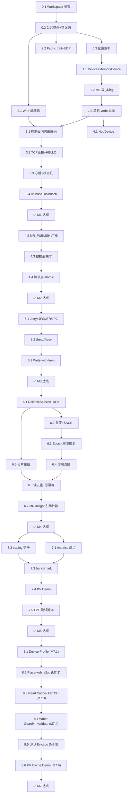

# UniBus Toy 实现计划

| 项 | 值 |
|---|---|
| **对应设计** | [DETAIL_DESIGN.md](./DETAIL_DESIGN.md) |
| **核心原则** | 每一步可编译、可运行、可验证，由小到大逐步叠加 |
| **最后更新** | 2026-04-14 |

---

## 总体策略

将设计文档的 6 个里程碑（M1–M5 + M7）拆解为 **27 个实现步骤**。每步结束后，项目处于一个**可运行、可演示**的状态——即使功能还不完整，已有功能必须正确工作。

**拆解原则**：

1. **先骨架后血肉**：先搭 crate 结构 + trait 定义 + 空实现，再逐步填充逻辑。
2. **先单机后分布式**：先在单进程内跑通路径，再扩展到跨进程。
3. **先 happy path 后错误处理**：先跑通正常流程，再补异常分支。
4. **先功能后性能**：先保证语义正确，再优化零拷贝、池化等。

**Cargo workspace 依赖图**（决定实现顺序）：

```
ub-fabric     (leaf)     ub-wire       (leaf)     ub-obs   (leaf)
     ↑                       ↑                       ↑
     │                   ┌───┘                   ┌───┘
     │                   │                       │
ub-control ──→ ub-fabric, ub-wire              │
     │                                           │
ub-transport ──→ ub-wire, ub-fabric, ub-obs     │
     │                                           │
ub-core ──→ ub-transport, ub-obs                │
     │                                           │
ub-managed ──→ ub-core, ub-control  (M7)        │
     │                                           │
unibusd ──→ 所有 crate                          │
unibusctl ──→ 独立（HTTP client）               │
```

---

## Phase 0: 工程脚手架

### Step 0.1 — Cargo workspace 初始化

**做什么**：创建 workspace，建立 9 个 crate 的骨架，确保 `cargo build` 通过。

```
unibus_toy/
├── Cargo.toml              # workspace 根
├── crates/
│   ├── ub-fabric/
│   │   ├── Cargo.toml
│   │   └── src/lib.rs
│   ├── ub-wire/
│   │   ├── Cargo.toml
│   │   └── src/lib.rs
│   ├── ub-transport/
│   │   ├── Cargo.toml
│   │   └── src/lib.rs
│   ├── ub-control/
│   │   ├── Cargo.toml
│   │   └── src/lib.rs
│   ├── ub-core/
│   │   ├── Cargo.toml
│   │   └── src/lib.rs
│   ├── ub-obs/
│   │   ├── Cargo.toml
│   │   └── src/lib.rs
│   ├── ub-managed/
│   │   ├── Cargo.toml
│   │   └── src/lib.rs
│   ├── unibusd/
│   │   ├── Cargo.toml
│   │   └── src/main.rs
│   └── unibusctl/
│       ├── Cargo.toml
│       └── src/main.rs
└── docs/
```

每个 `lib.rs` 只含 `pub mod placeholder;`，`main.rs` 只含 `fn main() {}`。

**验证**：`cargo build` 编译通过，无 warning。

### Step 0.2 — 公共类型与错误码

**做什么**：在 `ub-core` 中定义全项目共享的类型：

- `UbAddr(u128)` — UB 地址
- `UbStatus/u32` — 错误码枚举（`UB_OK`, `UB_ERR_ADDR_INVALID`, …）
- `UbError` — `thiserror` 错误类型
- `MrPerms` — 权限位掩码
- `MrHandle(u32)`, `JettyHandle(u32)`, `JettyAddr`, `WrId(u64)`, `Cqe`
- `DeviceKind` 枚举

**验证**：
- `cargo test -p ub-core` — 错误码常量值正确
- `UbAddr` 的文本表示解析/格式化 round-trip 正确
- `MrPerms` 位运算正确

### Step 0.3 — 配置解析

**做什么**：在 `ub-core` 中定义 `NodeConfig` struct，用 `serde + serde_yaml` 解析。包含所有字段（§12.1 的完整 YAML），M7 字段用 `Option` 或 `#[cfg(feature = "managed")]` 包裹。

**验证**：
- `cargo test -p ub-core` — YAML 字符串 → `NodeConfig` round-trip
- 缺少必填字段时报错
- 默认值正确（`pod_id=1`, `rto_ms=200`, `initial_credits=64` 等）

---

## Phase 1: 单机内存操作（M2 的最小子集）

> 目标：在**单个进程内**跑通 `ub_mr_register → ub_read/ub_write/ub_atomic` 的完整路径，不涉及任何网络。

### Step 1.1 — Device trait + MemoryDevice

**做什么**：

- `ub-core::device` 模块：定义 `Device` trait（`read/write/atomic_cas/atomic_faa`）
- `ub-core::device::memory`：实现 `MemoryDevice`（backing = `Box<[u8]>`）
- `ub-core::addr` 模块：UB 地址解析辅助函数

**验证**：
- 创建 `MemoryDevice(1024)` → `device.write(0, &[1,2,3])` → `device.read(0, &mut buf)` → `buf == [1,2,3]`
- `atomic_cas(0, 0, 42)` 返回旧值 0 → 再次 `atomic_cas(0, 0, 99)` 返回 42（CAS 失败不修改）
- `atomic_faa(0, 10)` 返回旧值 42 → 读回 52
- 非对齐 atomic 返回 `UB_ERR_ALIGNMENT`
- 越界访问返回 `UB_ERR_ADDR_INVALID`

### Step 1.2 — MR 表（本地）

**做什么**：

- `ub-core::mr` 模块：`MrTable`（`HashMap<u32, MrEntry>`）
- `ub_mr_register(device, offset, len, perms)` → `(UbAddr, MrHandle)`
- `ub_mr_deregister(handle)` — 首版简化：无 inflight 引用计数，直接释放
- Offset 分配器：bump allocator

**验证**：
- 注册 MR → 拿到 UbAddr → 通过 UbAddr 查 MrEntry → 读到正确的 Device
- 注册两个 MR → Offset 不重叠
- 注销 MR → 再次查表返回 `UB_ERR_ADDR_INVALID`
- 权限检查：只读 MR 执行 write 返回 `UB_ERR_PERM_DENIED`

### Step 1.3 — 单机 verbs 端到端

**做什么**：

- `ub-core::verbs` 模块：`ub_read_sync / ub_write_sync / ub_atomic_cas_sync / ub_atomic_faa_sync`
- 同节点短路路径：直接调用 `Device` trait 方法，不走网络

**验证**：
```rust
let device = MemoryDevice::new(4096);
let (addr, handle) = mr_register(device, 0, 4096, READ|WRITE|ATOMIC);
ub_write_sync(addr, &[1,2,3,4]);
let mut buf = [0u8; 4];
ub_read_sync(addr, &mut buf);
assert_eq!(buf, [1,2,3,4]);
let old = ub_atomic_faa_sync(addr, 10);
assert_eq!(old, 0x04030201);  // 大端解读
```

---

## Phase 2: Wire 协议与 Fabric 抽象（M1 的最小子集）

> 目标：两个进程能通过 UDP 交换原始字节帧。

### Step 2.1 — Wire 编解码

**做什么**：

- `ub-wire` crate：`FrameHeader` / `DataExtHeader` / `AckPayload` / `CreditPayload`
- `encode_frame()` / `decode_frame()`
- Magic 校验、Version 校验、大端序列化

**验证**：
- 构造一个 DATA 帧 → encode → decode → 字段完全一致
- 随机篡改 Magic → decode 返回 `UB_ERR_INTERNAL`
- 分片帧：`FragIndex=1, FragTotal=3` → encode/decode round-trip
- ACK 帧 + SACK bitmap → encode/decode round-trip
- `cargo test -p ub-wire` 全绿

### Step 2.2 — Fabric trait + UDP 实现

**做什么**：

- `ub-fabric` crate：定义 `Fabric` / `Listener` / `Session` trait + `PeerAddr` 枚举
- `ub-fabric::udp`：`UdpFabric` — 单 `UdpSocket` + `DashMap<PeerAddr, mpsc::Sender<BytesMut>>` demux
- `UdpSession::send/recv` 基本可用

**验证**：
- 本机两个 `UdpFabric`：A.listen("127.0.0.1:7901") + B.dial("127.0.0.1:7901")
- A 发送 `[1,2,3]` → B recv → 收到 `[1,2,3]`
- 双向收发正确
- `cargo test -p ub-fabric` 全绿

---

## Phase 3: 两节点控制面（M1 核心）

> 目标：两个 `unibusd` 进程能互相发现、交换 HELLO、维持心跳、在 CLI 看到对方。

### Step 3.1 — 控制面消息编解码

**做什么**：

- `ub-control` crate：控制面消息类型枚举（`ControlMsg`）
- `ControlMsg` 的 Length+MsgType+Payload 编解码
- `HELLO` / `HEARTBEAT` / `HEARTBEAT_ACK` 消息的 payload 结构

**验证**：
- `ControlMsg::Hello { node_id: 42, epoch: 1234, initial_credits: 64, data_addr: "10.0.0.1:7901" }` → encode → decode → round-trip
- `cargo test -p ub-control` 全绿

### Step 3.2 — 控制面 TCP 连接 + HELLO 交换

**做什么**：

- `ub-control::hub`：Static 模式的 TCP 连接管理
- 节点启动 → 向 peers 发起 TCP 连接 → 交换 HELLO → 建立会话
- `MemberTable`：维护 SuperPod 视图（节点列表 + 状态）

**验证**：
- 启动两个 `unibusd --config node0.yaml / node1.yaml`
- 两节点日志显示 `HELLO exchange completed with node X`
- 各节点内存中 `MemberTable` 包含对方信息

### Step 3.3 — 心跳 + 节点状态机

**做什么**：

- 定时心跳发送（`heartbeat.interval_ms`）
- `last_seen` 追踪 + 超时判定（`heartbeat.fail_after`）
- 节点状态机：`Joining → Active → (Suspect → Down | Leaving → Down)`

**验证**：
- 两节点运行 → 日志持续输出 `HEARTBEAT sent/recv`
- Kill 节点 B → 节点 A 在 ≤5s 内日志显示 `node B suspect → down`
- 重启节点 B → 节点 A 检测到 epoch 变化 → 重建会话

### Step 3.4 — unibusd 入口 + unibusctl node list

**做什么**：

- `unibusd` bin crate：读取 YAML 配置 → 初始化 tokio runtime → 启动控制面
- `unibusctl node list`：通过 HTTP admin API 查询本地 `unibusd`
- `axum` HTTP server：`/admin/node/list` 端点

**验证**：
- 终端 1：`unibusd --config node0.yaml`
- 终端 2：`unibusd --config node1.yaml`
- 终端 3：`unibusctl node list` → 显示两个 Active 节点
- Kill 终端 2 → 等待 5s → `unibusctl node list` → 节点 2 状态变为 Down

**里程碑 M1 达成**

---

## Phase 4: 两节点数据面——裸 UDP 读写（M2 核心）

> 目标：节点 A 注册 MR，节点 B 通过 UB 地址读写节点 A 的内存，暂不做可靠传输。

### Step 4.1 — NpuDevice 实现

**做什么**：

- `ub-core::device::npu`：`NpuDevice`（`RwLock<Vec<u8>>` + bump allocator）
- `ub_npu_open` / `ub_npu_alloc` API
- atomic 操作通过写锁 + 手动 u64 操作实现

**验证**：
- `ub_npu_open(256)` → 分配 256 MiB 模拟显存
- `ub_npu_alloc(handle, 1024, 8)` → 返回 `(offset=0, len=1024)`
- 第二次 alloc → offset=1024（不重叠）
- `device.write(0, &data) → device.read(0, &mut buf)` round-trip
- `device.atomic_cas(0, 0, 42)` → 返回 0，读回 42

### Step 4.2 — MR_PUBLISH 广播

**做什么**：

- 控制面新增 `MR_PUBLISH` / `MR_REVOKE` 消息
- 本地 `ub_mr_register` 成功后 → 异步广播 `MR_PUBLISH`
- 各节点维护 `MrCacheTable`（远端 MR 元数据缓存）

**验证**：
- 节点 A 注册 MR → 节点 B 日志显示 `MR_PUBLISH received`
- 节点 B 的 `MrCacheTable` 包含节点 A 的 MR 条目
- 节点 A 注销 MR → 节点 B 收到 `MR_REVOKE` → 缓存标记无效

### Step 4.3 — 数据面收发 + 裸写

**做什么**：

- `unibusd` 启动数据面 listener（UDP）
- 发送端：`ub_write_sync` → 构造 DATA 帧（WRITE verb） → `ub-wire` 编码 → `ub-fabric` 发送
- 接收端：fabric recv → wire 解码 → 查 MR 表 → Device.write → 构造 READ_RESP 或 ACK
- **首版不做可靠传输**：发完就完，不等待 ACK

**验证**：
- 节点 A 注册 MR（1KB）→ 节点 B 用 `ub_write_sync` 写入 `[1,2,3,4]`
- 节点 A 本地读回 → 数据一致
- 节点 B 用 `ub_read_sync` 读回 → 数据一致
- CPU MR 与 NPU MR 均可正常跨节点读写
- `unibusctl mr list 0` 显示 `MR[0] Device=CPU` 和 `MR[1] Device=NPU#0`

### Step 4.4 — 跨节点 atomic 操作

**做什么**：

- ATOMIC_CAS / ATOMIC_FAA 帧的发送与接收
- 接收端：查 MR → Device.atomic_* → 返回结果

**验证**：
- 节点 B 对节点 A 的 MR 执行 `ub_atomic_cas` → 成功
- 节点 B 对节点 A 的 MR 执行 `ub_atomic_faa` → 返回旧值
- 两个节点并发 `atomic_cas` 同一地址 → 结果正确（串行化）
- 非对齐地址 → 返回 `UB_ERR_ALIGNMENT`

**里程碑 M2 达成**

---

## Phase 5: Jetty 与消息语义（M3）

> 目标：跨节点 send/recv/write_with_imm 跑通。

### Step 5.1 — Jetty 数据结构 + JFS/JFR/JFC

**做什么**：

- `ub-core::jetty`：`Jetty` struct（JFS/JFR/JFC 队列）
- JFS：`parking_lot::Mutex<VecDeque<WorkRequest>>`（首版简洁实现）
- JFR：`VecDeque<RecvBuffer>` — post_recv 的 buffer 池
- JFC：`VecDeque<Cqe>` — 完成事件队列
- `ub_jetty_create` / `ub_jetty_close`
- 默认 Jetty：进程启动时自动创建

**验证**：
- 创建 Jetty → JFS post 3 个 WR → 逐一取出 → 顺序正确
- JFC push 3 个 CQE → poll 3 次 → 顺序正确
- JFC 达到 high_watermark → 新 WR 投递返回 `UB_ERR_NO_RESOURCES`

### Step 5.2 — Send / Recv 跨节点

**做什么**：

- SEND 帧：构造 → 发送 → 接收端匹配 JFR → CQE 入 JFC
- `ub_post_recv`：投递接收 buffer 到 JFR
- `ub_send` / `ub_send_with_imm`

**验证**：
- 节点 A 创建 Jetty → `ub_post_recv(jetty, buf, 1024)`
- 节点 B `ub_send(jetty, dst_addr, "hello", 5)` → 节点 A JFC 收到 CQE
- `ub_send_with_imm` → CQE 包含 imm 字段
- 同 (src, dst) 两条消息 → 到达顺序与发送一致

### Step 5.3 — Write-with-Immediate

**做什么**：

- WRITE_IMM 帧：写入远端 MR + 额外在目标 Jetty JFC 生成带 imm 的 CQE

**验证**：
- 节点 B `ub_write_with_imm(addr, data, imm=42)` → 节点 A MR 被写入 + JFC 收到 CQE(imm=42)
- 消息有序性测试：同 jetty 对有序，不同 jetty 对无序

**里程碑 M3 达成**

---

## Phase 6: 可靠传输 + 流控 + 故障检测（M4）

> 目标：在 1% 丢包下仍正确工作，信用流控防溢出，链路失效有明确错误。

### Step 6.1 — ReliableSession + 序号 + ACK

**做什么**：

- `ub-transport` crate：`ReliableSession` 结构
- 发送端：每帧分配 `StreamSeq`，进入 `retransmit_queue`
- 接收端：去重窗口（滑动窗口），`next_expected` 累积确认
- ACK 帧生成与处理

**验证**：
- 正常无丢包：发送 100 帧 → 全部按序到达 → ACK 正确推进
- 乱序注入：帧 3 先于帧 2 到达 → 暂存，帧 2 到后一起交付
- 重复帧：去重窗口正确丢弃

### Step 6.2 — 超时重传 + SACK

**做什么**：

- RTO 定时器 + 指数退避
- SACK bitmap 生成与解析
- 快速重传：3 次重复 SACK 触发
- `max_retries` 耗尽 → 会话 DEAD → `UB_ERR_LINK_DOWN`

**验证**：
- 注入 1% 丢包 → 全部操作仍正确完成（至多一次语义）
- 注入 10% 丢包 → 重传生效，无数据丢失
- 超过 max_retries → `UB_ERR_LINK_DOWN` CQE 交付

### Step 6.3 — Epoch 崩溃恢复

**做什么**：

- 进程启动生成 `local_epoch = rand::<u32>()`
- HELLO 携带 epoch → 对端检测变化 → 失效旧 session

**验证**：
- Kill 节点 B → 重启（新 epoch）→ 节点 A 检测到 epoch 变化 → 旧 session 失效 → 新 session 建立
- 旧 session 的未完成 WR → `UB_ERR_LINK_DOWN`

### Step 6.4 — 信用流控

**做什么**：

- HELLO 交换 `initial_credits`
- 发送端：信用计数递减 → 归零时停止发送
- 接收端：CQE 被消费 → `credits_to_grant++` → 嵌入 ACK 或独立 CREDIT 帧返还
- JFC 高水位背压

**验证**：
- 设置 `initial_credits=8` → 发送 8 个 WR 后暂停 → 消费 8 个 CQE → 继续发送
- JFC high_watermark 触发 → 发送端被背压
- 信用耗尽 + JFS 满 → `UB_ERR_NO_RESOURCES`

### Step 6.5 — 分片与重组

**做什么**：

- 发送端：payload > PMTU-80 时按 `(src_node, Opaque)` 切分
- 接收端：`ReassemblyTable` + inactivity 超时 2s + 总缓冲上限 64 MiB

**验证**：
- 发送 5KB payload（需分片）→ 接收端重组后完整
- 注入丢包导致部分分片丢失 → 2s 超时 → `UB_ERR_TIMEOUT`
- 超过重组缓冲上限 → 首片被拒绝

### Step 6.6 — 读路径去重 + 写路径幂等

**做什么**：

- 读响应缓存：`(src_node, Opaque) → READ_RESP_payload`，LRU 1024 条，TTL 5s
- 写路径已执行表：`(StreamSeq → result)`，窗口与去重窗口一致

**验证**：
- 重放 READ_REQ → 从缓存返回相同 RESP（不重复执行本地读）
- 重放 WRITE → 仅回 ACK，不重复执行写

### Step 6.7 — MR 注销 inflight 引用计数

**做什么**：

- `MrEntry.inflight_refs: AtomicI64` — 远端访问前 +1，完成后 -1
- `MrState`: `Active → Revoking → Released`
- `ub_mr_deregister` 异步等待 inflight 归零（超时 500ms）

**验证**：
- 注册 MR → 远端持续读写 → 执行 deregister → 等待 inflight 归零 → 成功
- deregister 超时 → 返回 `UB_ERR_TIMEOUT`
- Revoking 状态新到达帧 → `UB_ERR_ADDR_INVALID`

**里程碑 M4 达成**

---

## Phase 7: 可观测 + Benchmark + Demo（M5）

> 目标：/metrics 端点可用，benchmark 达标，分布式 KV demo 跑通。

### Step 7.1 — ub-obs 计数器 + /metrics

**做什么**：

- `ub-obs` crate：基于 `metrics` + `metrics-exporter-prometheus`
- 在各层关键路径插入计数器递增
- `axum` HTTP server：`/metrics` 端点

**验证**：
- 启动节点 → `curl http://127.0.0.1:9090/metrics` → 看到 `unibus_tx_pkts_total` 等指标
- 执行若干读写操作 → 指标数值增长

### Step 7.2 — tracing 钩子

**做什么**：

- 各模块关键路径加 `#[tracing::instrument]`
- `tracing_subscriber::fmt()` 输出到 stderr

**验证**：
- `RUST_LOG=debug unibusd --config node0.yaml` → stderr 输出结构化日志
- 关键事件（HELLO、MR_PUBLISH、WR 完成）可追踪

### Step 7.3 — criterion benchmark

**做什么**：

- `unibusctl bench write --size 1024` → 内置 criterion 循环
- 本机 loopback 吞吐和延迟测量

**验证**：
- 1 KiB write 吞吐 ≥ 50K ops/s
- P50 延迟 < 200μs

### Step 7.4 — 分布式 KV Demo

**做什么**：

- 简单 KV 存储：put / get / cas
- 用 `ub_write` / `ub_read` / `ub_atomic_cas` 实现
- `write_with_imm` 通知副本更新

**验证**：
- Shell 脚本起 3× `unibusd` + `unibusctl` 断言
- put("key", "value") → get("key") == "value"
- cas 更新正确
- Kill owner 节点 → client 收到 `UB_ERR_LINK_DOWN`

### Step 7.5 — E2E 测试脚本

**做什么**：

- Shell 脚本：启动 3 节点 → 注册 MR → 读写 → atomic → send/recv → kill 节点 → 验证错误

**验证**：
- 脚本 exit code 0
- 无内存泄漏（进程退出后无残留）

**里程碑 M5 达成**

---

## Phase 8: Managed 层（M7，Vision Track）

> 按子里程碑拆分，每步可独立验证。M7.3 之后即可停。

### Step 8.1 — Device Profile + Registry（M7.1）

**做什么**：

- `DeviceProfile` struct：静态字段（写死默认值）+ 动态字段（heartbeat piggyback）
- `DEVICE_PROFILE_PUBLISH` 控制面消息
- `unibusctl device list`

**验证**：`unibusctl device list` 显示所有节点的 CPU/NPU device 画像

### Step 8.2 — Placer + ub_alloc/ub_free 无缓存（M7.2）

**做什么**：

- Hub node 上的 Placer tokio task
- `ub_alloc(size, hints)` → `ALLOC_REQ` → Placer cost function → `REGION_CREATE` → `ALLOC_RESP`
- 读写直达 home
- `ub_free` → `REGION_DELETE`

**验证**：
- 跨节点 `ub_read_va` / `ub_write_va` 通
- 应用代码 `grep -r NodeId` = 0 命中

### Step 8.3 — 本地 Read Cache + FETCH（M7.3）

**做什么**：

- Reader 本地 cache MR（Shared 副本）
- `FETCH` / `FETCH_RESP` 协议
- Epoch 对比自判过期（无 invalidate）

**验证**：
- 首次读 → FETCH → 本地缓存
- 再次读 → 本地命中，不走网络
- 写入新值 → 读者重拉 → 拿到新值

### Step 8.4 — Writer Guard + Invalidation（M7.4）

**做什么**：

- `ub_acquire_writer` / `WriterGuard`
- `WRITE_LOCK_REQ` / `INVALIDATE` / `INVALIDATE_ACK` / `WRITE_LOCK_GRANTED`
- Writer lease 超时自动释放

**验证**：3 节点 demo 步骤 5–12 全部通过

### Step 8.5 — LRU Eviction（M7.5）

**做什么**：

- Cache pool 满时按 LRU 淘汰 Shared 副本
- 淘汰不通知 home

**验证**：cache pool 满时正确淘汰，不 OOM

### Step 8.6 — 3 节点 KV Cache Demo（M7.6）

**做什么**：

- KV cache demo + CLI/metrics 完善
- 全部验收条件满足

**里程碑 M7 达成**

---

## 步骤依赖关系总图



---

## 每步预估工作量

| Step | 新增代码量（估） | 核心难点 |
|---|---|---|
| 0.1 | ~200 行 | workspace 配置 |
| 0.2 | ~300 行 | 错误码设计 |
| 0.3 | ~200 行 | YAML schema |
| 1.1 | ~200 行 | atomic 操作正确性 |
| 1.2 | ~200 行 | Offset 分配器 |
| 1.3 | ~100 行 | 短路路径 |
| 2.1 | ~400 行 | 二进制编解码 + 分片头 |
| 2.2 | ~300 行 | UDP demux |
| 3.1 | ~200 行 | 消息枚举 |
| 3.2 | ~400 行 | TCP 连接管理 |
| 3.3 | ~300 行 | 状态机 + 定时器 |
| 3.4 | ~400 行 | axum server + CLI |
| 4.1 | ~150 行 | RwLock + atomic |
| 4.2 | ~200 行 | 广播逻辑 |
| 4.3 | ~500 行 | 首条跨节点数据路径 |
| 4.4 | ~200 行 | atomic 帧处理 |
| 5.1 | ~300 行 | 队列实现 |
| 5.2 | ~400 行 | JFR 匹配 + CQE |
| 5.3 | ~200 行 | imm 通知 |
| 6.1 | ~500 行 | 序号 + 去重窗口 |
| 6.2 | ~400 行 | 重传定时器 + SACK |
| 6.3 | ~200 行 | epoch 检测 |
| 6.4 | ~300 行 | 信用计数 |
| 6.5 | ~400 行 | 重组表 |
| 6.6 | ~300 行 | 缓存 + 幂等表 |
| 6.7 | ~300 行 | 引用计数 + Notify |
| 7.1 | ~200 行 | metrics 集成 |
| 7.2 | ~100 行 | tracing 装饰 |
| 7.3 | ~200 行 | criterion 集成 |
| 7.4 | ~500 行 | KV demo 应用 |
| 7.5 | ~200 行 | Shell 脚本 |
| 8.1–8.6 | ~3000 行 | Managed 层全套 |

**总计**：约 9500 行 Rust（M1–M5 约 6500 行，M7 约 3000 行）

---

## 开发节奏建议

1. **Phase 0（1–2 天）**：骨架搭好，`cargo build` 绿。
2. **Phase 1（2–3 天）**：单机内存操作跑通——这是最关键的一步，验证 Device trait + MR 设计正确。
3. **Phase 2（2–3 天）**：Wire + Fabric 跑通——首条跨进程字节路径。
4. **Phase 3（3–4 天）**：控制面——从这步起每次改动都涉及多进程调试。
5. **Phase 4（3–4 天）**：数据面——verbs 跨节点可用，项目开始"有用"。
6. **Phase 5（2–3 天）**：Jetty + 消息——双工通信完整。
7. **Phase 6（5–7 天）**：可靠传输——最复杂的部分，需要丢包注入测试。
8. **Phase 7（3–4 天）**：可观测 + Demo——收尾与打磨。
9. **Phase 8（5–7 天）**：Managed 层——独立轨，可随时 park。

**M1–M5 主线预计 3–4 周**（单人开发），M7 额外 1–2 周。
